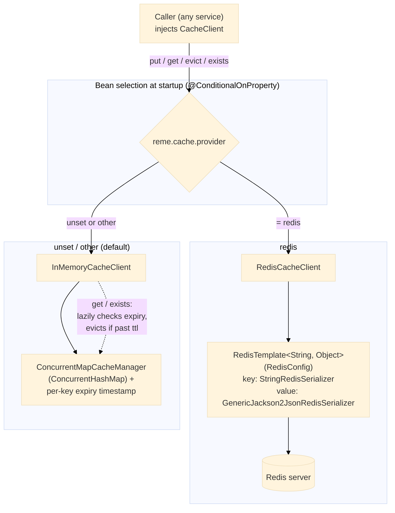

# `common.cache` — Usage & Data Flow

Vendor-neutral caching for all RemeLearning services. Callers depend only on the `CacheClient`
interface; the concrete implementation is chosen at startup by Spring based on the
`reme.cache.provider` property — no code change needed to switch backend.

## Usage

Inject `CacheClient` like any other Spring bean — never the concrete `RedisCacheClient` /
`InMemoryCacheClient` classes directly:

```java
@Service
@RequiredArgsConstructor
public class SomeService {

    private final CacheClient cacheClient;

    public WeakPointSummary getSummary(String userId) {
        String key = "weak-point-summary:" + userId;
        WeakPointSummary cached = cacheClient.get(key, WeakPointSummary.class);
        if (cached != null) {
            return cached;
        }
        WeakPointSummary computed = computeSummary(userId);
        cacheClient.put(key, computed, Duration.ofMinutes(10));
        return computed;
    }
}
```

- `put(key, value, ttl)` — `ttl == null` means no expiration.
- `get(key, type)` — returns `null` if absent, expired, or not an instance of `type`.
- `evict(key)` / `exists(key)`.

## Choosing a provider

| `reme.cache.provider` | Bean registered | Backing store |
|---|---|---|
| `redis` | `RedisCacheClient` (+ `RedisConfig`'s `RedisTemplate`) | Redis server (`spring.data.redis.*`) |
| unset / anything else | `InMemoryCacheClient` | JVM-local `ConcurrentMapCacheManager` (Spring Boot's own, no external server) |

```yaml
# application.yml — only needed when an actual Redis server is available
reme:
  cache:
    provider: redis
spring:
  data:
    redis:
      host: localhost
      port: 6379
```

Leaving `reme.cache.provider` unset (the default for every service today, since none run Redis
locally yet) falls back to the in-memory client automatically — no Redis dependency required to run
a service standalone.

**Gotcha:** `InMemoryCacheClient` is single-JVM and non-shared — do not rely on it for state that
must be visible across multiple instances of a scaled-out service. Switch to `reme.cache.provider:
redis` once a shared cache is actually needed.

## Data flow



Both implementations satisfy the same `CacheClient` contract, so `put`/`get`/`evict`/`exists`
behave identically from the caller's point of view — the only observable differences are:
persistence across restarts (Redis: yes, in-memory: no) and visibility across instances
(Redis: shared, in-memory: per-JVM).
