# bff-service — Data Flow

Focuses on **what happens to the data** (shapes/transformations) as it moves through `bff-service`,
as opposed to the sequence diagrams in [../sequence/Bff_service/](../sequence/Bff_service/) which
focus on call order. `bff-service` holds no data of its own — every response shape here is either a
straight pass-through of a downstream's `ApiResponse.data`, or a merge of several.

```mermaid
---
config:
  theme: base
  themeVariables:
    background: '#ffffff'
---
flowchart TD
    subgraph Upload["POST /api/v1/recordings (upload proxy)"]
        InFile["multipart/form-data<br/>{file, userId, languageCode?}"]
        BindPart["bind reactively -> FilePart + form fields"]
        Rebuild["MultipartBodyBuilder.asyncPart(file.content())<br/>+ part(userId) + part(languageCode)"]
        ProxyPost["POST recording-service /api/v1/recordings<br/>(streamed, not buffered)"]
        RecordingDtoOut["RecordingDto{recordingId, userId, status,<br/>s3Bucket, s3Key, createdAt}"]
    end

    subgraph Overview["GET /api/v1/learners/{userId}/overview"]
        DashCall["GET dashboard-service /api/v1/dashboard/{userId}<br/>-> DashboardSummaryDto"]
        RecCall["GET recording-service /api/v1/recordings/user/{userId}<br/>-> List[RecordingDto]"]
        UserCall["GET user-service /api/v1/users/{userId}<br/>-> UserDto"]
        DashFallback{"dashboard-service error?"}
        RecFallback{"recording-service error?"}
        UserFallback{"user-service error?"}
        DashEmpty["default: empty categoryProgress[] + recentRecommendations[]"]
        RecEmpty["default: empty List"]
        UserEmpty["default: null (wrapped Optional.empty() for Mono.zip)"]
        ZipOverview["Mono.zip -> LearnerOverviewResponse{userId,<br/>categoryProgress, recentRecommendations, recentRecordings, user}"]
    end

    subgraph WeakPoints["GET /api/v1/learners/{userId}/weak-points"]
        VocabCall["GET english-service /vocabulary/weak-points/{userId}<br/>-> List[VocabularyWeakPoint]"]
        GrammarCall["GET english-service /grammar/weak-points/{userId}<br/>-> List[GrammarWeakPoint]"]
        PronCall["GET english-service /pronunciation/weak-points/{userId}<br/>-> List[PronunciationWeakPoint]"]
        StampVocab["map -> WeakPointDto, category='vocabulary'"]
        StampGrammar["map -> WeakPointDto, category='grammar'"]
        StampPron["map -> WeakPointDto, category='pronunciation'"]
        VocabFallback{"error?"}
        GrammarFallback{"error?"}
        PronFallback{"error?"}
        ZipWeakPoints["Mono.zip -> Map{vocabulary: [...],<br/>grammar: [...], pronunciation: [...]}"]
    end

    subgraph Auth["POST /api/v1/auth/register, /login + GET/PATCH /api/v1/users/{userId}"]
        AuthCall["POST user-service /api/v1/auth/register or /login<br/>-> AuthResponseDto{token, user}"]
        UserProxyCall["GET/PATCH user-service /api/v1/users/{userId}<br/>-> UserDto"]
        AuthPassthrough["straight pass-through, no fallback - errors propagate"]
    end

    subgraph Recommendations["GET /api/v1/learners/{userId}/recommendations"]
        RecoCall["GET recommendation-service /recommendations/{userId}/grouped<br/>-> Map[String, List[Recommendation]]"]
        RecoPassthrough["straight pass-through -> Map[String, List[RecommendationDto]]<br/>(no aggregation, no fallback - errors propagate as 500)"]
    end

    subgraph ListeningSpeakingLibrary["learn/listening|speaking/library/... (9 routes)"]
        LibTopicsCall["GET english-service .../library/{userId}/topics<br/>-> ListeningLibraryTopicDto[] / SpeakingLibraryTopicDto[]"]
        LibSectionCall["POST english-service .../library/{userId}/topics/{topicId}/sections<br/>-> ListeningLibrarySectionDto / SpeakingLibrarySectionDto"]
        LibAnswersCall["POST english-service listening .../sections/{sectionId}/answers<br/>-> SubmitListeningAnswersResponse"]
        LibAttemptCall["POST english-service speaking .../sentences/{sentenceId}/attempts (multipart, streamed)<br/>-> SentenceAttemptResultDto"]
        LibFinishCall["POST english-service speaking .../sections/{sectionId}/finish<br/>-> FinishSpeakingSectionResponse"]
        LibHistoryCall["GET english-service .../library/{userId}/sections/history<br/>-> ListeningLibraryHistoryEntryDto[] / SpeakingLibraryHistoryEntryDto[]"]
        LibPassthrough["straight pass-through, no aggregation, no fallback - errors propagate as-is<br/>(403 when a topic is LOCKED, 500 otherwise)"]
    end

    InFile --> BindPart --> Rebuild --> ProxyPost --> RecordingDtoOut

    DashCall --> DashFallback
    DashFallback -->|yes| DashEmpty --> ZipOverview
    DashFallback -->|no| ZipOverview
    RecCall --> RecFallback
    RecFallback -->|yes| RecEmpty --> ZipOverview
    RecFallback -->|no| ZipOverview
    UserCall --> UserFallback
    UserFallback -->|yes| UserEmpty --> ZipOverview
    UserFallback -->|no| ZipOverview

    VocabCall --> StampVocab --> VocabFallback
    VocabFallback -->|yes| ZipWeakPoints
    VocabFallback -->|no| ZipWeakPoints
    GrammarCall --> StampGrammar --> GrammarFallback
    GrammarFallback -->|yes| ZipWeakPoints
    GrammarFallback -->|no| ZipWeakPoints
    PronCall --> StampPron --> PronFallback
    PronFallback -->|yes| ZipWeakPoints
    PronFallback -->|no| ZipWeakPoints

    RecoCall --> RecoPassthrough

    AuthCall --> AuthPassthrough
    UserProxyCall --> AuthPassthrough

    LibTopicsCall --> LibPassthrough
    LibSectionCall --> LibPassthrough
    LibAnswersCall --> LibPassthrough
    LibAttemptCall --> LibPassthrough
    LibFinishCall --> LibPassthrough
    LibHistoryCall --> LibPassthrough
```

## Data shape at each stage

| Stage | Format | Notes |
|---|---|---|
| Upload request | `multipart/form-data {file, userId, languageCode?}` | bound reactively as `FilePart` + form fields, never a blocking `MultipartFile` |
| Upload proxy body | re-published as `MultipartBodyBuilder` async part | file bytes stream through; not buffered fully in bff-service memory |
| `RecordingDto` | `{recordingId, userId, status, s3Bucket, s3Key, createdAt}` | 1:1 with recording-service's `RecordingResponse`, unwrapped from `ApiResponse.data` |
| `DashboardSummaryDto` | `{userId, categoryProgress: [...], recentRecommendations: [...]}` | 1:1 with dashboard-service's `DashboardSummaryResponse`; defaulted to empty lists on downstream error |
| `UserDto` | `{userId, email, name, role, createdAt}` | 1:1 with user-service's `UserResponse`, unwrapped from `ApiResponse.data`; defaulted to `null` on downstream error (wrapped in `Optional` internally so `Mono.zip` still has a value to zip) |
| `AuthResponseDto` | `{token, user: UserDto}` | 1:1 with user-service's `AuthResponse`; passed straight through with no bff-side transformation |
| `LearnerOverviewResponse` | `{userId, categoryProgress, recentRecommendations, recentRecordings, user}` | merge of `DashboardSummaryDto`'s two lists + `RecordingDto[]` + `UserDto` |
| `WeakPointDto` | `{itemId, label, category, forgettingScore, recommendation}` | deserialized from each domain's own weak-point JSON (extra fields like `vocabularyType`/`id`/`recordingId` are ignored); `category` is not in the source JSON - `EnglishServiceClient` stamps it itself per endpoint called |
| Weak points merged map | `Map<String, List<WeakPointDto>>` keyed `"vocabulary"/"grammar"/"pronunciation"` | any category whose upstream call failed is present as `[]`, not omitted |
| `RecommendationDto` | `{itemId, category, label, forgettingScore, recommendationText, updatedAt}` | 1:1 with recommendation-service's `Recommendation`; passed straight through with no bff-side transformation |
| `ListeningLibraryTopicDto` / `SpeakingLibraryTopicDto` | `{id, name, level, status}` | 1:1 with english-service's own topic DTO; `status` is a flat `String` (`LOCKED`/`UNLOCKED`/`IN_PROGRESS`/`PASSED`), passed straight through with no bff-side transformation |
| `ListeningLibrarySectionDto` / `SpeakingLibrarySectionDto` | listening: `{sectionId, passageText, audioUrl, questions: [{questionId, questionText, options}]}`; speaking: `{sectionId, sentences: [{sentenceId, sentenceText, ipa, sampleAudioUrl}]}` | 1:1 with english-service's own section DTO; answers/correct options are never included (withheld server-side) |
| `SubmitListeningAnswersResponse` / `FinishSpeakingSectionResponse` | `{..., topicPassed/passed, nextTopicId, nextTopicUnlocked}` | 1:1 pass-through of the scoring result; `nextTopicId`/`nextTopicUnlocked` are only populated when the topic was just passed |
| `SentenceAttemptResultDto` | `{sentenceId, phonemeScore, wordScore, passed, transcript}` | 1:1 pass-through of one scored speaking-library sentence attempt; does not itself affect topic gating |
| `ListeningLibraryHistoryEntryDto` / `SpeakingLibraryHistoryEntryDto` | listening: `{id, sectionId, score, correctCount, totalQuestions, startedAt, completedAt}`; speaking: `{id, sectionId, sentenceId, phonemeScore, wordScore, createdAt}` | 1:1 with english-service's own attempt row; `userId` is dropped (implicit in the request path) |

## Where data comes from / where it can go next

- Every field bff-service returns originates in one of the five downstream services
  (`user-service`, `recording-service`, `english-service`, `recommendation-service`,
  `dashboard-service`) - see `docs/API.md` for how each of those shapes is produced internally.
- `bff-service` performs no persistence and publishes no Kafka events; it is a pure synchronous
  read/write composition layer over REST.
- The upload proxy is the one write path; everything else (`overview`, `weak-points`,
  `recommendations`, `auth`, profile `GET`/`PATCH`) is read-only from bff-service's own perspective
  (register/login/PATCH do write in user-service, but bff-service itself holds no state).
- `.onErrorResume` fallbacks are applied only in the two aggregation services
  (`LearnerOverviewService`, `WeakPointAggregationService`); the recommendations endpoint, the auth
  proxy, the profile proxy, the upload proxy, and all `vocabulary`/`grammar`/`listening`/`speaking`
  library proxies are thin 1:1 forwards and let a downstream error propagate to `common`'s
  `GlobalExceptionHandler` (500 `INTERNAL_ERROR`, or the downstream's own status - e.g. `403` when a
  library topic is `LOCKED`) rather than silently defaulting.
- The speaking-library sentence-attempt upload follows the exact same multipart-streaming shape as
  the upload proxy above: `FilePart.content()` is re-published via `MultipartBodyBuilder.asyncPart`
  straight to english-service, never buffered fully in bff-service memory.
