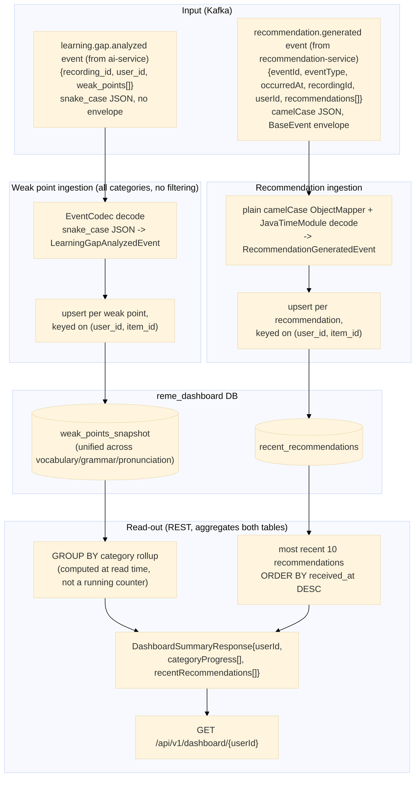

# dashboard-service — Data Flow

Focuses on **what happens to the data** (transformations, formats, storage) as it moves through
`dashboard-service`, as opposed to the sequence diagrams in
[../sequence/Dashboard_service/](../sequence/Dashboard_service/) which focus on call order between
components. Two independent Kafka events feed two independent tables; the one REST endpoint
combines both at read time — there is no cross-table write path.

## Data shape at each stage

| Stage | Format | Notes |
|---|---|---|
| `LearningGapAnalyzedEvent` | `{recordingId, userId, weakPoints: [{itemId, category, label, forgettingScore, recommendation}]}` | decoded from ai-service's snake_case JSON via `EventCodec`; covers all categories and **none are discarded** here (unlike `english-service`'s per-domain consumers) |
| `weak_points_snapshot` row | `{id, user_id, recording_id, item_id, category, label, forgetting_score, recommendation, updated_at}` | upserted on `(user_id, item_id)` — re-analysis updates score in place instead of duplicating; `category` is a plain string column (`vocabulary`/`grammar`/`pronunciation`), not filtered/split into separate tables |
| `RecommendationGeneratedEvent` | `{eventId, eventType, occurredAt, recordingId, userId, recommendations: [{itemId, category, label, recommendationText, exercises, forgettingScore}]}` | decoded from recommendation-service's camelCase JSON (BaseEvent envelope) via a plain `ObjectMapper` + `JavaTimeModule`, not `EventCodec` |
| `recent_recommendations` row | `{id, user_id, item_id, category, label, recommendation_text, exercises, forgetting_score, received_at}` | upserted on `(user_id, item_id)` — re-recommending the same item refreshes it in place; `exercises` (produced by recommendation-service's `ExerciseGenerator`) stored as a JSON array string via a small MyBatis `TypeHandler` |
| `CategoryProgress` (read-time aggregate) | `{category, weakPointCount, avgForgettingScore, lastUpdated}` | `resultType` of a `GROUP BY category` SQL query over `weak_points_snapshot`; computed fresh on every request, never persisted |
| `DashboardSummaryResponse` | `{userId, categoryProgress: [CategoryProgress], recentRecommendations: [RecommendationSnapshot]}` | returned by `GET /api/v1/dashboard/{userId}`, combining both tables in one response |

## Where data comes from / where it can go next

- `learning.gap.analyzed` is published by `ai-service` — see
  [ai-service-data-flow.md](ai-service-data-flow.md) for how that data was produced (S3 -> Whisper ->
  pyannote -> `RuleBasedAnalyzer`).
- `recommendation.generated` is published by `recommendation-service` — see
  [recommendation-service-data-flow.md](recommendation-service-data-flow.md) for how `exercises` is
  produced (its `ExerciseGenerator`, rule-based by default or Gemini-backed opt-in) before that event
  is published.
- No outbound Kafka event is produced by `dashboard-service` — it is a pure read-model/sink, the
  terminal point of both event chains.
- Unlike `english-service` (3 separate weak-point tables, one per domain), `dashboard-service`
  deliberately unifies all categories into a single `weak_points_snapshot` table so the `GROUP BY
  category` rollup can be a single query instead of a UNION across 3 tables.
