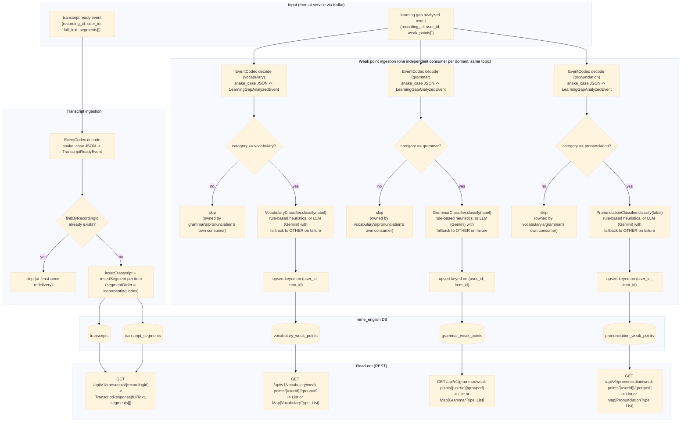

# english-service — Data Flow

Focuses on **what happens to the data** (transformations, formats, storage) as it moves through
`english-service`'s three domains — `vocabulary`, `grammar`, `pronunciation` — as opposed to the
sequence diagrams in [../sequence/English_service/](../sequence/English_service/) which focus on
call order between components. Only `vocabulary` ingests `transcript.ready`; `grammar` and
`pronunciation` each run their own weak-point ingestion off the same `learning.gap.analyzed` event,
filtered to their own `category`, on their own Kafka `groupId`.

## Data shape at each stage

| Stage | Format | Notes |
|---|---|---|
| `TranscriptReadyEvent` | `{recordingId, userId, fullText, segments: [{speaker, text, startSeconds, endSeconds}]}` | decoded from ai-service's snake_case JSON via `EventCodec` |
| `transcripts` row | `{id, recording_id, user_id, full_text}` | one row per recording, idempotent on `recording_id` |
| `transcript_segments` rows | `{id, transcript_id, speaker, content, start_seconds, end_seconds, segment_order}` | one row per segment, ordered |
| `LearningGapAnalyzedEvent` | `{recordingId, userId, weakPoints: [{itemId, category, label, forgettingScore, recommendation}]}` | covers all categories; each domain's own consumer keeps only its matching category and discards the rest — its own copy of the DTO lives in that domain's `event` package |
| `vocabulary_weak_points` row | `{id, recording_id, user_id, item_id, label, vocabulary_type, forgetting_score, recommendation, updated_at}` | upserted on `(user_id, item_id)` — re-analysis updates score in place instead of duplicating |
| `VocabularyType` | enum `NOUN, VERB, ADJECTIVE, ADVERB, PHRASAL_VERB, COLLOCATION, IDIOM, OTHER` | assigned by `VocabularyClassifier` |
| `grammar_weak_points` row | `{id, recording_id, user_id, item_id, label, grammar_type, forgetting_score, recommendation, updated_at}` | upserted on `(user_id, item_id)`, same shape as vocabulary's table |
| `GrammarType` | enum `TENSE, SUBJECT_VERB_AGREEMENT, ARTICLE, PREPOSITION, WORD_ORDER, PLURAL, PUNCTUATION, OTHER` | assigned by `GrammarClassifier` |
| `pronunciation_weak_points` row | `{id, recording_id, user_id, item_id, label, pronunciation_type, forgetting_score, recommendation, updated_at}` | upserted on `(user_id, item_id)`, same shape as vocabulary's table |
| `PronunciationType` | enum `VOWEL, CONSONANT, STRESS, INTONATION, LINKING, RHYTHM, OTHER` | assigned by `PronunciationClassifier` |

## Where data comes from / where it can go next

- Both input events are published by `ai-service` — see
  [../flow/ai-service-data-flow.md](ai-service-data-flow.md) for how that data was produced (S3 ->
  Whisper -> pyannote -> `RuleBasedAnalyzer`).
- No outbound Kafka event is produced by `english-service` today (`vocabulary.analyzed`,
  `grammar.analyzed`, `pronunciation.analyzed` topic constants exist but have no producer).
- `grammar` and `pronunciation` don't re-ingest `transcript.ready`: the `transcripts`/
  `transcript_segments` tables are written once by `vocabulary`'s consumer and read back by all
  three domains via `GET /api/v1/transcripts/{recordingId}`.
- All three `learning.gap.analyzed` consumers share the same topic but run on distinct Kafka
  `groupId`s (`english-service`, `english-service-grammar`, `english-service-pronunciation`) so
  each domain receives every message rather than Kafka splitting partitions across them.
