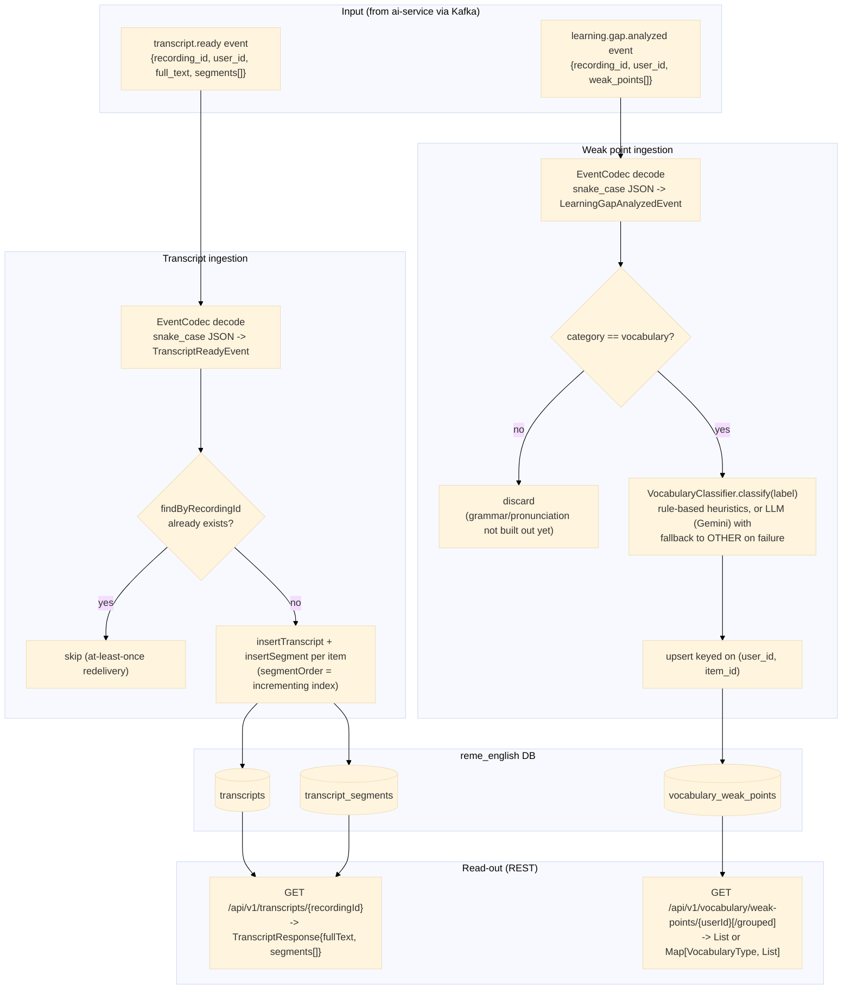

# english-service — Data Flow

Focuses on **what happens to the data** (transformations, formats, storage) as it moves through
`english-service`'s `vocabulary` domain, as opposed to the sequence diagrams in
[../sequence/English_service/](../sequence/English_service/) which focus on call order between
components.

## Data shape at each stage

| Stage | Format | Notes |
|---|---|---|
| `TranscriptReadyEvent` | `{recordingId, userId, fullText, segments: [{speaker, text, startSeconds, endSeconds}]}` | decoded from ai-service's snake_case JSON via `EventCodec` |
| `transcripts` row | `{id, recording_id, user_id, full_text}` | one row per recording, idempotent on `recording_id` |
| `transcript_segments` rows | `{id, transcript_id, speaker, content, start_seconds, end_seconds, segment_order}` | one row per segment, ordered |
| `LearningGapAnalyzedEvent` | `{recordingId, userId, weakPoints: [{itemId, category, label, forgettingScore, recommendation}]}` | covers all categories; only `vocabulary` survives the filter |
| `vocabulary_weak_points` row | `{id, recording_id, user_id, item_id, label, vocabulary_type, forgetting_score, recommendation, updated_at}` | upserted on `(user_id, item_id)` — re-analysis updates score in place instead of duplicating |
| `VocabularyType` | enum `NOUN, VERB, ADJECTIVE, ADVERB, PHRASAL_VERB, COLLOCATION, IDIOM, OTHER` | assigned by `VocabularyClassifier` |

## Where data comes from / where it can go next

- Both input events are published by `ai-service` — see
  [../flow/ai-service-data-flow.md](ai-service-data-flow.md) for how that data was produced (S3 ->
  Whisper -> pyannote -> `RuleBasedAnalyzer`).
- No outbound Kafka event is produced by `english-service` today (`vocabulary.analyzed` topic
  constant exists but has no producer).
- `grammar`/`pronunciation` categories are received in `learning.gap.analyzed` but discarded —
  their own storage/read-out flow doesn't exist yet (`package-info.java` placeholders only).
