# english-service — Data Flow

Focuses on **what happens to the data** (transformations, formats, storage) as it moves through
`english-service`'s three analysis domains — `vocabulary`, `grammar`, `pronunciation` — plus the
cross-cutting `practice` (redo-exercise) and `dictation` (listen-and-type practice) packages, as
opposed to the sequence diagrams in [../sequence/English_service/](../sequence/English_service/)
which focus on call order between components. Only `vocabulary` ingests `transcript.ready`; `grammar`
and `pronunciation` each run their own weak-point ingestion off the same `learning.gap.analyzed`
event, filtered to their own `category`, on their own Kafka `groupId`. `practice` also consumes
`learning.gap.analyzed` (no category filter, to seed `mistake_history`) and is the first component in
`english-service` to *produce* a Kafka event, `learning.gap.analysis.requested`, once a learner redoes
an exercise. `dictation` is pull-based, not event-driven: it reads `vocabulary`/`grammar`'s weak-point
tables in-process to pick sentences, calls out to an LLM and Google Cloud TTS, and stores generated
audio in S3/MinIO.

```mermaid
---
config:
  theme: base
  themeVariables:
    background: '#ffffff'
---
flowchart TD
    subgraph Input["Input (from ai-service via Kafka)"]
        TREvent["transcript.ready event<br/>{recording_id, user_id, full_text, segments[]}"]
        LGAEvent["learning.gap.analyzed event<br/>{recording_id, user_id, weak_points[]}"]
    end

    subgraph TranscriptFlow["Transcript ingestion"]
        Decode1["EventCodec decode<br/>snake_case JSON -> TranscriptReadyEvent"]
        Idem1{"findByRecordingId<br/>already exists?"}
        Skip1["skip (at-least-once redelivery)"]
        Insert1["insertTranscript + insertSegment per item<br/>(segmentOrder = incrementing index)"]
    end

    subgraph WeakPointFlow["Weak point ingestion (one independent consumer per domain, same topic)"]
        Decode2V["EventCodec decode (vocabulary)<br/>snake_case JSON -> LearningGapAnalyzedEvent"]
        FilterV{"category == vocabulary?"}
        DiscardV["skip<br/>(owned by grammar's/pronunciation's own consumer)"]
        ClassifyV["VocabularyClassifier.classify(label)<br/>rule-based heuristics, or LLM (Gemini) with<br/>fallback to OTHER on failure"]
        UpsertV["upsert keyed on (user_id, item_id)"]

        Decode2G["EventCodec decode (grammar)<br/>snake_case JSON -> LearningGapAnalyzedEvent"]
        FilterG{"category == grammar?"}
        DiscardG["skip<br/>(owned by vocabulary's/pronunciation's own consumer)"]
        ClassifyG["GrammarClassifier.classify(label)<br/>rule-based heuristics, or LLM (Gemini) with<br/>fallback to OTHER on failure"]
        UpsertG["upsert keyed on (user_id, item_id)"]

        Decode2P["EventCodec decode (pronunciation)<br/>snake_case JSON -> LearningGapAnalyzedEvent"]
        FilterP{"category == pronunciation?"}
        DiscardP["skip<br/>(owned by vocabulary's/grammar's own consumer)"]
        ClassifyP["PronunciationClassifier.classify(label)<br/>rule-based heuristics, or LLM (Gemini) with<br/>fallback to OTHER on failure"]
        UpsertP["upsert keyed on (user_id, item_id)"]
    end

    subgraph PracticeFlow["Practice / redo-exercise (package practice)"]
        Decode2Pr["EventCodec decode (practice seed)<br/>snake_case JSON -> LearningGapAnalyzedEvent"]
        SeedPr["seedIfAbsent per weak point<br/>(no category filter; ON CONFLICT (user_id, item_id) DO NOTHING)"]

        RedoReq["POST /api/v1/practice/redo<br/>{userId, attempts: [{itemId, category, label, correct}]}"]
        LogAttempt["insert practice_attempts (audit log)<br/>per attempt"]
        LockPrior["findOneForUpdate (SELECT ... FOR UPDATE)<br/>read scoring state BEFORE this attempt"]
        RecordAttempt["recordAttempt per attempt<br/>occurrence_count += (correct ? 0 : 1), last_seen_at = now()"]
        ScoreEngine["common.scoring.WeakPointScoringEngine<br/>forgetting (adaptive half-life) x (1-mastery, BKT)<br/>x difficultyWeight (Rasch) x recurrenceBoost"]
        UpdateState["updateScoringState + item_difficulty_stats upsertIncrement"]
        DispatchDomain["dispatch to owning domain's<br/>applyJavaComputedScore (scoreSource=JAVA_ENGINE)"]
        BuildHistory["findByUserId -> build AnalysisRequestedEvent<br/>{recordingId: practice-&lt;uuid&gt;, userId, segments: [], history[]}"]
        PublishAR["AnalysisRequestedProducer.publish<br/>-> learning.gap.analysis.requested"]
        RevQueue["GET /api/v1/practice/review-queue/{userId}<br/>findDueForReview(userId, now)"]
    end

    subgraph DictationFlow["Dictation (package dictation, pull-based; grading feeds the Kafka pipeline)"]
        ImportLib["DictationLibraryImporter (startup)<br/>StorageClient.list/read -> upsertClip per real audio clip<br/>taxonomy: skill/level(CEFR)/topic/examType from folder+filename<br/>+ folder (direct parent dir, rev 2) + split scriptText into sentences (rev 2)"]
        SessionReq["POST /api/v1/dictation/sessions/{userId}<br/>{skill?, level?, topic?, examType?, count}"]
        PickClips["findRandomClipsByFacets -> List[DictationClipDto] (no script)"]
        StreamAudio["GET /clips/{id}/audio -> StorageClient.read stream (mp3/wav)"]

        ListFolders["GET /dictation/folders (rev 2)<br/>findDistinctFolders -> List[DictationFolderDto]{folderId, name, lessonCount}"]
        ListFolderLessons["GET /dictation/folders/{folderId}/lessons (rev 2)<br/>findClipsByFolder -> List[DictationLessonSummaryDto] (no script)"]
        GetClipDetail["GET /dictation/clips/{clipId} (rev 2)<br/>findClipById + findSentencesByClipId -> DictationClipDetailDto{scriptText, sentences[]}"]
        AlignSentences["ensureSentencesAligned (lazy, only if a sentence is missing startMs/endMs)<br/>StorageClient.read(audio) -> SentenceAlignmentClient.align -> ai-service POST /api/v1/dictation/align-sentences<br/>-> updateSentenceTimestamps per matched sentence; failures/no-match just leave nulls"]

        AttemptReq["POST /api/v1/dictation/attempts<br/>{userId, clipId? | practiceItemId?, userTranscript, sentenceMistakes?}"]
        ScoreDictation["DictationScorer.score(referenceText, userTranscript)<br/>word-level Levenshtein -> WER<br/>(rev 2: FE grades per-sentence client-side first, then reassembles the full transcript here)"]
        ScoreSentenceMistakes["rev 3: DictationScorer.score(expectedText, attemptedText) per sentenceMistakes[] entry<br/>-> extra missing/substituted words merged into the same miss list"]
        InsertAttempt["insertAttempt + insertMisses (missing/substituted words from userTranscript's diff, plus any from ScoreSentenceMistakes)"]
        Analyze["DictationAnalyzer.analyzeAttempt<br/>rule-based, or Gemini -> suggestions + practice sentences"]
        PublishGap["DictationGapEventPublisher -> learning.gap.analyzed<br/>(missed words as vocabulary weak points)"]

        AiGen["POST /ai-practice/{userId}/generate<br/>{level?, examType?, translationLang?} -> resolveLevel/resolveExamType (concrete value, RANDOM from a fixed CEFR pool<br/>A1/A2/B1/B2/C1 or the library's own distinct exam types w/ TOEIC/IELTS/TOEFL/General fallback, or unset)<br/>-> pending items' text (or top missed words if none pending) + resolved level/examType/translationLang -> LlmDictationDialogueGenerator (Gemini)<br/>-> one monologue/multi-speaker dialogue with a topic label + parallel per-line translation (only if translationLang != en)<br/>-> random voice per speaker -> Supertonic (ai-service) per line, synthesized from the SAME text persisted as the graded sentence<br/>-> WavAudioMerger -> one merged file -> StorageClient.write -> replaces prior pending items"]
        AiGenFromAttempt["POST /dictation/history/{userId}/{attemptId}/ai-practice<br/>{translationLang?} -> one attempt's own missed words -> same LlmDictationDialogueGenerator as AiGen (level/examType left unset)<br/>-> Supertonic (ai-service) -> StorageClient.write"]
        GetAiPracticeDetail["GET /dictation/ai-practice/items/{practiceItemId}/detail<br/>findPracticeItemById + splitIntoSentences(sentenceText, translationText) (zips translation per sentence)<br/>-> DictationPracticeItemDetailDto{scriptText, level, examType, topic, sentences[]} (startMs/endMs always null, one merged audio file)"]
    end

    subgraph Storage["reme_english DB"]
        T1[("transcripts")]
        T2[("transcript_segments")]
        T3[("vocabulary_weak_points")]
        T4[("grammar_weak_points")]
        T5[("pronunciation_weak_points")]
        T6[("mistake_history")]
        T7[("practice_attempts")]
        T8[("item_difficulty_stats")]
        T9[("dictation_clips")]
        T10[("dictation_misses")]
        T11[("dictation_attempts")]
        T12[("dictation_practice_items")]
        T13[("dictation_clip_sentences")]
    end

    subgraph ReadOut["Read-out (REST)"]
        GetTranscript["GET /api/v1/transcripts/{recordingId}<br/>-> TranscriptResponse{fullText, segments[]}"]
        GetWeakV["GET /api/v1/vocabulary/weak-points/{userId}[/grouped]<br/>-> List or Map[VocabularyType, List]"]
        GetWeakG["GET /api/v1/grammar/weak-points/{userId}[/grouped]<br/>-> List or Map[GrammarType, List]"]
        GetWeakP["GET /api/v1/pronunciation/weak-points/{userId}[/grouped]<br/>-> List or Map[PronunciationType, List]"]
        GetDictationHistory["GET /api/v1/dictation/history/{userId}<br/>-> List[DictationHistoryEntryDto]{attemptId, clipId, title, skill,<br/>level, examType, accuracy, wer, attemptedAt, attemptCount, practiceType}"]
        GetAttemptDetail["GET /api/v1/dictation/history/{userId}/{attemptId}<br/>findAttemptDetailByIdAndUserId + findMissesByAttemptId<br/>-> DictationAttemptDetailDto{referenceText, userTranscript, mistakes[], aiSuggestions[]}"]
    end

    subgraph Output["Output (to ai-service via Kafka)"]
        AREvent["learning.gap.analysis.requested event<br/>{recording_id, user_id, segments: [], history[]}"]
    end

    TREvent --> Decode1 --> Idem1
    Idem1 -->|yes| Skip1
    Idem1 -->|no| Insert1
    Insert1 --> T1
    Insert1 --> T2

    LGAEvent --> Decode2V --> FilterV
    FilterV -->|no| DiscardV
    FilterV -->|yes| ClassifyV
    ClassifyV --> UpsertV
    UpsertV --> T3

    LGAEvent --> Decode2G --> FilterG
    FilterG -->|no| DiscardG
    FilterG -->|yes| ClassifyG
    ClassifyG --> UpsertG
    UpsertG --> T4

    LGAEvent --> Decode2P --> FilterP
    FilterP -->|no| DiscardP
    FilterP -->|yes| ClassifyP
    ClassifyP --> UpsertP
    UpsertP --> T5

    LGAEvent --> Decode2Pr --> SeedPr --> T6

    RedoReq --> LogAttempt --> T7
    RedoReq --> LockPrior --> T6
    LockPrior --> RecordAttempt --> T6
    RecordAttempt --> ScoreEngine
    T8 --> ScoreEngine
    ScoreEngine --> UpdateState --> T6
    UpdateState --> T8
    ScoreEngine --> DispatchDomain
    DispatchDomain -->|category=vocabulary| T3
    DispatchDomain -->|category=grammar| T4
    DispatchDomain -->|category=pronunciation| T5
    RecordAttempt --> BuildHistory
    T6 --> BuildHistory
    BuildHistory --> PublishAR --> AREvent
    T6 --> RevQueue

    T1 --> GetTranscript
    T2 --> GetTranscript
    T3 --> GetWeakV
    T4 --> GetWeakG
    T5 --> GetWeakP

    ImportLib --> T9
    ImportLib --> T13
    SessionReq --> PickClips
    T9 --> PickClips
    T9 --> StreamAudio

    T9 --> ListFolders
    T9 --> ListFolderLessons
    T9 --> GetClipDetail
    T13 --> GetClipDetail
    GetClipDetail --> AlignSentences
    AlignSentences --> T13

    AttemptReq --> ScoreDictation
    T9 --> ScoreDictation
    T12 --> ScoreDictation
    AttemptReq --> ScoreSentenceMistakes
    ScoreDictation --> InsertAttempt --> T11
    ScoreSentenceMistakes --> InsertAttempt
    InsertAttempt --> T10
    InsertAttempt --> Analyze --> T12
    Analyze --> PublishGap
    T11 --> GetDictationHistory
    T9 --> GetDictationHistory
    T11 --> GetAttemptDetail
    T9 --> GetAttemptDetail
    T12 --> GetAttemptDetail
    T10 --> GetAttemptDetail

    T10 --> AiGen
    AiGen --> T12

    T11 --> AiGenFromAttempt
    T10 --> AiGenFromAttempt
    AiGenFromAttempt --> T12

    T12 --> GetAiPracticeDetail
```

## Data shape at each stage

| Stage | Format | Notes |
|---|---|---|
| `TranscriptReadyEvent` | `{recordingId, userId, fullText, segments: [{speaker, text, startSeconds, endSeconds, language}]}` | decoded from ai-service's snake_case JSON via `EventCodec` |
| `transcripts` row | `{id, recording_id, user_id, full_text}` | one row per recording, idempotent on `recording_id` |
| `transcript_segments` rows | `{id, transcript_id, speaker, content, start_seconds, end_seconds, segment_order, language}` | one row per segment, ordered; `language` (`V4__transcript_segment_language.sql`) is per-segment since ai-service auto-detects each diarized speaker turn's language independently |
| `LearningGapAnalyzedEvent` | `{recordingId, userId, weakPoints: [{itemId, category, label, forgettingScore, recommendation}]}` | covers all categories; each domain's own consumer keeps only its matching category and discards the rest — its own copy of the DTO lives in that domain's `event` package |
| `vocabulary_weak_points` row | `{id, recording_id, user_id, item_id, label, vocabulary_type, forgetting_score, recommendation, mastery_level, next_review_at, score_source, updated_at}` | upserted on `(user_id, item_id)` — re-analysis updates score in place instead of duplicating; `score_source` (`PYTHON_LEGACY`/`JAVA_ENGINE`) guards the upsert so a Kafka-sourced write can't clobber a fresher Java-direct one (see below) |
| `VocabularyType` | enum `NOUN, VERB, ADJECTIVE, ADVERB, PHRASAL_VERB, COLLOCATION, IDIOM, OTHER` | assigned by `VocabularyClassifier` |
| `grammar_weak_points` row | `{id, recording_id, user_id, item_id, label, grammar_type, forgetting_score, recommendation, mastery_level, next_review_at, score_source, updated_at}` | upserted on `(user_id, item_id)`, same shape/guard as vocabulary's table |
| `GrammarType` | enum `TENSE, SUBJECT_VERB_AGREEMENT, ARTICLE, PREPOSITION, WORD_ORDER, PLURAL, PUNCTUATION, OTHER` | assigned by `GrammarClassifier` |
| `pronunciation_weak_points` row | `{id, recording_id, user_id, item_id, label, pronunciation_type, forgetting_score, recommendation, mastery_level, next_review_at, score_source, updated_at}` | upserted on `(user_id, item_id)`, same shape/guard as vocabulary's table |
| `PronunciationType` | enum `VOWEL, CONSONANT, STRESS, INTONATION, LINKING, RHYTHM, OTHER` | assigned by `PronunciationClassifier` |
| `PracticeRedoRequest` | `{userId, attempts: [{itemId, category, label, correct}]}` | REST request body, not an event |
| `practice_attempts` row | `{id, user_id, item_id, category, label, is_correct, attempted_at}` | audit-log insert only, never read back by the scoring pipeline |
| `mistake_history` row | `{id, user_id, item_id, category, label, occurrence_count, last_seen_at, updated_at, ease_factor, half_life_days, mastery, leitner_box, next_review_at, last_weak_score, label_key}` | upserted on `(user_id, item_id)`; `occurrence_count`/`last_seen_at` seeded/updated as before, the scoring-state columns are read (locked via `FOR UPDATE`) then updated by `WeakPointScoringOrchestrator` around each redo attempt |
| `item_difficulty_stats` row | `{category, label_key, correct_count, incorrect_count, updated_at}` | population-level (cross-user) aggregate, keyed `(category, label_key)` — feeds `RaschDifficultyEstimator`'s item-difficulty weight; `label_key` is `LabelKeys.normalize(label)` (trim/collapse-whitespace/lowercase), used because `item_id` isn't a verified cross-user-shared identifier in this system |
| `ScoringResult` (in-memory) | `{weakScore, updatedState: {easeFactor, halfLifeDays, mastery, leitnerBox}, nextReviewAt}` | output of `common.scoring.WeakPointScoringEngine.scoreAfterAttempt`, computed from the item's PRE-attempt state so the same-batch recurrence signal stays meaningful |
| `WeakPointScoreUpdate` (in-memory) | `{recordingId, userId, itemId, category, label, weakScore, masteryLevel, nextReviewAt}` | handed from the orchestrator to whichever domain's `applyJavaComputedScore` owns `category` |
| `AnalysisRequestedEvent` | `{recordingId: "practice-<uuid>", userId, segments: [], history: [{itemId, category, label, occurrenceCount, lastSeenDaysAgo}]}` | built from the learner's full current `mistake_history`, not just the items just redone; `lastSeenDaysAgo` computed as `Duration.between(lastSeenAt, now)` in days; still published so `recommendation-service`/`dashboard-service` stay in sync even though they never see the new Java-direct path |
| `ReviewQueueItem` | `{itemId, category, label, lastWeakScore, nextReviewAt}` | read straight off `mistake_history` where `next_review_at <= now()`, ordered soonest-first — the Leitner schedule surfaced |
| `StartDictationSessionRequest` | `{skill?, level?, topic?, examType?, count}` | REST request body; any null facet is unfiltered on that dimension |
| `dictation_clips` row | `{id, code, title, skill, level, topic, exam_type, script_text, storage_key, source, folder, created_at}` | fixed library clip; `script_text` is never returned by browse/session, only as `referenceText` after grading or `scriptText` on the rev-2 clip-detail endpoint; upsert-by-`code`; `folder` (rev 2) = direct parent directory of the audio file, independent of `topic`/`skill`/`level`/`exam_type` |
| `DictationClipDto` | `{clipId, code, title, skill, level, topic, examType, audioUrl}` | REST response for browse/session; omits the script |
| `dictation_clip_sentences` row (rev 2, translation rev 7) | `{id, clip_id, seq, text, start_ms?, end_ms?, translation?, created_at}` | one row per script line, upserted on `(clip_id, seq)`; `start_ms`/`end_ms` stay null until `GetClipDetail`'s lazy AI-alignment step matches that sentence; `translation` (rev 7) stays null until `ensureSentencesTranslated` fills it for a requested non-"en" `translationLang` |
| `DictationFolderDto` (rev 2) | `{folderId, name, lessonCount}` | REST response for `GET /dictation/folders` |
| `DictationLessonSummaryDto` (rev 2) | `{clipId, code, title, audioUrl}` | REST response for `GET /dictation/folders/{folderId}/lessons`; no script |
| `DictationClipDetailDto` (rev 2, translation rev 7) | `{clipId, code, title, audioUrl, scriptText, sentences: [{index, text, startMs?, endMs?, translation?}]}` | REST response for `GET /dictation/clips/{clipId}?translationLang=`; the only rev-2 endpoint that exposes the script, and only for the one clip opened; `translation` lazily filled the same way `startMs`/`endMs` are, gated on `translationLang` being present and not "en" |
| `DictationAttemptRequest` | `{userId, clipId? | practiceItemId?, userTranscript, sentenceMistakes?: [{sentenceIndex, expectedText, attemptedText}]}` | REST request body; exactly one of clipId/practiceItemId; `sentenceMistakes` (rev 3) only sent for sentence-mode retries, scored separately and merged into the same miss list as `userTranscript`'s diff |
| `DictationScoreResult` (in-memory) | `{accuracy, wer, diff: [{tag: CORRECT|SUBSTITUTED|MISSING|EXTRA, actualWord, expectedWord}]}` | output of `DictationScorer.score`, a pure word-level Levenshtein alignment |
| `dictation_misses` row | `{id, attempt_id, user_id, clip_id, expected_word, actual_word, tag, created_at}` | one row per wrong word; drives AI analysis + the published forgetting score |
| `dictation_attempts` row | `{id, clip_id?, practice_item_id?, user_id, user_transcript, accuracy, wer, ai_suggestions?, created_at}` | one row per graded submission, full history kept; `ai_suggestions` (new) is a JSON-encoded array of the suggestions generated at submit time, null for attempts made before this column existed |
| `dictation_practice_items` row | `{id, user_id, sentence_text, source, storage_key?, level?, exam_type?, topic?, translation_text?, created_at}` | `AiGenFromAttempt`: one row per generated passage (level/exam_type left null - no facet selector on this entry point); `AiGen` (rev 5, taxonomy rev 7): one row for the whole generated dialogue passage (`sentence_text` = full passage, `"Speaker: line"` per turn if multi-speaker); `level`/`exam_type`/`topic` (rev 7) = the resolved facets (concrete or RANDOM-resolved) plus the LLM's own topic label; `translation_text` (rev 7) is the parallel per-line translation, populated only when `translationLang` was requested and isn't "en"; `storage_key` set once Supertonic audio synthesized/merged |
| `GenerateAiPracticeRequest` (rev 7) | `{level?, examType?, translationLang?}` | REST request body for `AiGen`; `level`/`examType` each accept a concrete value, the literal `"RANDOM"` (server resolves it - level from `A1,A2,B1,B2,C1`, examType from the library's own distinct exam types, falling back to `TOEIC,IELTS,TOEFL,General`), or unset (no preference, LLM's own default) |
| `DictationPracticeItemDetailDto` (rev 6, taxonomy+translation rev 7) | `{practiceItemId, audioUrl, scriptText, level?, examType?, topic?, sentences: [{index, text, startMs: null, endMs: null, translation?}]}` | REST response for `GetAiPracticeDetail`; `sentences` split in-memory from `sentence_text`/`translation_text` in parallel (one per dialogue line, or by sentence-ending punctuation for a monologue) - mirrors `DictationClipDetailDto` but timings are always null since the passage is one merged audio file |
| `DictationAttemptResultDto` | `{referenceText, accuracy, wer, diff[], aiSuggestions[], practiceSentences[]}` | REST grading response; only point `script_text` is exposed |
| published `learning.gap.analyzed` | `{recording_id: "dictation-clip-<id>", user_id, weak_points: [{item_id: "dictation:<word>", category: "vocabulary", label, forgetting_score}]}` | dictation misses fed into the existing recommendation pipeline |
| `DictationHistoryEntryDto.practiceType` | `LIBRARY \| AI_PRACTICE` | derived in Java from `clipId` being present/null - not a DB column - so the FE can badge each history row |

## Where data comes from / where it can go next

- Both input events are published by `ai-service` — see
  [../flow/ai-service-data-flow.md](ai-service-data-flow.md) for how that data was produced (S3 ->
  Whisper -> pyannote -> `RuleBasedAnalyzer`).
- `english-service` now does produce one Kafka event: `learning.gap.analysis.requested`, published by
  `practice.kafka.AnalysisRequestedProducer` after a redo-exercise submission. `vocabulary.analyzed`/
  `grammar.analyzed`/`pronunciation.analyzed` topic constants still exist with no producer.
- `grammar` and `pronunciation` don't re-ingest `transcript.ready`: the `transcripts`/
  `transcript_segments` tables are written once by `vocabulary`'s consumer and read back by all
  three domains via `GET /api/v1/transcripts/{recordingId}`.
- All four `learning.gap.analyzed` consumers (three domains + `practice`'s seed consumer) share the
  same topic but run on distinct Kafka `groupId`s (`english-service`, `english-service-grammar`,
  `english-service-pronunciation`, `english-service-practice`) so each receives every message rather
  than Kafka splitting partitions across them.
- `practice`'s consumer only *seeds* `mistake_history` (a no-op if the item already has history) —
  the `occurrence_count`/`last_seen_at` values that actually drive re-scoring only change when a
  learner submits `POST /api/v1/practice/redo`, so replaying old `learning.gap.analyzed` messages
  can never inflate a learner's mistake count.
- `learning.gap.analysis.requested`'s consumer (`ai-service`) and the resulting
  `learning.gap.analyzed` republish are documented in
  [../flow/ai-service-data-flow.md](ai-service-data-flow.md) — this file stops at the point the event
  is published, since ai-service's processing of it is unchanged by `practice`'s existence.
- **New in this update:** the redo flow no longer only round-trips through Kafka for a fresh score.
  `WeakPointScoringOrchestratorImpl` computes one directly, in Java, per attempt, via
  `common.scoring.WeakPointScoringEngine` — combining an adaptive-half-life generalization of the
  Ebbinghaus decay, a Bayesian Knowledge Tracing mastery estimate, and a Rasch-style
  population-level difficulty weight, plus a same-batch recurrence boost — and writes the result
  straight into the owning domain's weak-point table with `score_source = JAVA_ENGINE`. The
  ai-service round-trip is kept (unchanged formula, still `occurrence_count x forgetting`) purely so
  `recommendation-service`/`dashboard-service` still learn about the update; a `score_source` guard
  on each domain's `upsert` (`WHERE NOT (existing = JAVA_ENGINE AND incoming = PYTHON_LEGACY)`) stops
  that slower, older-formula write from clobbering the fresher one. Full rationale and formula in
  `Business.md` §10 (both copies) and the class docs under
  `RemeLearning/common/src/main/java/com/remelearning/common/scoring/`.
- **`dictation` (redesigned).** Two sections over one grading flow: a **fixed library** of real
  recorded clips (imported from disk/cloud via `common.storage.StorageClient` into `dictation_clips`,
  tagged skill/level/topic/examType) and **"Luyện nghe với AI"** (Gemini sentences voiced by
  **Supertonic** in ai-service). The request flow is pull-based (FE → bff → REST), but grading
  (`POST /attempts`) now **publishes `learning.gap.analyzed`** so misses reach the existing
  recommendation pipeline — the one point this flow re-enters Kafka. Outbound calls: `StorageClient`
  (local FS/S3) for clip + generated audio, HTTP to ai-service for TTS, and optional Gemini for the
  analysis. Grading itself (`DictationScorer`) is still a pure in-memory function.
- **Rev 2 (sentence-mode dictation).** Adds a folder → file browse path (`GET /dictation/folders` →
  `.../folders/{folderId}/lessons` → `.../clips/{clipId}`) alongside the existing facet/session path,
  backed by a new `folder` column and `dictation_clip_sentences` table populated at import time. The
  grading endpoint (`POST /attempts`) and its published `learning.gap.analyzed` are **unchanged** —
  the FE grades sentence-by-sentence client-side against `sentences[]`, then reassembles the full
  transcript and calls the same attempt endpoint. `sentences[].startMs`/`endMs` are filled in by
  `GetClipDetail`'s lazy AI-alignment step (`AlignSentences` above): `SentenceAlignmentClient`
  (`common.ai.align`) sends the clip's audio + sentence texts to ai-service's Whisper-based
  `POST /api/v1/dictation/align-sentences`, and whatever timings come back are persisted via
  `updateSentenceTimestamps` before the response is built. A sentence Whisper can't locate, or any
  failure reaching ai-service, just leaves that sentence's fields null - retried on the next read of
  the same clip, never fails the request.
- **Rev 3 (sentence-mode gating + mistake aggregation).** The FE's sentence runner now requires an
  explicit correct check before advancing (no auto-advance, no skipping a wrong answer), so
  `userTranscript` reaching `POST /attempts` is always fully correct sentence-by-sentence and its diff
  alone would show zero misses even for a learner who struggled. The FE now also submits
  `sentenceMistakes[]` - every wrong check it recorded along the way - in the same request.
  `DictationServiceImpl` scores each `{expectedText, attemptedText}` pair independently with the same
  `DictationScorer` (`ScoreSentenceMistakes` above) and merges the resulting word-level misses into the
  exact same `insertMisses`/`learning.gap.analyzed` flow a normal wrong `userTranscript` would produce
  - no new table, no new Kafka topic, just an additional input folded into the existing pipeline.
  `DictationAttemptResultDto`'s `accuracy`/`wer`/`diff` are computed only from `userTranscript` and are
  unaffected by `sentenceMistakes`.
- **Rev 4 (per-attempt AI practice + history badge).** A second AI-practice trigger,
  `POST /dictation/history/{userId}/{attemptId}/ai-practice`, scopes the same Gemini-sentences ->
  Supertonic-audio pipeline as `AiGen` to **one specific past attempt's** misses instead of the
  aggregate `missWindow` top-missed-words pool - the "Luyện tập với AI" action on a single history
  row. It shares `AiGen`'s private helpers (`generateFreshPracticeItems`/`synthesizeAudio` were split
  into `createPracticeItems` + `synthesizeAudio` so both flows reuse the persistence/TTS loop).
  Sentences it creates flow back through the unchanged grading endpoint and reappear in history like
  any other AI-practice attempt. Separately, `DictationHistoryEntryDto` now carries `practiceType`
  (`LIBRARY`/`AI_PRACTICE`), computed in Java from `clipId` - no new column - so the FE can badge each
  history row by its origin.
- **Rev 5 (`AiGen` -> one AI-generated dialogue passage instead of N templated sentences).**
  `generateAiPractice` (`AiGen` above) no longer calls `DictationAnalyzer.generatePracticeSentences`
  (that helper - previously named `generateFreshPracticeItems` - is removed; `AiGenFromAttempt` is
  unaffected and still uses it via `createPracticeItems`). It now always asks Gemini
  (`LlmDictationDialogueGenerator`, a new always-active `DictationDialogueGenerator` - not gated by
  `dictation.analyzer.mode`) to write **one** listening-practice passage - a monologue or a
  multi-speaker dialogue - covering all target phrases (the pending items' text, or the learner's
  top-missed words if none are pending) at once. `DictationServiceImpl.assignVoicesToSpeakers` then
  picks one random Supertonic voice per distinct speaker from the fixed 10-voice pool (`F1-F5`/`M1-M5`),
  each line is synthesized individually, and `WavAudioMerger` (new, `dictation.audio` package)
  concatenates the resulting WAV clips into one continuous file. The result replaces whatever
  practice items were previously pending (`deletePracticeItemsWithoutAudio`) with this single new
  one; any failure along the way is logged and swallowed, leaving prior pending items untouched so
  the next call can retry. No schema change: the passage is still stored in the existing
  `dictation_practice_items.sentence_text`/`storage_key` columns.
- **Rev 6 (`GetAiPracticeDetail` -> sentence-mode practice for AI passages, matching the library).**
  New read-only endpoint, no schema change: `splitIntoSentences` splits the already-persisted
  `sentence_text` in memory the moment a learner opens an AI-practice item - one sentence per dialogue
  line (`\n`-separated, matching how `AiGen`/`AiGenFromAttempt` write multi-speaker turns) for a
  dialogue, or by sentence-ending punctuation for a single-speaker monologue. Every sentence's
  `startMs`/`endMs` stays `null` (the passage's audio was already merged into one file by `AiGen`
  before this endpoint ever runs), so the FE falls back to its own word-count-share time estimate -
  the same fallback it already used for a library clip whose `AlignSentences` step hasn't matched a
  sentence yet. This lets the FE drive AI-practice through the identical sentence-by-sentence runner
  it uses for `GetClipDetail`, instead of a single free-text transcript box.
- **Rev 7 (audio/answer-key fix + level/examType/topic facets + unified from-attempt generation +
  translation).** `V11__ai_practice_taxonomy_and_translation.sql` adds `level`/`exam_type`/`topic`/
  `translation_text` to `dictation_practice_items` and `translation` to `dictation_clip_sentences`.
  Five changes: (1) **bug fix** - `synthesizeDialoguePracticeItem` used to synthesize each TTS line
  from the bare dialogue text while persisting the graded/displayed text with a `"Speaker: "` prefix
  for multi-speaker passages, so the audio never actually said the speaker name the learner was
  graded against; both now come from one shared `lineText`. (2) **Topic label** - the LLM assigns a
  short topic string to each generated passage, stored in `topic` and returned on every
  `DictationPracticeItemDto`/`DictationPracticeItemDetailDto`. (3) **Level/exam-type facets with
  "RANDOM"** - `AiGen`'s new `GenerateAiPracticeRequest` body lets the caller pick a concrete `level`/
  `examType`, the literal `"RANDOM"` (`resolveLevel`/`resolveExamType` pick one - level from the fixed
  CEFR pool `A1,A2,B1,B2,C1`, examType from the library's own distinct exam types via
  `findDistinctExamTypes`, falling back to `TOEIC,IELTS,TOEFL,General` if the library has none), or
  leave it unset (LLM's own default, unchanged prior behavior); the resolved value is always echoed
  back on the created item. (4) **Unified from-attempt generation** - `AiGenFromAttempt` now calls the
  same `LlmDictationDialogueGenerator` as `AiGen` (previously it called a separate
  `DictationAnalyzer.generatePracticeSentences`, producing many single-sentence items instead of one
  cohesive passage); the only remaining difference is that it never sets `level`/`examType`. (5)
  **Translation** - both `AiGen`/`AiGenFromAttempt`'s `translationLang` and `GetClipDetail`'s
  `translationLang` query param produce a per-line/per-sentence translation, but only when the value
  is present and not `"en"` (the content's own language); for the library this is lazy-filled via
  `ensureSentencesTranslated` (mirroring `ensureSentencesAligned`'s shape), for AI-practice it's
  generated inline as part of the same Gemini call that writes the passage.
