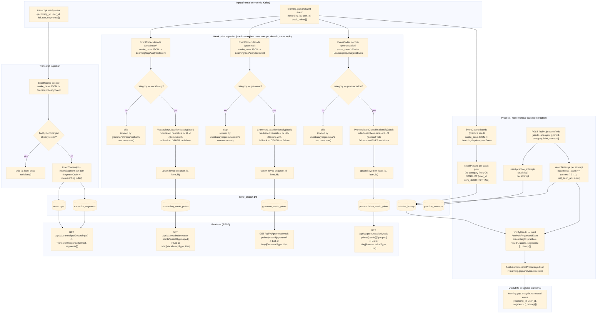

# english-service — Data Flow

Focuses on **what happens to the data** (transformations, formats, storage) as it moves through
`english-service`'s three analysis domains — `vocabulary`, `grammar`, `pronunciation` — plus the
cross-cutting `practice` (redo-exercise) package, as opposed to the sequence diagrams in
[../sequence/English_service/](../sequence/English_service/) which focus on call order between
components. Only `vocabulary` ingests `transcript.ready`; `grammar` and `pronunciation` each run
their own weak-point ingestion off the same `learning.gap.analyzed` event, filtered to their own
`category`, on their own Kafka `groupId`. `practice` also consumes `learning.gap.analyzed` (no
category filter, to seed `mistake_history`) and is the first component in `english-service` to
*produce* a Kafka event, `learning.gap.analysis.requested`, once a learner redoes an exercise.

## Data shape at each stage

| Stage | Format | Notes |
|---|---|---|
| `TranscriptReadyEvent` | `{recordingId, userId, fullText, segments: [{speaker, text, startSeconds, endSeconds, language}]}` | decoded from ai-service's snake_case JSON via `EventCodec` |
| `transcripts` row | `{id, recording_id, user_id, full_text}` | one row per recording, idempotent on `recording_id` |
| `transcript_segments` rows | `{id, transcript_id, speaker, content, start_seconds, end_seconds, segment_order, language}` | one row per segment, ordered; `language` (`V4__transcript_segment_language.sql`) is per-segment since ai-service auto-detects each diarized speaker turn's language independently |
| `LearningGapAnalyzedEvent` | `{recordingId, userId, weakPoints: [{itemId, category, label, forgettingScore, recommendation}]}` | covers all categories; each domain's own consumer keeps only its matching category and discards the rest — its own copy of the DTO lives in that domain's `event` package |
| `vocabulary_weak_points` row | `{id, recording_id, user_id, item_id, label, vocabulary_type, forgetting_score, recommendation, updated_at}` | upserted on `(user_id, item_id)` — re-analysis updates score in place instead of duplicating |
| `VocabularyType` | enum `NOUN, VERB, ADJECTIVE, ADVERB, PHRASAL_VERB, COLLOCATION, IDIOM, OTHER` | assigned by `VocabularyClassifier` |
| `grammar_weak_points` row | `{id, recording_id, user_id, item_id, label, grammar_type, forgetting_score, recommendation, updated_at}` | upserted on `(user_id, item_id)`, same shape as vocabulary's table |
| `GrammarType` | enum `TENSE, SUBJECT_VERB_AGREEMENT, ARTICLE, PREPOSITION, WORD_ORDER, PLURAL, PUNCTUATION, OTHER` | assigned by `GrammarClassifier` |
| `pronunciation_weak_points` row | `{id, recording_id, user_id, item_id, label, pronunciation_type, forgetting_score, recommendation, updated_at}` | upserted on `(user_id, item_id)`, same shape as vocabulary's table |
| `PronunciationType` | enum `VOWEL, CONSONANT, STRESS, INTONATION, LINKING, RHYTHM, OTHER` | assigned by `PronunciationClassifier` |
| `PracticeRedoRequest` | `{userId, attempts: [{itemId, category, label, correct}]}` | REST request body, not an event |
| `practice_attempts` row | `{id, user_id, item_id, category, label, is_correct, attempted_at}` | audit-log insert only, never read back by the scoring pipeline |
| `mistake_history` row | `{id, user_id, item_id, category, label, occurrence_count, last_seen_at, updated_at}` | upserted on `(user_id, item_id)`; seeded (`occurrence_count=1`) on first sighting, then only `occurrence_count`/`last_seen_at` change, on a redo attempt |
| `AnalysisRequestedEvent` | `{recordingId: "practice-<uuid>", userId, segments: [], history: [{itemId, category, label, occurrenceCount, lastSeenDaysAgo}]}` | built from the learner's full current `mistake_history`, not just the items just redone; `lastSeenDaysAgo` computed as `Duration.between(lastSeenAt, now)` in days |

## Where data comes from / where it can go next

- Both input events are published by `ai-service` — see
  [../flow/ai-service-data-flow.md](ai-service-data-flow.md) for how that data was produced (S3 ->
  Whisper -> pyannote -> `RuleBasedAnalyzer`).
- `english-service` now does produce one Kafka event: `learning.gap.analysis.requested`, published by
  `practice.kafka.AnalysisRequestedProducer` after a redo-exercise submission. `vocabulary.analyzed`/
  `grammar.analyzed`/`pronunciation.analyzed` topic constants still exist with no producer.
- `grammar` and `pronunciation` don't re-ingest `transcript.ready`: the `transcripts`/
  `transcript_segments` tables are written once by `vocabulary`'s consumer and read back by all
  three domains via `GET /api/v1/transcripts/{recordingId}`.
- All four `learning.gap.analyzed` consumers (three domains + `practice`'s seed consumer) share the
  same topic but run on distinct Kafka `groupId`s (`english-service`, `english-service-grammar`,
  `english-service-pronunciation`, `english-service-practice`) so each receives every message rather
  than Kafka splitting partitions across them.
- `practice`'s consumer only *seeds* `mistake_history` (a no-op if the item already has history) —
  the `occurrence_count`/`last_seen_at` values that actually drive re-scoring only change when a
  learner submits `POST /api/v1/practice/redo`, so replaying old `learning.gap.analyzed` messages
  can never inflate a learner's mistake count.
- `learning.gap.analysis.requested`'s consumer (`ai-service`) and the resulting
  `learning.gap.analyzed` republish are documented in
  [../flow/ai-service-data-flow.md](ai-service-data-flow.md) — this file stops at the point the event
  is published, since ai-service's processing of it is unchanged by `practice`'s existence.
