# english-service — Data Flow

Focuses on **what happens to the data** (transformations, formats, storage) as it moves through
`english-service`'s three analysis domains — `vocabulary`, `grammar`, `pronunciation` — plus the
cross-cutting `practice` (redo-exercise) and `dictation` (listen-and-type practice) packages, as
opposed to the sequence diagrams in [../sequence/English_service/](../sequence/English_service/)
which focus on call order between components. Only `vocabulary` ingests `transcript.ready`; `grammar`
and `pronunciation` each run their own weak-point ingestion off the same `learning.gap.analyzed`
event, filtered to their own `category`, on their own Kafka `groupId`. `practice` also consumes
`learning.gap.analyzed` (no category filter, to seed `mistake_history`) and is the first component in
`english-service` to *produce* a Kafka event, `learning.gap.analysis.requested`, once a learner redoes
an exercise. `dictation` is pull-based, not event-driven: it reads `vocabulary`/`grammar`'s weak-point
tables in-process to pick sentences, calls out to an LLM and Google Cloud TTS, and stores generated
audio in S3/MinIO.

```mermaid
---
config:
  theme: base
  themeVariables:
    background: '#ffffff'
---
flowchart TD
    subgraph Input["Input (from ai-service via Kafka)"]
        TREvent["transcript.ready event<br/>{recording_id, user_id, full_text, segments[]}"]
        LGAEvent["learning.gap.analyzed event<br/>{recording_id, user_id, weak_points[]}"]
    end

    subgraph TranscriptFlow["Transcript ingestion"]
        Decode1["EventCodec decode<br/>snake_case JSON -> TranscriptReadyEvent"]
        Idem1{"findByRecordingId<br/>already exists?"}
        Skip1["skip (at-least-once redelivery)"]
        Insert1["insertTranscript + insertSegment per item<br/>(segmentOrder = incrementing index)"]
    end

    subgraph WeakPointFlow["Weak point ingestion (one independent consumer per domain, same topic)"]
        Decode2V["EventCodec decode (vocabulary)<br/>snake_case JSON -> LearningGapAnalyzedEvent"]
        FilterV{"category == vocabulary?"}
        DiscardV["skip<br/>(owned by grammar's/pronunciation's own consumer)"]
        ClassifyV["VocabularyClassifier.classify(label)<br/>rule-based heuristics, or LLM (Gemini) with<br/>fallback to OTHER on failure"]
        UpsertV["upsert keyed on (user_id, item_id)"]

        Decode2G["EventCodec decode (grammar)<br/>snake_case JSON -> LearningGapAnalyzedEvent"]
        FilterG{"category == grammar?"}
        DiscardG["skip<br/>(owned by vocabulary's/pronunciation's own consumer)"]
        ClassifyG["GrammarClassifier.classify(label)<br/>rule-based heuristics, or LLM (Gemini) with<br/>fallback to OTHER on failure"]
        UpsertG["upsert keyed on (user_id, item_id)"]

        Decode2P["EventCodec decode (pronunciation)<br/>snake_case JSON -> LearningGapAnalyzedEvent"]
        FilterP{"category == pronunciation?"}
        DiscardP["skip<br/>(owned by vocabulary's/grammar's own consumer)"]
        ClassifyP["PronunciationClassifier.classify(label)<br/>rule-based heuristics, or LLM (Gemini) with<br/>fallback to OTHER on failure"]
        UpsertP["upsert keyed on (user_id, item_id)"]
    end

    subgraph PracticeFlow["Practice / redo-exercise (package practice)"]
        Decode2Pr["EventCodec decode (practice seed)<br/>snake_case JSON -> LearningGapAnalyzedEvent"]
        SeedPr["seedIfAbsent per weak point<br/>(no category filter; ON CONFLICT (user_id, item_id) DO NOTHING)"]

        RedoReq["POST /api/v1/practice/redo<br/>{userId, attempts: [{itemId, category, label, correct}]}"]
        LogAttempt["insert practice_attempts (audit log)<br/>per attempt"]
        LockPrior["findOneForUpdate (SELECT ... FOR UPDATE)<br/>read scoring state BEFORE this attempt"]
        RecordAttempt["recordAttempt per attempt<br/>occurrence_count += (correct ? 0 : 1), last_seen_at = now()"]
        ScoreEngine["common.scoring.WeakPointScoringEngine<br/>forgetting (adaptive half-life) x (1-mastery, BKT)<br/>x difficultyWeight (Rasch) x recurrenceBoost"]
        UpdateState["updateScoringState + item_difficulty_stats upsertIncrement"]
        DispatchDomain["dispatch to owning domain's<br/>applyJavaComputedScore (scoreSource=JAVA_ENGINE)"]
        BuildHistory["findByUserId -> build AnalysisRequestedEvent<br/>{recordingId: practice-&lt;uuid&gt;, userId, segments: [], history[]}"]
        PublishAR["AnalysisRequestedProducer.publish<br/>-> learning.gap.analysis.requested"]
        RevQueue["GET /api/v1/practice/review-queue/{userId}<br/>findDueForReview(userId, now)"]
    end

    subgraph DictationFlow["Dictation (package dictation, pull-based; grading feeds the Kafka pipeline)"]
        ImportLib["DictationLibraryImporter (startup)<br/>StorageClient.list/read -> upsertClip per real audio clip<br/>taxonomy: skill/level(CEFR)/topic/examType from folder+filename"]
        SessionReq["POST /api/v1/dictation/sessions/{userId}<br/>{skill?, level?, topic?, examType?, count}"]
        PickClips["findRandomClipsByFacets -> List[DictationClipDto] (no script)"]
        StreamAudio["GET /clips/{id}/audio -> StorageClient.read stream (mp3/wav)"]

        AttemptReq["POST /api/v1/dictation/attempts<br/>{userId, clipId? | practiceItemId?, userTranscript}"]
        ScoreDictation["DictationScorer.score(referenceText, userTranscript)<br/>word-level Levenshtein -> WER"]
        InsertAttempt["insertAttempt + insertMisses (missing/substituted words)"]
        Analyze["DictationAnalyzer.analyzeAttempt<br/>rule-based, or Gemini -> suggestions + practice sentences"]
        PublishGap["DictationGapEventPublisher -> learning.gap.analyzed<br/>(missed words as vocabulary weak points)"]

        AiGen["POST /ai-practice/{userId}/generate<br/>top missed words -> Gemini sentences -> Supertonic (ai-service) -> StorageClient.write"]
    end

    subgraph Storage["reme_english DB"]
        T1[("transcripts")]
        T2[("transcript_segments")]
        T3[("vocabulary_weak_points")]
        T4[("grammar_weak_points")]
        T5[("pronunciation_weak_points")]
        T6[("mistake_history")]
        T7[("practice_attempts")]
        T8[("item_difficulty_stats")]
        T9[("dictation_clips")]
        T10[("dictation_misses")]
        T11[("dictation_attempts")]
        T12[("dictation_practice_items")]
    end

    subgraph ReadOut["Read-out (REST)"]
        GetTranscript["GET /api/v1/transcripts/{recordingId}<br/>-> TranscriptResponse{fullText, segments[]}"]
        GetWeakV["GET /api/v1/vocabulary/weak-points/{userId}[/grouped]<br/>-> List or Map[VocabularyType, List]"]
        GetWeakG["GET /api/v1/grammar/weak-points/{userId}[/grouped]<br/>-> List or Map[GrammarType, List]"]
        GetWeakP["GET /api/v1/pronunciation/weak-points/{userId}[/grouped]<br/>-> List or Map[PronunciationType, List]"]
        GetDictationHistory["GET /api/v1/dictation/history/{userId}<br/>-> List[DictationHistoryEntryDto], newest first"]
    end

    subgraph Output["Output (to ai-service via Kafka)"]
        AREvent["learning.gap.analysis.requested event<br/>{recording_id, user_id, segments: [], history[]}"]
    end

    TREvent --> Decode1 --> Idem1
    Idem1 -->|yes| Skip1
    Idem1 -->|no| Insert1
    Insert1 --> T1
    Insert1 --> T2

    LGAEvent --> Decode2V --> FilterV
    FilterV -->|no| DiscardV
    FilterV -->|yes| ClassifyV
    ClassifyV --> UpsertV
    UpsertV --> T3

    LGAEvent --> Decode2G --> FilterG
    FilterG -->|no| DiscardG
    FilterG -->|yes| ClassifyG
    ClassifyG --> UpsertG
    UpsertG --> T4

    LGAEvent --> Decode2P --> FilterP
    FilterP -->|no| DiscardP
    FilterP -->|yes| ClassifyP
    ClassifyP --> UpsertP
    UpsertP --> T5

    LGAEvent --> Decode2Pr --> SeedPr --> T6

    RedoReq --> LogAttempt --> T7
    RedoReq --> LockPrior --> T6
    LockPrior --> RecordAttempt --> T6
    RecordAttempt --> ScoreEngine
    T8 --> ScoreEngine
    ScoreEngine --> UpdateState --> T6
    UpdateState --> T8
    ScoreEngine --> DispatchDomain
    DispatchDomain -->|category=vocabulary| T3
    DispatchDomain -->|category=grammar| T4
    DispatchDomain -->|category=pronunciation| T5
    RecordAttempt --> BuildHistory
    T6 --> BuildHistory
    BuildHistory --> PublishAR --> AREvent
    T6 --> RevQueue

    T1 --> GetTranscript
    T2 --> GetTranscript
    T3 --> GetWeakV
    T4 --> GetWeakG
    T5 --> GetWeakP

    ImportLib --> T9
    SessionReq --> PickClips
    T9 --> PickClips
    T9 --> StreamAudio

    AttemptReq --> ScoreDictation
    T9 --> ScoreDictation
    T12 --> ScoreDictation
    ScoreDictation --> InsertAttempt --> T11
    InsertAttempt --> T10
    InsertAttempt --> Analyze --> T12
    Analyze --> PublishGap
    T11 --> GetDictationHistory
    T9 --> GetDictationHistory

    T10 --> AiGen
    AiGen --> T12
```

## Data shape at each stage

| Stage | Format | Notes |
|---|---|---|
| `TranscriptReadyEvent` | `{recordingId, userId, fullText, segments: [{speaker, text, startSeconds, endSeconds, language}]}` | decoded from ai-service's snake_case JSON via `EventCodec` |
| `transcripts` row | `{id, recording_id, user_id, full_text}` | one row per recording, idempotent on `recording_id` |
| `transcript_segments` rows | `{id, transcript_id, speaker, content, start_seconds, end_seconds, segment_order, language}` | one row per segment, ordered; `language` (`V4__transcript_segment_language.sql`) is per-segment since ai-service auto-detects each diarized speaker turn's language independently |
| `LearningGapAnalyzedEvent` | `{recordingId, userId, weakPoints: [{itemId, category, label, forgettingScore, recommendation}]}` | covers all categories; each domain's own consumer keeps only its matching category and discards the rest — its own copy of the DTO lives in that domain's `event` package |
| `vocabulary_weak_points` row | `{id, recording_id, user_id, item_id, label, vocabulary_type, forgetting_score, recommendation, mastery_level, next_review_at, score_source, updated_at}` | upserted on `(user_id, item_id)` — re-analysis updates score in place instead of duplicating; `score_source` (`PYTHON_LEGACY`/`JAVA_ENGINE`) guards the upsert so a Kafka-sourced write can't clobber a fresher Java-direct one (see below) |
| `VocabularyType` | enum `NOUN, VERB, ADJECTIVE, ADVERB, PHRASAL_VERB, COLLOCATION, IDIOM, OTHER` | assigned by `VocabularyClassifier` |
| `grammar_weak_points` row | `{id, recording_id, user_id, item_id, label, grammar_type, forgetting_score, recommendation, mastery_level, next_review_at, score_source, updated_at}` | upserted on `(user_id, item_id)`, same shape/guard as vocabulary's table |
| `GrammarType` | enum `TENSE, SUBJECT_VERB_AGREEMENT, ARTICLE, PREPOSITION, WORD_ORDER, PLURAL, PUNCTUATION, OTHER` | assigned by `GrammarClassifier` |
| `pronunciation_weak_points` row | `{id, recording_id, user_id, item_id, label, pronunciation_type, forgetting_score, recommendation, mastery_level, next_review_at, score_source, updated_at}` | upserted on `(user_id, item_id)`, same shape/guard as vocabulary's table |
| `PronunciationType` | enum `VOWEL, CONSONANT, STRESS, INTONATION, LINKING, RHYTHM, OTHER` | assigned by `PronunciationClassifier` |
| `PracticeRedoRequest` | `{userId, attempts: [{itemId, category, label, correct}]}` | REST request body, not an event |
| `practice_attempts` row | `{id, user_id, item_id, category, label, is_correct, attempted_at}` | audit-log insert only, never read back by the scoring pipeline |
| `mistake_history` row | `{id, user_id, item_id, category, label, occurrence_count, last_seen_at, updated_at, ease_factor, half_life_days, mastery, leitner_box, next_review_at, last_weak_score, label_key}` | upserted on `(user_id, item_id)`; `occurrence_count`/`last_seen_at` seeded/updated as before, the scoring-state columns are read (locked via `FOR UPDATE`) then updated by `WeakPointScoringOrchestrator` around each redo attempt |
| `item_difficulty_stats` row | `{category, label_key, correct_count, incorrect_count, updated_at}` | population-level (cross-user) aggregate, keyed `(category, label_key)` — feeds `RaschDifficultyEstimator`'s item-difficulty weight; `label_key` is `LabelKeys.normalize(label)` (trim/collapse-whitespace/lowercase), used because `item_id` isn't a verified cross-user-shared identifier in this system |
| `ScoringResult` (in-memory) | `{weakScore, updatedState: {easeFactor, halfLifeDays, mastery, leitnerBox}, nextReviewAt}` | output of `common.scoring.WeakPointScoringEngine.scoreAfterAttempt`, computed from the item's PRE-attempt state so the same-batch recurrence signal stays meaningful |
| `WeakPointScoreUpdate` (in-memory) | `{recordingId, userId, itemId, category, label, weakScore, masteryLevel, nextReviewAt}` | handed from the orchestrator to whichever domain's `applyJavaComputedScore` owns `category` |
| `AnalysisRequestedEvent` | `{recordingId: "practice-<uuid>", userId, segments: [], history: [{itemId, category, label, occurrenceCount, lastSeenDaysAgo}]}` | built from the learner's full current `mistake_history`, not just the items just redone; `lastSeenDaysAgo` computed as `Duration.between(lastSeenAt, now)` in days; still published so `recommendation-service`/`dashboard-service` stay in sync even though they never see the new Java-direct path |
| `ReviewQueueItem` | `{itemId, category, label, lastWeakScore, nextReviewAt}` | read straight off `mistake_history` where `next_review_at <= now()`, ordered soonest-first — the Leitner schedule surfaced |
| `StartDictationSessionRequest` | `{skill?, level?, topic?, examType?, count}` | REST request body; any null facet is unfiltered on that dimension |
| `dictation_clips` row | `{id, code, title, skill, level, topic, exam_type, script_text, storage_key, source, created_at}` | fixed library clip; `script_text` is never returned by browse/session, only as `referenceText` after grading; upsert-by-`code` |
| `DictationClipDto` | `{clipId, code, title, skill, level, topic, examType, audioUrl}` | REST response for browse/session; omits the script |
| `DictationAttemptRequest` | `{userId, clipId? | practiceItemId?, userTranscript}` | REST request body; exactly one of clipId/practiceItemId |
| `DictationScoreResult` (in-memory) | `{accuracy, wer, diff: [{tag: CORRECT|SUBSTITUTED|MISSING|EXTRA, actualWord, expectedWord}]}` | output of `DictationScorer.score`, a pure word-level Levenshtein alignment |
| `dictation_misses` row | `{id, attempt_id, user_id, clip_id, expected_word, actual_word, tag, created_at}` | one row per wrong word; drives AI analysis + the published forgetting score |
| `dictation_attempts` row | `{id, clip_id?, practice_item_id?, user_id, user_transcript, accuracy, wer, created_at}` | one row per graded submission, full history kept |
| `dictation_practice_items` row | `{id, user_id, sentence_text, source, storage_key?, created_at}` | Gemini practice sentence; `storage_key` set once Supertonic audio synthesized |
| `DictationAttemptResultDto` | `{referenceText, accuracy, wer, diff[], aiSuggestions[], practiceSentences[]}` | REST grading response; only point `script_text` is exposed |
| published `learning.gap.analyzed` | `{recording_id: "dictation-clip-<id>", user_id, weak_points: [{item_id: "dictation:<word>", category: "vocabulary", label, forgetting_score}]}` | dictation misses fed into the existing recommendation pipeline |

## Where data comes from / where it can go next

- Both input events are published by `ai-service` — see
  [../flow/ai-service-data-flow.md](ai-service-data-flow.md) for how that data was produced (S3 ->
  Whisper -> pyannote -> `RuleBasedAnalyzer`).
- `english-service` now does produce one Kafka event: `learning.gap.analysis.requested`, published by
  `practice.kafka.AnalysisRequestedProducer` after a redo-exercise submission. `vocabulary.analyzed`/
  `grammar.analyzed`/`pronunciation.analyzed` topic constants still exist with no producer.
- `grammar` and `pronunciation` don't re-ingest `transcript.ready`: the `transcripts`/
  `transcript_segments` tables are written once by `vocabulary`'s consumer and read back by all
  three domains via `GET /api/v1/transcripts/{recordingId}`.
- All four `learning.gap.analyzed` consumers (three domains + `practice`'s seed consumer) share the
  same topic but run on distinct Kafka `groupId`s (`english-service`, `english-service-grammar`,
  `english-service-pronunciation`, `english-service-practice`) so each receives every message rather
  than Kafka splitting partitions across them.
- `practice`'s consumer only *seeds* `mistake_history` (a no-op if the item already has history) —
  the `occurrence_count`/`last_seen_at` values that actually drive re-scoring only change when a
  learner submits `POST /api/v1/practice/redo`, so replaying old `learning.gap.analyzed` messages
  can never inflate a learner's mistake count.
- `learning.gap.analysis.requested`'s consumer (`ai-service`) and the resulting
  `learning.gap.analyzed` republish are documented in
  [../flow/ai-service-data-flow.md](ai-service-data-flow.md) — this file stops at the point the event
  is published, since ai-service's processing of it is unchanged by `practice`'s existence.
- **New in this update:** the redo flow no longer only round-trips through Kafka for a fresh score.
  `WeakPointScoringOrchestratorImpl` computes one directly, in Java, per attempt, via
  `common.scoring.WeakPointScoringEngine` — combining an adaptive-half-life generalization of the
  Ebbinghaus decay, a Bayesian Knowledge Tracing mastery estimate, and a Rasch-style
  population-level difficulty weight, plus a same-batch recurrence boost — and writes the result
  straight into the owning domain's weak-point table with `score_source = JAVA_ENGINE`. The
  ai-service round-trip is kept (unchanged formula, still `occurrence_count x forgetting`) purely so
  `recommendation-service`/`dashboard-service` still learn about the update; a `score_source` guard
  on each domain's `upsert` (`WHERE NOT (existing = JAVA_ENGINE AND incoming = PYTHON_LEGACY)`) stops
  that slower, older-formula write from clobbering the fresher one. Full rationale and formula in
  `Business.md` §10 (both copies) and the class docs under
  `RemeLearning/common/src/main/java/com/remelearning/common/scoring/`.
- **`dictation` (redesigned).** Two sections over one grading flow: a **fixed library** of real
  recorded clips (imported from disk/cloud via `common.storage.StorageClient` into `dictation_clips`,
  tagged skill/level/topic/examType) and **"Luyện nghe với AI"** (Gemini sentences voiced by
  **Supertonic** in ai-service). The request flow is pull-based (FE → bff → REST), but grading
  (`POST /attempts`) now **publishes `learning.gap.analyzed`** so misses reach the existing
  recommendation pipeline — the one point this flow re-enters Kafka. Outbound calls: `StorageClient`
  (local FS/S3) for clip + generated audio, HTTP to ai-service for TTS, and optional Gemini for the
  analysis. Grading itself (`DictationScorer`) is still a pure in-memory function.
