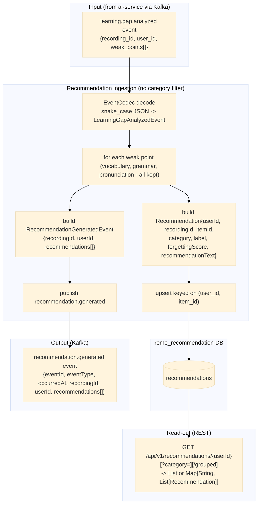

# recommendation-service — Data Flow

Focuses on **what happens to the data** (transformations, formats, storage) as it moves through
`recommendation-service`, as opposed to the sequence diagrams in
[../sequence/Recommendation_service/](../sequence/Recommendation_service/) which focus on call
order between components. `recommendation-service` consumes the same `learning.gap.analyzed` event
as `english-service`'s `vocabulary`/`grammar`/`pronunciation` domains (see
[english-service-data-flow.md](english-service-data-flow.md)), but does not filter by category —
every weak point becomes a recommendation row — and it is the only service that publishes
`recommendation.generated`.

## Data shape at each stage

| Stage | Format | Notes |
|---|---|---|
| `LearningGapAnalyzedEvent` | `{recordingId, userId, weakPoints: [{itemId, category, label, forgettingScore, recommendation}]}` | decoded from ai-service's snake_case JSON via `EventCodec`; same shape english-service consumes, own copy of the DTO in `recommendation.event` |
| `recommendations` row | `{id, user_id, recording_id, item_id, category, label, forgetting_score, recommendation_text, updated_at}` | upserted on `(user_id, item_id)` — re-analysis updates score in place instead of duplicating; one row per weak point regardless of category |
| `RecommendationGeneratedEvent` | `{eventId, eventType: "recommendation.generated", occurredAt, recordingId, userId, recommendations: [{itemId, category, label, recommendationText, forgettingScore}]}` | extends `common`'s `BaseEvent`; published once per `learning.gap.analyzed` batch, after all rows in that batch are upserted |
| REST response (`GET /api/v1/recommendations/{userId}`) | `ApiResponse<List<Recommendation>>` or, for `/grouped`, `ApiResponse<Map<String, List<Recommendation>>>` keyed by `category` | camelCase JSON via the app's default Jackson config (distinct from `EventCodec`'s snake_case mapper used only for decoding Kafka input) |

## Where data comes from / where it can go next

- `learning.gap.analyzed` is published by `ai-service` — see
  [ai-service-data-flow.md](ai-service-data-flow.md) for how that data was produced (S3 -> Whisper ->
  pyannote -> `RuleBasedAnalyzer`).
- `recommendation-service` is the first producer of `recommendation.generated` (topic constant
  already existed in `KafkaTopics.java`, unused until now); no consumer exists for it yet — a future
  notification or exercise-generation service is expected to pick it up.
- Unlike `english-service`, which discards weak points outside a domain's own category,
  `recommendation-service` keeps all of them — it aggregates across domains instead of specializing
  in one, and does not run any classifier (no vocabulary/grammar/pronunciation type assignment).
