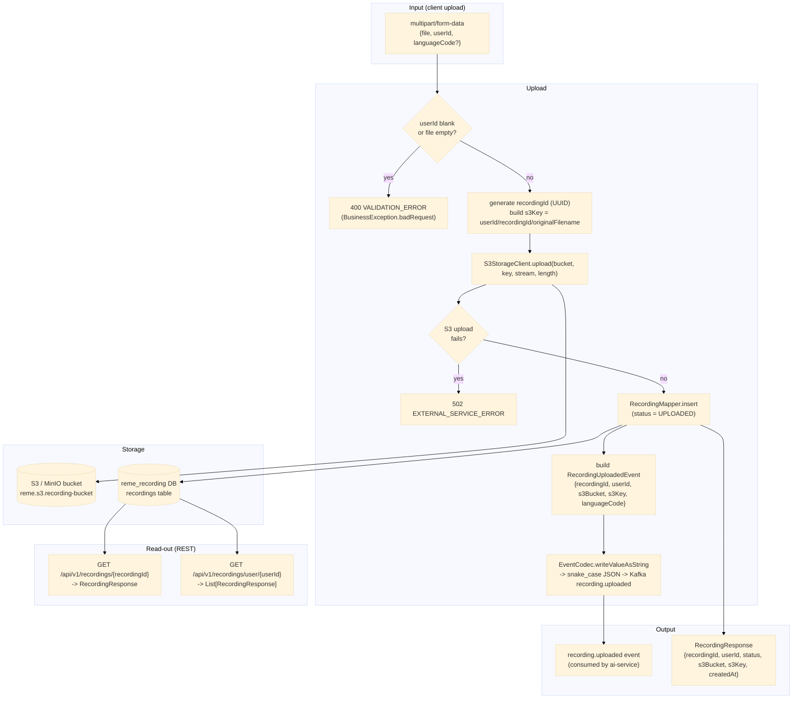

# recording-service — Data Flow

Focuses on **what happens to the data** (transformations, formats, storage) as it moves through
`recording-service`, as opposed to the sequence diagrams in
[../sequence/Recording_service/](../sequence/Recording_service/) which focus on call order between
components.

## Data shape at each stage

| Stage | Format | Notes |
|---|---|---|
| Multipart request | `{file (binary), userId, languageCode?}` | `languageCode` defaults to `"en"` when absent/blank |
| S3 object | raw file bytes | key = `{userId}/{recordingId}/{originalFilename}`, bucket = `reme.s3.recording-bucket` (env `S3_RECORDING_BUCKET`, default `reme-recordings`) |
| `recordings` row | `{id, recording_id, user_id, s3_bucket, s3_key, language_code, original_filename, content_type, status, created_at}` | `status` fixed to `UPLOADED` on insert; no update path today |
| `RecordingUploadedEvent` | `{recordingId, userId, s3Bucket, s3Key, languageCode}` (Java, camelCase) | serialized via `EventCodec` (snake_case `ObjectMapper`) before publishing |
| `recording.uploaded` Kafka payload | `{recording_id, user_id, s3_bucket, s3_key, language_code}` (snake_case JSON) | matches `ai-service`'s pydantic `RecordingUploadedEvent` exactly, no envelope |
| `RecordingResponse` | `{recordingId, userId, status, s3Bucket, s3Key, createdAt}` | returned by all three REST endpoints; omits `originalFilename`/`contentType` |

## Where data comes from / where it can go next

- Input is a direct client multipart upload — no upstream Kafka event feeds this service.
- `recording.uploaded` is consumed by `ai-service`, which downloads the file from S3 and runs
  STT + diarization — see [ai-service-data-flow.md](ai-service-data-flow.md) and
  [../sequence/Ai_service/overview.md](../sequence/Ai_service/overview.md) for what happens next.
- `recording_id` (the UUID generated here) is the correlation key threaded through the rest of the
  pipeline: `ai-service`'s `transcript.ready`/`learning.gap.analyzed` events and `english-service`'s
  `transcripts`/`*_weak_points` tables all key off the same value.
