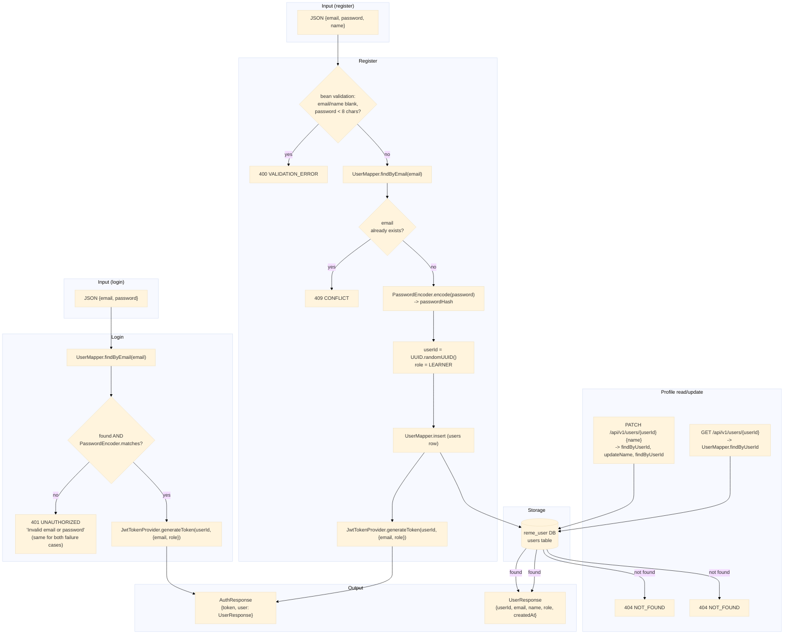

# user-service — Data Flow

Focuses on **what happens to the data** (transformations, formats, storage) as it moves through
`user-service`, as opposed to the sequence diagrams in
[../sequence/User_service/](../sequence/User_service/) which focus on call order between
components.

## Data shape at each stage

| Stage | Format | Notes |
|---|---|---|
| `RegisterRequest` (JSON in) | `{email, password, name}` | `password` min 8 chars, never persisted raw |
| `LoginRequest` (JSON in) | `{email, password}` | |
| `users` row | `{id, user_id, email, password_hash, name, role, created_at, updated_at}` | `role` defaults to `LEARNER`; `password_hash` is BCrypt output, never returned |
| JWT | HMAC-signed, `subject = userId`, claims `{email, role}`, expires after `reme.jwt.expiration-minutes` (default 60) | issued by `common`'s `JwtTokenProvider`; nothing validates it yet anywhere in the repo |
| `AuthResponse` (JSON out) | `{token, user: UserResponse}` | returned by both register and login |
| `UpdateProfileRequest` (JSON in) | `{name}` | only field mutable today |
| `UserResponse` (JSON out) | `{userId, email, name, role, createdAt}` | never includes `password`/`passwordHash`; returned by register, login, get-profile, update-profile |

## Where data comes from / where it can go next

- Input is a direct client REST call — no upstream Kafka event feeds this service, and it has no
  Kafka producer of its own yet (unlike `recording-service`'s `recording.uploaded`).
- `userId` (the UUID generated at registration) is the identifier other services will eventually
  correlate against — `recording-service`'s `recordings.user_id` and `english-service`'s
  `*_weak_points.user_id` already use free-form string user ids of the same shape, so this
  service's `userId` is the natural source of truth for that value once wiring is added.
- The issued JWT is not yet consumed anywhere: no service (including `user-service` itself) has a
  `SecurityConfig`/filter that validates it on incoming requests. It exists purely so a future
  auth-enforcement pass has something to validate against.
