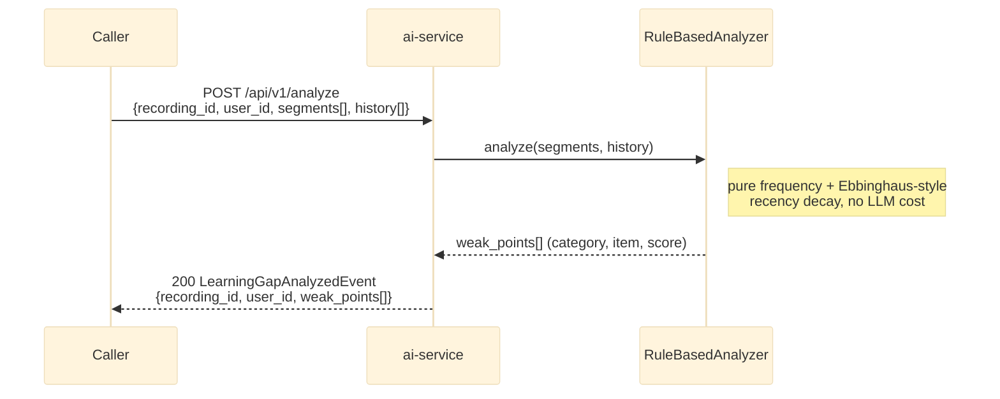

# POST /api/v1/analyze

Synchronous forgetting-pattern analysis for manual re-runs (the main pipeline uses Kafka's
`learning.gap.analysis.requested` -> `learning.gap.analyzed` instead — see
[overview.md](overview.md)). See `app/api/routes.py::analyze`.

## External calls

None — `RuleBasedAnalyzer` is a pure in-memory computation (frequency + recency decay), no
DB/S3/Kafka/LLM calls.

## Notes

- `RuleBasedAnalyzer` implements the `MistakeAnalyzer` ABC (`app/analysis/base.py`) — swappable for an
  LLM-backed analyzer later without touching this route or the Kafka handler.
- `weak_points` covers all categories (grammar/vocabulary/pronunciation); only `english-service`'s
  `vocabulary` domain currently persists them (filters `category == "vocabulary"`), the other two are
  received and discarded until their domains are built out.
