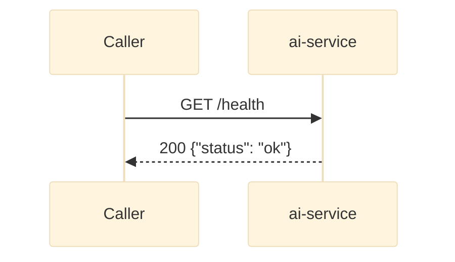

# GET /health

Liveness check, no dependencies. See `app/api/routes.py`.

```mermaid
---
config:
  theme: base
  themeVariables:
    background: '#ffffff'
---
sequenceDiagram
    participant Caller
    participant AI as ai-service

    Caller->>AI: GET /health
    AI-->>Caller: 200 {"status": "ok"}
```
