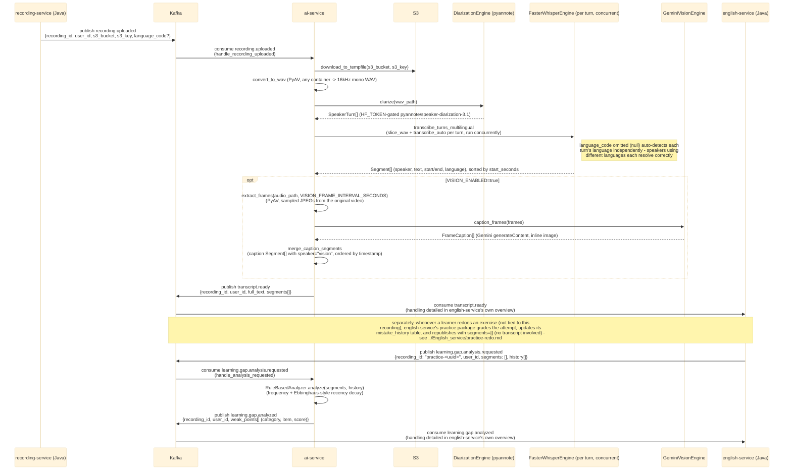
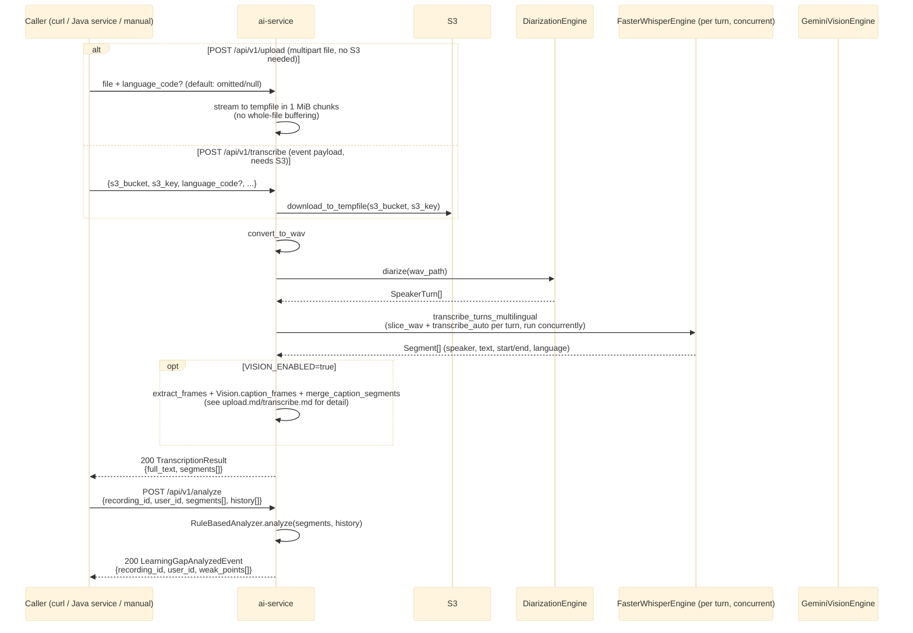

# ai-service — Overview

`ai-service` (Python/FastAPI) exposes the same two processing stages — **STT + diarization** and
**forgetting-pattern analysis** — through two parallel entry points: the async Kafka pipeline (used
when `KAFKA_ENABLED=true`) and synchronous REST endpoints (always available, for manual calls or
environments without Kafka/S3 wired up yet). See `RemeLearning/services/ai-service/app/main.py`,
`app/kafka/handlers/`, and `app/api/routes.py`.

This file covers `ai-service`'s own internals only. The Kafka topics it publishes to
(`transcript.ready`, `learning.gap.analyzed`) are consumed downstream by `english-service` — for
that side's internal handling, see
[../English_service/overview.md](../English_service/overview.md). Per-endpoint detail lives in
[health.md](health.md), [upload.md](upload.md), [transcribe.md](transcribe.md),
[analyze.md](analyze.md), [enroll-face.md](enroll-face.md).

Two more optional stages, gated by feature flags, now run after diarization in all three entry
points (Kafka handler, `/api/v1/upload`, `/api/v1/transcribe`): **face recognition**
(`FACE_RECOGNITION_ENABLED`, `app/face/`) matches faces sampled per diarized speaker turn against
photos enrolled from `user-service` (see [enroll-face.md](enroll-face.md)), and **voice
authenticity** (`VOICE_AUTHENTICITY_ENABLED`, `app/voice_auth/`) heuristically flags each speaker
turn as human/synthetic/uncertain. Both persist to a new dedicated database, `reme_ai` (schema
`ai`), and are deliberately **not** added to the `transcript.ready` Kafka payload - see
[../../flow/ai-service-data-flow.md](../../flow/ai-service-data-flow.md) for the full rationale and
data shapes.

## 1. Kafka event-driven pipeline

## 2. Synchronous REST fallback

Used when Kafka/S3 aren't available, or for ad-hoc/manual testing (e.g. via `curl` or Swagger UI at
`/docs`). Same underlying engines as the Kafka path, no event envelope.

## Notes

- `KAFKA_ENABLED` (`app/config.py`) defaults to `false`; with it `false`, only the REST endpoints run
  and the two consumer tasks in `app/main.py`'s lifespan never start.
- The Kafka payloads (`app/schemas/events.py`) are plain pydantic models with **snake_case** JSON keys
  (`event.model_dump()`, no `BaseEvent` envelope) — Java consumers decode via a dedicated snake_case
  mapper (`english-service`'s `EventCodec`), not the default camelCase Jackson config.
- Diarization requires `HF_TOKEN` (HuggingFace token with access to
  `pyannote/speaker-diarization-3.1`) set in `ai-service/.env`.
- Both the Kafka path and the REST fallback diarize first, then transcribe each speaker turn
  concurrently (`app/stt/pipeline.py::transcribe_turns_multilingual`, worker count via
  `STT_MAX_CONCURRENT_TRANSCRIPTIONS`, default 4). `language_code` omitted/null (the default)
  auto-detects each turn's language independently, so a recording with speakers using different
  languages is analyzed correctly; an explicit `language_code` forces that language across every
  turn instead. Every `Segment` now carries the language used for that segment.
- `VISION_ENABLED` (`app/config.py`, default `false`) gates an optional frame-captioning step
  (`app/vision/`): sampled video frames are captioned by Gemini vision and merged into
  `segments` as `speaker == "vision"` entries, so recurring-vocabulary analysis can also draw
  on on-screen text/objects, not just spoken words. Requires `GEMINI_API_KEY`.
- `english-service` consumes both `transcript.ready` (`vocabulary` domain only) and
  `learning.gap.analyzed` (all three analysis domains, plus a fourth consumer in its `practice`
  package that seeds mistake history) — see
  [../English_service/overview.md](../English_service/overview.md) for how it handles them.
- `learning.gap.analysis.requested` now has a real producer: `english-service`'s `practice` package,
  triggered by a learner redoing an exercise (`POST /api/v1/practice/redo`) rather than by a fresh
  recording — see [../English_service/practice-redo.md](../English_service/practice-redo.md).
