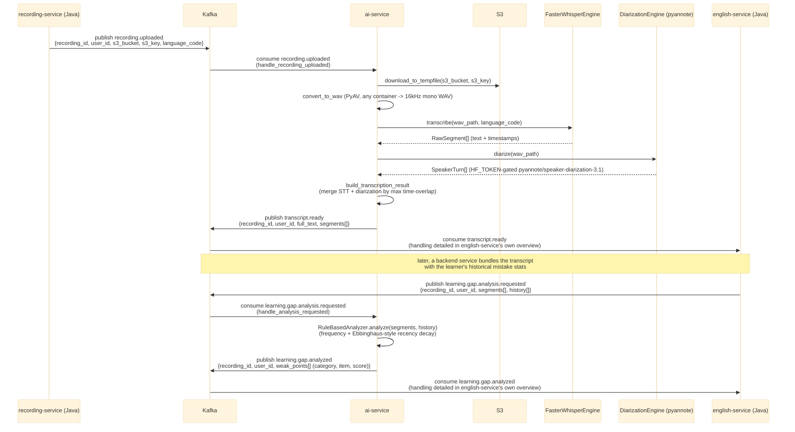
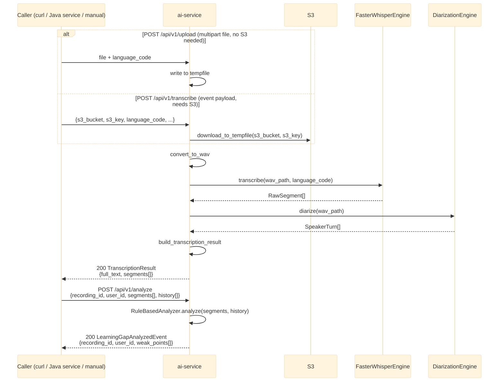

# ai-service — Overview

`ai-service` (Python/FastAPI) exposes the same two processing stages — **STT + diarization** and
**forgetting-pattern analysis** — through two parallel entry points: the async Kafka pipeline (used
when `KAFKA_ENABLED=true`) and synchronous REST endpoints (always available, for manual calls or
environments without Kafka/S3 wired up yet). See `RemeLearning/services/ai-service/app/main.py`,
`app/kafka/handlers/`, and `app/api/routes.py`.

This file covers `ai-service`'s own internals only. The Kafka topics it publishes to
(`transcript.ready`, `learning.gap.analyzed`) are consumed downstream by `english-service` — for
that side's internal handling, see
[../English_service/overview.md](../English_service/overview.md). Per-endpoint detail lives in
[health.md](health.md), [upload.md](upload.md), [transcribe.md](transcribe.md),
[analyze.md](analyze.md).

## 1. Kafka event-driven pipeline

## 2. Synchronous REST fallback

Used when Kafka/S3 aren't available, or for ad-hoc/manual testing (e.g. via `curl` or Swagger UI at
`/docs`). Same underlying engines as the Kafka path, no event envelope.

## Notes

- `KAFKA_ENABLED` (`app/config.py`) defaults to `false`; with it `false`, only the REST endpoints run
  and the two consumer tasks in `app/main.py`'s lifespan never start.
- The Kafka payloads (`app/schemas/events.py`) are plain pydantic models with **snake_case** JSON keys
  (`event.model_dump()`, no `BaseEvent` envelope) — Java consumers decode via a dedicated snake_case
  mapper (`english-service`'s `EventCodec`), not the default camelCase Jackson config.
- Diarization requires `HF_TOKEN` (HuggingFace token with access to
  `pyannote/speaker-diarization-3.1`) set in `ai-service/.env`.
- `english-service` (`vocabulary` domain) is currently the only Java-side consumer of
  `transcript.ready` / `learning.gap.analyzed` — see
  [../English_service/overview.md](../English_service/overview.md) for how it handles them.
