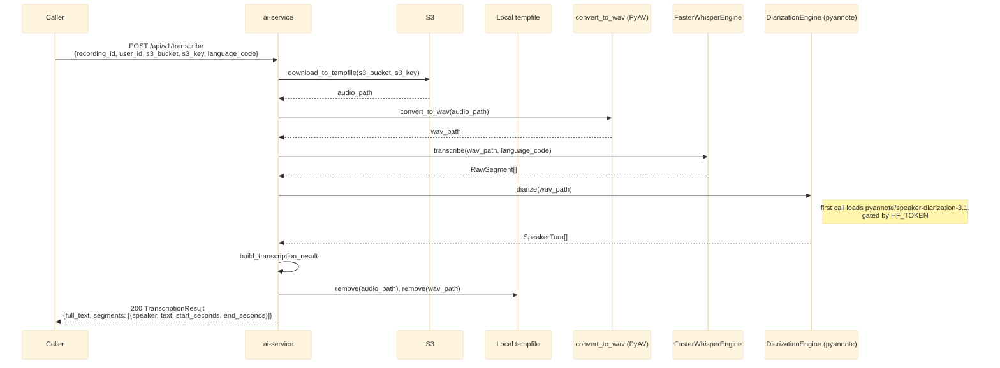

# POST /api/v1/transcribe

Synchronous STT + diarization for manual/ad-hoc calls (the main pipeline uses Kafka's
`recording.uploaded` -> `transcript.ready` instead — see
[overview.md](overview.md)). Takes the same event shape as
`RecordingUploadedEvent`, but downloads from S3 and returns the result directly instead of
publishing it. See `app/api/routes.py::transcribe`.

## External calls

| # | Call | From -> To | Notes |
|---|------|-----------|-------|
| 1 | S3 GetObject | ai-service -> S3/MinIO | requires `S3_ENDPOINT`/`S3_ACCESS_KEY`/`S3_SECRET_KEY` |
| 2 | HuggingFace Hub download | ai-service -> huggingface.co | diarization model, requires `HF_TOKEN`; cached after first call |

## Notes

- Requires S3 env vars (`S3_ENDPOINT`/`S3_ACCESS_KEY`/`S3_SECRET_KEY`) to actually be reachable —
  unlike `/api/v1/upload`, which needs no S3 at all.
- Request/response schemas mirror the Kafka `recording.uploaded` / `transcript.ready` events
  (`app/schemas/events.py`), snake_case JSON keys.
