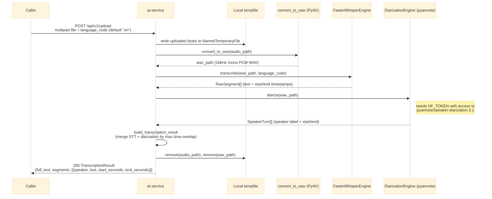

# POST /api/v1/upload

Accepts a video/audio file directly (`multipart/form-data`) and runs STT + diarization
synchronously. For environments without Kafka/S3 wired up yet — the Java side (or a manual caller)
sends the raw file instead of publishing `recording.uploaded`. See `app/api/routes.py::upload`.

## External calls

| # | Call | From -> To | Notes |
|---|------|-----------|-------|
| 1 | HuggingFace Hub download | ai-service -> huggingface.co | diarization model, requires `HF_TOKEN`; cached after first call, no S3/Kafka involved |

## Notes

- No S3 or Kafka dependency — the only synchronous entry point that works with just a file in hand.
- Temp files are always cleaned up in a `finally` block, even if transcription/diarization raises.
