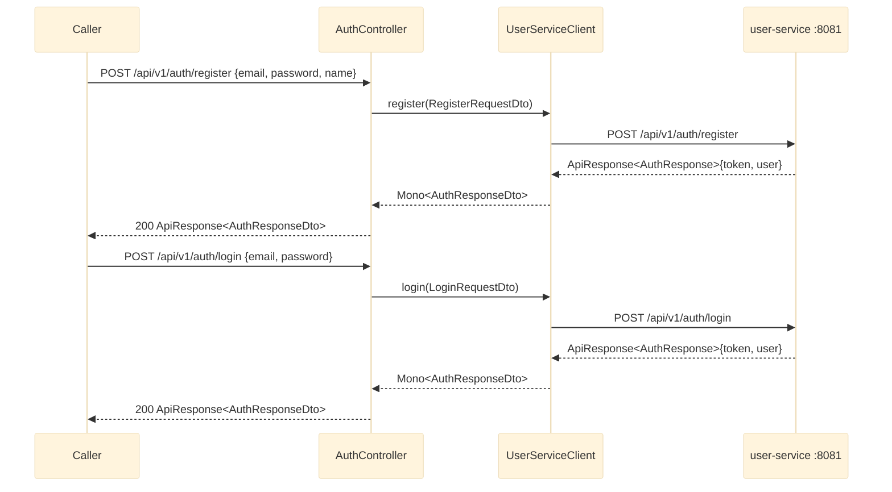

# POST /api/v1/auth/register, POST /api/v1/auth/login

`AuthController` proxies straight through to user-service's auth endpoints via `UserServiceClient`.
Both are simple request/response forwards - no aggregation, no fallback. See `bff-service`'s
`controller/AuthController.java` / `client/UserServiceClient.java`.

## External calls

| # | Call | From -> To | Notes |
|---|------|-----------|-------|
| 1 | `POST /api/v1/auth/register` | bff-service -> user-service | request body forwarded as-is; user-service does its own validation |
| 2 | `POST /api/v1/auth/login` | bff-service -> user-service | request body forwarded as-is |

## Notes

- Both endpoints are thin 1:1 proxies, like `LearnerController.getRecommendations` - no
  `.onErrorResume` fallback is applied. A user-service failure (e.g. duplicate email on register,
  bad credentials on login) propagates to `common`'s `GlobalExceptionHandler` and comes back as the
  standard error `ApiResponse` envelope, not a silently-defaulted response.
- `UserServiceClient` is also used by `UserController` (`GET`/`PATCH /api/v1/users/{userId}`, thin
  proxies, not shown here) and by `LearnerOverviewService` as the third fan-out slice of the
  composite learner overview - see [learner-overview.md](learner-overview.md).
- bff-service does not itself issue, store, or validate JWTs - it forwards whatever user-service
  returns. No `Authorization` header handling exists in bff-service yet (see `common`'s `security/`
  package note in the top-level `CLAUDE.md`: JWT support exists but is unused anywhere in the repo
  today).
