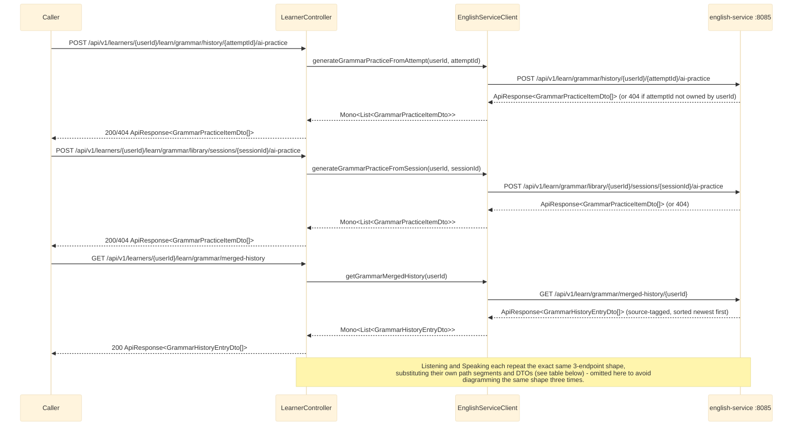

# History-retry proxy: generate-from-attempt + merged-history (grammar/listening/speaking)

`LearnerController` exposes the 9 new "history retry" endpoints added to english-service across
Tasks 3-8 of the history-retry plan: for each of grammar/listening/speaking, one "generate practice
from a past learn attempt" endpoint, one "generate practice from a past library
session/section" endpoint, and one merged (learn + library) history endpoint. Every route here is a
thin 1:1 proxy through `EnglishServiceClient` — no aggregation, no `.onErrorResume` (same convention
as `listening-speaking-library.md`/the `vocabulary.library`/`grammar.library` proxies): a downstream
failure propagates as-is and is turned into a standard error `ApiResponse` by `common`'s
`GlobalExceptionHandler`. See `bff-service`'s `controller/LearnerController.java` /
`client/EnglishServiceClient.java`.

The 6 "generate from attempt/session" endpoints all return the SAME practice-item-list DTO shape
their domain's existing "học thường" generate flow already returns
(`GrammarPracticeItemDto[]`/`ListeningPracticeItemDto[]`/`SpeakingPracticeItemDto[]`) — no new bff DTO
was needed for them, only for the 3 merged-history endpoints
(`GrammarHistoryEntryDto`/`ListeningHistoryEntryDto`/`SpeakingHistoryEntryDto`, new in this task).

## External calls

| # | Call | From -> To | Notes |
|---|------|-----------|-------|
| 1 | `POST /api/v1/learn/grammar/history/{userId}/{attemptId}/ai-practice` | bff-service -> english-service | `404` if attempt not owned by `userId` |
| 2 | `POST /api/v1/learn/grammar/library/{userId}/sessions/{sessionId}/ai-practice` | bff-service -> english-service | `404` if session not owned by `userId` |
| 3 | `GET /api/v1/learn/grammar/merged-history/{userId}` | bff-service -> english-service | no fallback |
| 4 | `POST /api/v1/learn/listening/history/{userId}/{attemptId}/ai-practice` | bff-service -> english-service | `404` if attempt not owned by `userId` |
| 5 | `POST /api/v1/learn/listening/library/{userId}/sections/{sectionId}/ai-practice` | bff-service -> english-service | `404` if section attempt not owned by `userId` |
| 6 | `GET /api/v1/learn/listening/merged-history/{userId}` | bff-service -> english-service | no fallback |
| 7 | `POST /api/v1/learn/speaking/history/{userId}/{attemptId}/ai-practice` | bff-service -> english-service | `404` if attempt not owned by `userId` |
| 8 | `POST /api/v1/learn/speaking/library/{userId}/sections/{sectionId}/ai-practice` | bff-service -> english-service | `404` if no attempts on the section |
| 9 | `GET /api/v1/learn/speaking/merged-history/{userId}` | bff-service -> english-service | no fallback |

## bff-service routes -> english-service routes

| bff-service route | english-service route | `EnglishServiceClient` method |
|---|---|---|
| `POST /{userId}/learn/grammar/history/{attemptId}/ai-practice` | `POST /api/v1/learn/grammar/history/{userId}/{attemptId}/ai-practice` | `generateGrammarPracticeFromAttempt` |
| `POST /{userId}/learn/grammar/library/sessions/{sessionId}/ai-practice` | `POST /api/v1/learn/grammar/library/{userId}/sessions/{sessionId}/ai-practice` | `generateGrammarPracticeFromSession` |
| `GET /{userId}/learn/grammar/merged-history` | `GET /api/v1/learn/grammar/merged-history/{userId}` | `getGrammarMergedHistory` |
| `POST /{userId}/learn/listening/history/{attemptId}/ai-practice` | `POST /api/v1/learn/listening/history/{userId}/{attemptId}/ai-practice` | `generateListeningPracticeFromAttempt` |
| `POST /{userId}/learn/listening/library/sections/{sectionId}/ai-practice` | `POST /api/v1/learn/listening/library/{userId}/sections/{sectionId}/ai-practice` | `generateListeningPracticeFromSection` |
| `GET /{userId}/learn/listening/merged-history` | `GET /api/v1/learn/listening/merged-history/{userId}` | `getListeningMergedHistory` |
| `POST /{userId}/learn/speaking/history/{attemptId}/ai-practice` | `POST /api/v1/learn/speaking/history/{userId}/{attemptId}/ai-practice` | `generateSpeakingPracticeFromAttempt` |
| `POST /{userId}/learn/speaking/library/sections/{sectionId}/ai-practice` | `POST /api/v1/learn/speaking/library/{userId}/sections/{sectionId}/ai-practice` | `generateSpeakingPracticeFromSection` |
| `GET /{userId}/learn/speaking/merged-history` | `GET /api/v1/learn/speaking/merged-history/{userId}` | `getSpeakingMergedHistory` |

All 9 bff routes mount under `/{userId}/learn/<domain>/...`, matching the established path convention
of the sibling learn/library proxies already in `LearnerController` (e.g.
`/{userId}/learn/grammar/history/{attemptId}` for attempt detail, `/{userId}/learn/grammar/library/
sessions/{sessionId}/answers` for grading) rather than the plan's illustrative
`/attempts/{attemptId}/ai-practice`/`/sessions-or-sections/{id}/ai-practice` guess - kept consistent
with what every other endpoint in this controller already does.

## Notes

- Structurally identical to `listening-speaking-library.md`'s proxies — same `WebClient.get()/post()`
  + `ApiResponse::getData` unwrapping style via `.doOnError` (not `.onErrorResume`), matching the
  established `EnglishServiceClient` convention.
- The 6 generate-from-attempt/session endpoints reuse the existing
  `GrammarPracticeItemDto`/`ListeningPracticeItemDto`/`SpeakingPracticeItemDto` bff DTOs (already
  present from earlier plans) — confirmed no new DTO was needed before adding any new class.
- The 3 merged-history endpoints introduce one new bff DTO each
  (`GrammarHistoryEntryDto`/`ListeningHistoryEntryDto`/`SpeakingHistoryEntryDto`, in
  `com.remelearning.bff.dto`), field-for-field mirrors of english-service's own new merged-history
  DTOs — `{source: "LEARN"|"LIBRARY", attemptOrSessionId, completedAt?, score?, topicId?/sectionId?}`.
  The existing `GrammarLibraryHistoryEntryDto` bff DTO also gained a `topicId` field, mirroring the
  same addition on the english-service side (Task 6).
- For english-service's own internals of these 9 endpoints (ownership checks, mistake-analysis logic,
  circular-dependency-avoidance via standalone `*HistoryService` classes), see
  [../English_service/grammar-learn.md](../English_service/grammar-learn.md) sections 3-4,
  [../English_service/listening-learn.md](../English_service/listening-learn.md) sections 3-4, and
  [../English_service/speaking-learn.md](../English_service/speaking-learn.md) sections 3-4.
