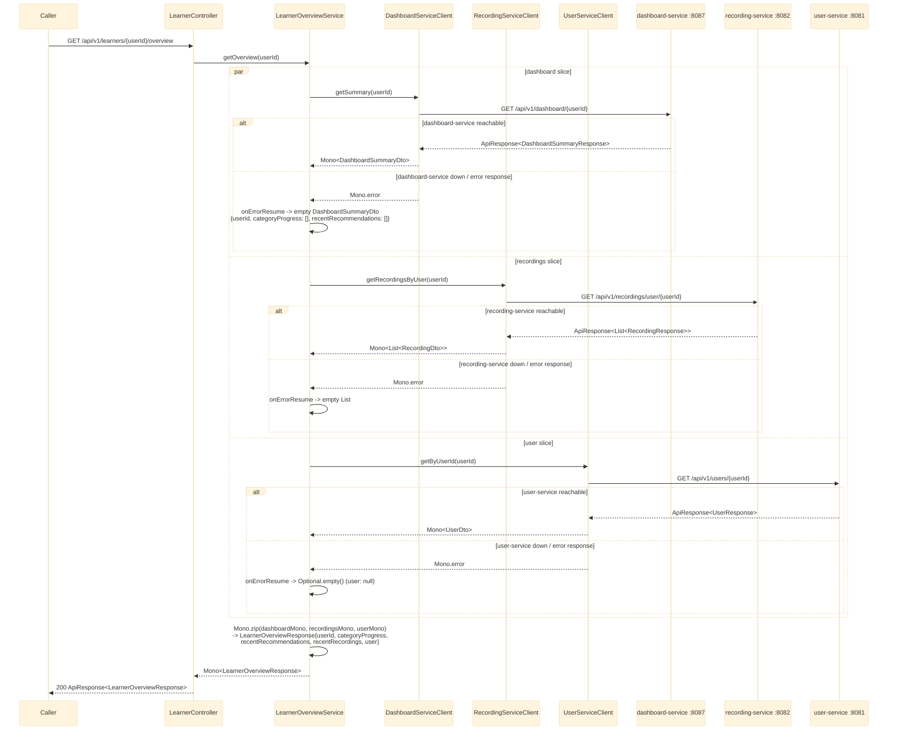

# GET /api/v1/learners/{userId}/overview

`LearnerController.getOverview` delegates to `LearnerOverviewService.getOverview`, which fans out to
`dashboard-service`, `recording-service`, and `user-service` in parallel via `Mono.zip` and
assembles a single `LearnerOverviewResponse`. See `bff-service`'s
`service/LearnerOverviewService.java` / `client/DashboardServiceClient.java` /
`client/RecordingServiceClient.java` / `client/UserServiceClient.java`.

## External calls

| # | Call | From -> To | Notes |
|---|------|-----------|-------|
| 1 | `GET /api/v1/dashboard/{userId}` | bff-service -> dashboard-service | defaults to an empty summary on failure, doesn't fail the request |
| 2 | `GET /api/v1/recordings/user/{userId}` | bff-service -> recording-service | defaults to an empty list on failure, doesn't fail the request |
| 3 | `GET /api/v1/users/{userId}` | bff-service -> user-service | defaults to a `null` `user` field on failure, doesn't fail the request |

## Notes

- All three calls run concurrently (`Mono.zip`), not sequentially — total latency is bounded by the
  slowest of the three, not their sum.
- Partial-failure resilience: any downstream being unreachable still returns `200` with that slice
  defaulted to empty (`null` for the `user` slice, since a single profile object has no natural
  "empty" value the way a list/summary does), logged at `warn` level with the userId (never at
  `error`, since this is an expected/handled degradation, not a bug).
- The user slice is wrapped in `Optional<UserDto>` internally so `Mono.zip` still has a value to
  zip even when user-service is down (`Mono.zip` completes empty, not with a null, if any source
  Mono is empty) - unwrapped back to a plain (possibly `null`) `UserDto` before building the
  response.
