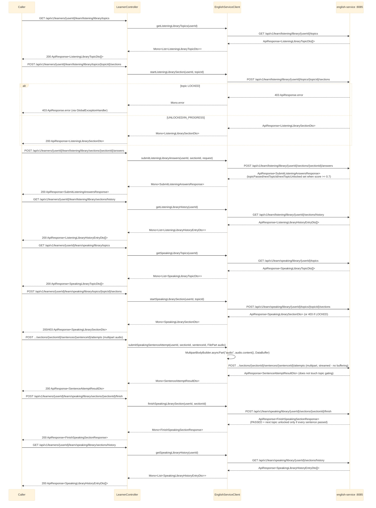

# Listening/Speaking Library (BFF proxy)

`LearnerController` exposes the `listening.library`/`speaking.library` endpoints of english-service
under `/api/v1/learners/{userId}/learn/listening/library/...` and
`/api/v1/learners/{userId}/learn/speaking/library/...`. Every route is a thin 1:1 proxy through
`EnglishServiceClient` — no aggregation, no `.onErrorResume` (same as the
`vocabulary.library`/`grammar.library` proxies): a downstream failure propagates as-is and is turned
into a standard error `ApiResponse` by `common`'s `GlobalExceptionHandler`. See
`bff-service`'s `controller/LearnerController.java` / `client/EnglishServiceClient.java`.

## External calls

| # | Call | From -> To | Notes |
|---|------|-----------|-------|
| 1 | `GET /api/v1/learn/listening/library/{userId}/topics` | bff-service -> english-service | no fallback, errors propagate |
| 2 | `POST /api/v1/learn/listening/library/{userId}/topics/{topicId}/sections` | bff-service -> english-service | `403` if topic `LOCKED` |
| 3 | `POST /api/v1/learn/listening/library/{userId}/sections/{sectionId}/answers` | bff-service -> english-service | scores answer set, may unlock next topic |
| 4 | `GET /api/v1/learn/listening/library/{userId}/sections/history` | bff-service -> english-service | no fallback |
| 5 | `GET /api/v1/learn/speaking/library/{userId}/topics` | bff-service -> english-service | no fallback |
| 6 | `POST /api/v1/learn/speaking/library/{userId}/topics/{topicId}/sections` | bff-service -> english-service | `403` if topic `LOCKED` |
| 7 | `POST /api/v1/learn/speaking/library/{userId}/sections/{sectionId}/sentences/{sentenceId}/attempts` | bff-service -> english-service | multipart, streamed via `FilePart`, no buffering |
| 8 | `POST /api/v1/learn/speaking/library/{userId}/sections/{sectionId}/finish` | bff-service -> english-service | may unlock next topic |
| 9 | `GET /api/v1/learn/speaking/library/{userId}/sections/history` | bff-service -> english-service | no fallback |

## Notes

- Structurally identical to the `vocabulary.library`/`grammar.library` proxies already in
  `EnglishServiceClient`/`LearnerController` — same `WebClient.get()/post()` + `ApiResponse::getData`
  unwrapping style, same lack of `.onErrorResume` (these are thin 1:1 forwards, not fan-out
  aggregations like `weak-points.md`/`learner-overview.md`).
- All bff-service DTOs (`ListeningLibrary*Dto`, `SpeakingLibrary*Dto`, `SubmitListeningAnswers*`,
  `SentenceAttemptResultDto`, `FinishSpeakingSectionResponse`) are plain classes in
  `com.remelearning.bff.dto`, field-for-field mirrors of english-service's own DTOs — no shared Java
  classes cross the deployable boundary. `status` is a flat `String` with values
  `LOCKED`/`UNLOCKED`/`IN_PROGRESS`/`PASSED`.
- `submitSpeakingSentenceAttempt` follows the exact same multipart-streaming pattern already used by
  the non-library `submitSpeakingAttempt` proxy (`MultipartBodyBuilder.asyncPart` + `FilePart.content()`,
  never buffering the recorded audio in bff-service's memory).
- For english-service's own internals (gating state machine, LLM content generation, GOP scoring),
  see [../English_service/listening-library.md](../English_service/listening-library.md) and
  [../English_service/speaking-library.md](../English_service/speaking-library.md).
