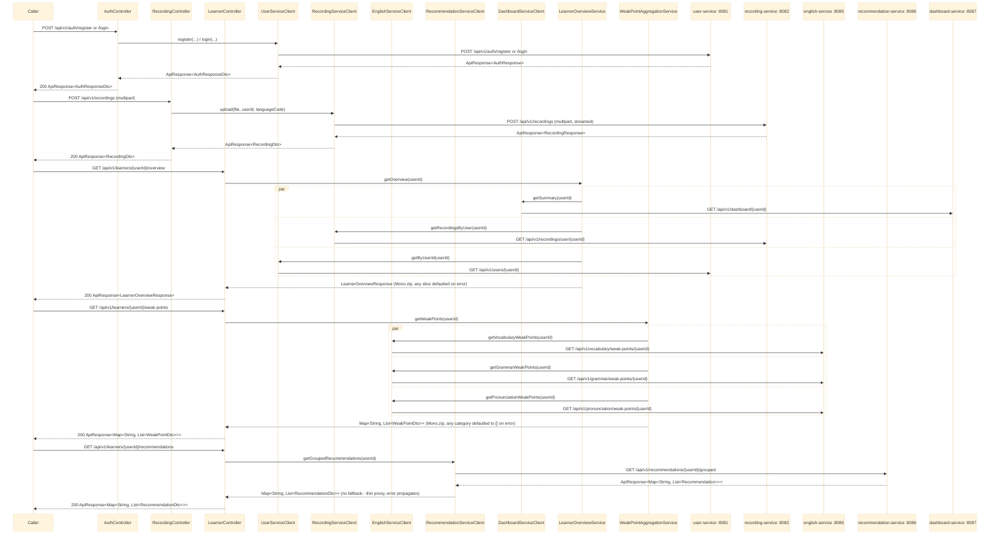

# bff-service — Overview

`bff-service` (Java/Spring Boot, **reactive** — WebFlux, not MVC) is the single HTTP entry point for
the web/mobile client. It has no database of its own: every endpoint composes one or more calls to
the domain services via `WebClient` (`com.remelearning.bff.client.*`) and shapes a combined response
for the UI, instead of the frontend calling each service directly. See
`RemeLearning/services/bff-service/src/main/java/com/remelearning/bff/`.

Downstream services it composes: `user-service` (8081), `recording-service` (8082),
`english-service` (8085 — merged vocabulary/grammar/pronunciation), `recommendation-service` (8086),
`dashboard-service` (8087).

Per-endpoint detail lives in [auth-proxy.md](auth-proxy.md) (thin proxy to user-service's
register/login), [learner-overview.md](learner-overview.md) (fan-out to dashboard-service +
recording-service + user-service), [weak-points.md](weak-points.md) (fan-out to english-service x3),
[recording-upload-proxy.md](recording-upload-proxy.md) (multipart streaming proxy), and
[listening-speaking-library.md](listening-speaking-library.md) (9 thin 1:1 proxies to
english-service's `listening.library`/`speaking.library` endpoints, including a multipart
sentence-attempt upload). `UserController` (thin `GET`/`PATCH /api/v1/users/{userId}` proxies to
user-service) isn't broken out into its own sequence file since it's a 1:1 forward with the same
shape as `auth-proxy.md`; likewise the `vocabulary.library`/`grammar.library` proxies aren't
diagrammed separately (same 1:1 shape, see `docs/API.md` for their endpoint list).

## 1. Routes and what they compose

## Notes

- `bff-service` is the only reactive (WebFlux) service in the repo — every controller/client/service
  method returns `Mono`/`Flux`, never blocks.
- `LearnerOverviewService`/`WeakPointAggregationService` each apply `.onErrorResume` per downstream
  call so one service being unavailable degrades that slice to an empty default instead of failing
  the whole composite response. The recommendations proxy, the auth proxy (`AuthController`), and
  the profile proxy (`UserController`, `GET`/`PATCH /api/v1/users/{userId}`, not diagrammed above -
  same 1:1 shape as the auth calls) are all straight 1:1 forwards with no aggregation, so their
  errors are not caught here — they propagate to `common`'s `GlobalExceptionHandler` and come back
  as a standard error `ApiResponse` envelope.
- No Kafka producer/consumer exists in `bff-service` — it is REST-only, synchronous composition.
- For the domain services' own internals, see
  [../English_service/overview.md](../English_service/overview.md) and the sequence files under
  `recording-service`/`recommendation-service`/`dashboard-service` (not yet documented here — see
  `docs/API.md` for their endpoint shapes).
