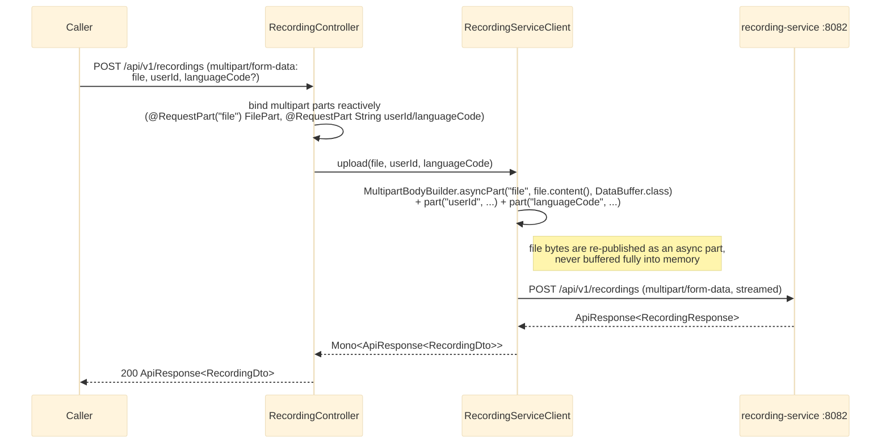

# POST /api/v1/recordings

`RecordingController.upload` proxies a multipart upload straight through to recording-service's
`POST /api/v1/recordings`. See `bff-service`'s `controller/RecordingController.java` /
`client/RecordingServiceClient.java`.

## External calls

| # | Call | From -> To | Notes |
|---|------|-----------|-------|
| 1 | `POST /api/v1/recordings` (multipart) | bff-service -> recording-service | streamed through, not buffered; recording-service does the actual S3 upload + `recording.uploaded` publish (see `docs/sequence/English_service` for the downstream pipeline, or `docs/API.md` mục 2/7) |

## Notes

- **Why streaming, not `MultipartFile`:** bff-service is WebFlux, which never materializes an
  uploaded file as a blocking `MultipartFile` the way Spring MVC does. The controller receives it
  reactively as a `FilePart` (`org.springframework.http.codec.multipart.FilePart`), whose `content()`
  is a `Flux<DataBuffer>`. `RecordingServiceClient.upload` re-publishes that `Flux` directly as an
  `asyncPart` in a `MultipartBodyBuilder` (Spring's documented WebClient multipart-proxy pattern) so
  the file's bytes flow straight from the inbound request to the outbound one without bff-service
  ever holding the whole file in memory.
- No error-fallback (`onErrorResume`) is applied here, unlike the aggregation services — an upload
  failure is a real failure the caller needs to see and retry, not something to silently default.
- bff-service does not touch S3 or publish `recording.uploaded` itself; that all happens inside
  recording-service after it receives the proxied request.
