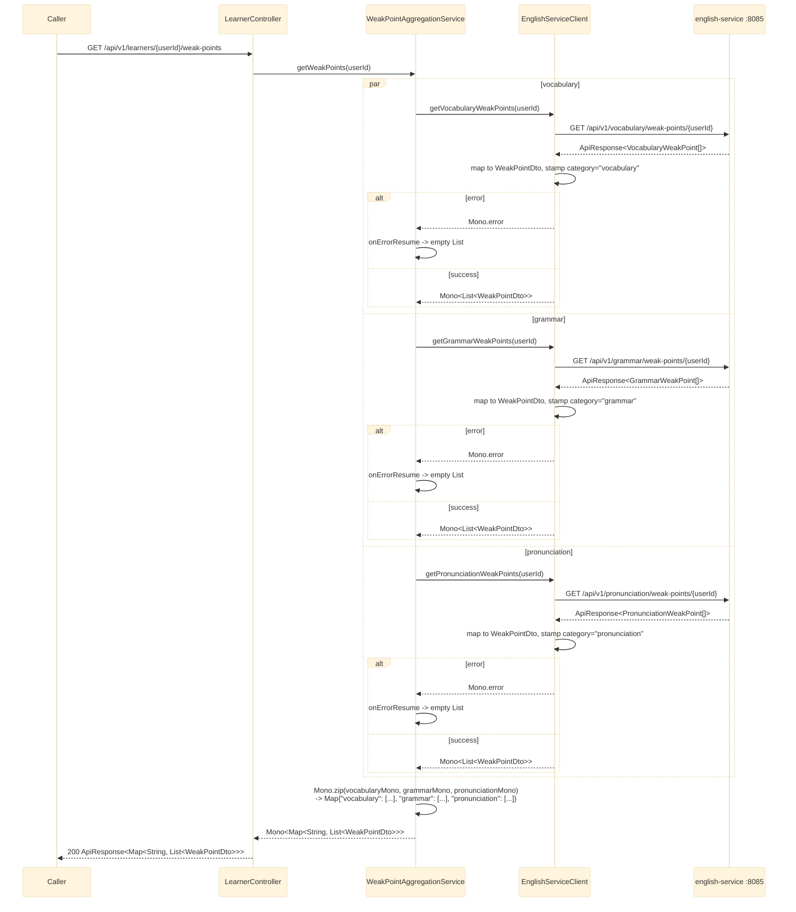

# GET /api/v1/learners/{userId}/weak-points

`LearnerController.getWeakPoints` delegates to `WeakPointAggregationService.getWeakPoints`, which
fans out to english-service's three weak-point endpoints (all served by the one merged
`english-service` on port 8085) in parallel via `Mono.zip`, merging them into one map keyed by
category. See `bff-service`'s `service/WeakPointAggregationService.java` /
`client/EnglishServiceClient.java`.

## External calls

| # | Call | From -> To | Notes |
|---|------|-----------|-------|
| 1 | `GET /api/v1/vocabulary/weak-points/{userId}` | bff-service -> english-service | defaults to `[]` on failure |
| 2 | `GET /api/v1/grammar/weak-points/{userId}` | bff-service -> english-service | defaults to `[]` on failure |
| 3 | `GET /api/v1/pronunciation/weak-points/{userId}` | bff-service -> english-service | defaults to `[]` on failure |

## Notes

- All three calls hit the same physical `english-service` instance (port 8085) but are still issued
  as three independent HTTP requests, run concurrently — english-service has no combined endpoint
  today that returns all three domains in one call.
- `category` isn't present in english-service's per-domain JSON (each uses its own
  `vocabularyType`/`grammarType`/`pronunciationType` field) — `EnglishServiceClient` stamps the
  literal category string itself right after deserializing, based on which endpoint it called, so
  the merged map can be built.
- Any one domain failing degrades only that entry to `[]`; the other two still populate normally.
