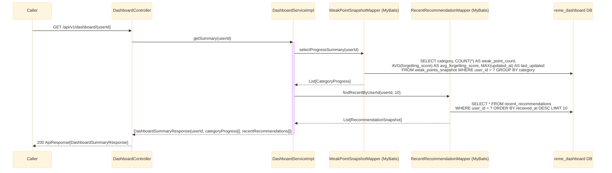

# REST endpoint: GET /api/v1/dashboard/{userId}

`DashboardController.getSummary` (package `dashboard.controller`) is the single read endpoint the
service exposes — it aggregates both Kafka-fed tables (`weak_points_snapshot`,
`recent_recommendations`) into one response. No REST calls to other services are made; everything
comes from data dashboard-service has already ingested off Kafka.

## External calls

| # | Call | From -> To | Notes |
|---|------|-----------|-------|
| 1 | Postgres SELECT (aggregate) | dashboard-service -> `reme_dashboard` DB | `GROUP BY category` over `weak_points_snapshot`, computed at read time — not a maintained running counter |
| 2 | Postgres SELECT (recent) | dashboard-service -> `reme_dashboard` DB | top 10 rows from `recent_recommendations`, ordered by `received_at DESC` |

## Notes

- No pagination/filtering parameters today — always returns all categories present for the user and
  the 10 most recent recommendations (`RECENT_RECOMMENDATIONS_LIMIT` in `DashboardServiceImpl`).
- Deliberately event-driven only: this endpoint never calls `english-service` or
  `recommendation-service` directly, matching the rest of the architecture (`bff-service` has no
  gateway routes yet — see root `CLAUDE.md`).
- If a user has no rows in either table, both lists in the response are simply empty (no 404) — the
  endpoint doesn't distinguish "unknown user" from "no activity yet".
