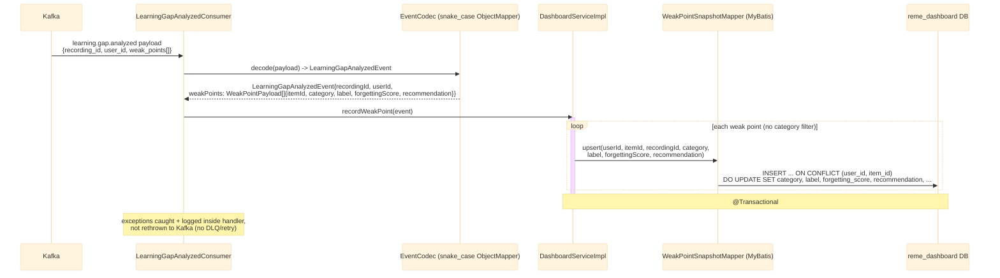

# Kafka consumer: learning.gap.analyzed

`LearningGapAnalyzedConsumer` (package `dashboard.kafka`, `groupId: dashboard-service`) listens on
the `learning.gap.analyzed` topic (published by `ai-service` after forgetting-pattern analysis —
see [../Ai_service/overview.md](../Ai_service/overview.md) and
[../Ai_service/analyze.md](../Ai_service/analyze.md)). Unlike `english-service`'s three per-domain
consumers on the same topic (each filtering to its own category), dashboard-service keeps **every**
category — vocabulary, grammar, and pronunciation all land in one unified
`weak_points_snapshot` table, with `category` kept as a plain column. See `dashboard-service`'s
`kafka/LearningGapAnalyzedConsumer.java`.

## External calls

| # | Call | From -> To | Notes |
|---|------|-----------|-------|
| 1 | Kafka consume `learning.gap.analyzed` | Kafka broker -> dashboard-service | published by `ai-service`, see [../Ai_service/overview.md](../Ai_service/overview.md) |
| 2 | Postgres UPSERT | dashboard-service -> `reme_dashboard` DB | writes/updates `weak_points_snapshot` |

## Notes

- Idempotency key: `(user_id, item_id)` — re-analyzing the same item across sessions updates its
  score instead of creating a new row.
- No filtering by category: every weak point (vocabulary/grammar/pronunciation) is persisted, since
  dashboard-service's purpose is a single cross-domain rollup, unlike `english-service`'s per-domain
  tables.
- Runs on its own Kafka `groupId` (`dashboard-service`), distinct from `english-service`'s
  (`english-service`, `english-service-grammar`, `english-service-pronunciation`), so it gets its own
  full copy of every message rather than splitting partitions with those consumers.
- No downstream event is published by dashboard-service.
- For the producer side (`RuleBasedAnalyzer`) and the full cross-service picture, see
  [../Ai_service/overview.md](../Ai_service/overview.md).
