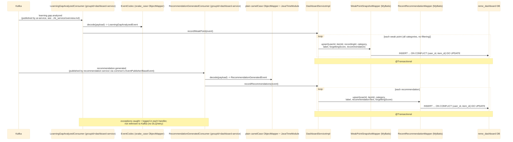
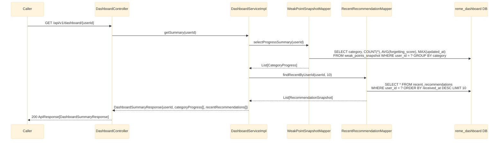

# dashboard-service — Overview

`dashboard-service` (Java/Spring Boot, port 8087, `reme_dashboard` DB) builds a cross-domain read
model for a learner's progress. Unlike `english-service` (one weak-point table per domain, filtered
by category), it consumes `learning.gap.analyzed` **unfiltered** into a single unified
`weak_points_snapshot` table (category kept as a plain column), plus a second, Java-to-Java-only
event, `recommendation.generated` (published by `recommendation-service`), into
`recent_recommendations`. It exposes one read endpoint that aggregates both — no REST calls to any
other service, matching the rest of the architecture (`bff-service` has no gateway routes yet). See
`RemeLearning/services/dashboard-service/src/main/java/com/remelearning/dashboard/`.

Per-event/per-endpoint detail lives in
[learning-gap-analyzed.md](learning-gap-analyzed.md),
[recommendation-generated.md](recommendation-generated.md),
[get-dashboard-summary.md](get-dashboard-summary.md).

## 1. Kafka consumers (ingestion)

## 2. REST controller (read-out)

## Notes

- Idempotency key for both tables: `(user_id, item_id)` — Kafka delivers at-least-once.
- `learning.gap.analyzed` is consumed on its own Kafka `groupId` (`dashboard-service`), distinct from
  `english-service`'s groupIds (`english-service`, `english-service-grammar`,
  `english-service-pronunciation`), so dashboard-service receives its own full copy of every message.
- Per-category counts/avg forgetting score are **computed at read time** via `GROUP BY category`,
  never maintained as a running counter — avoids a second write path that could drift from the
  underlying rows.
- `recommendation.generated` has no producer yet (`recommendation-service` is being built
  concurrently); this consumer is ready to receive it once that service starts publishing.
- For where `learning.gap.analyzed` comes from (S3 download, Whisper, pyannote diarization,
  `RuleBasedAnalyzer`), see [../Ai_service/overview.md](../Ai_service/overview.md).
