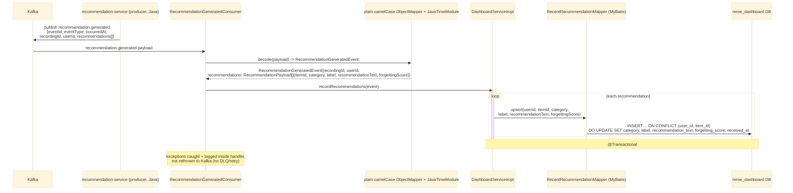

# Kafka consumer: recommendation.generated

`RecommendationGeneratedConsumer` (package `dashboard.kafka`, `groupId: dashboard-service`) listens
on the `recommendation.generated` topic, published by `recommendation-service` (a sibling service
being built concurrently) once it generates personalized study recommendations. Unlike
`learning.gap.analyzed` (published by the Python `ai-service` as snake_case JSON with no envelope),
this event is Java-to-Java only, produced via `common`'s `EventPublisher`/`BaseEvent` infra — it
arrives as plain **camelCase** JSON with the standard envelope fields (`eventId`, `eventType`,
`occurredAt`) plus the payload. See `dashboard-service`'s `kafka/RecommendationGeneratedConsumer.java`.

## External calls

| # | Call | From -> To | Notes |
|---|------|-----------|-------|
| 1 | Kafka consume `recommendation.generated` | Kafka broker -> dashboard-service | published by `recommendation-service`; topic constant already exists in `KafkaTopics.java`, no producer wired up yet as of this writing |
| 2 | Postgres UPSERT | dashboard-service -> `reme_dashboard` DB | writes/updates `recent_recommendations` |

## Notes

- Idempotency key: `(user_id, item_id)` — re-recommending the same item refreshes it in place
  instead of duplicating rows.
- Decoded with a dedicated plain `ObjectMapper` (camelCase default naming, `JavaTimeModule`
  registered for the `Instant occurredAt` envelope field) — **not** the snake_case `EventCodec` used
  for `learning.gap.analyzed`, since this event is Java-to-Java and already camelCase.
- Runs on its own Kafka `groupId` (`dashboard-service`), same groupId as
  `LearningGapAnalyzedConsumer` but a different topic, so no partition-splitting concern between the
  two.
- No downstream event is published by dashboard-service.
