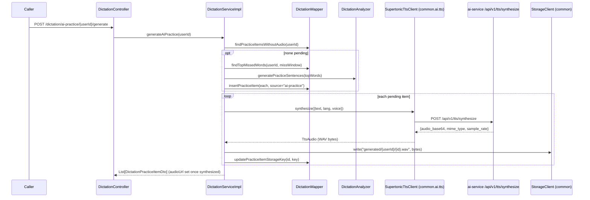

# Dictation practice: library sessions, grading, AI practice

Covers the redesigned `dictation` package (`com.remelearning.english.dictation`), a fifth package in
english-service's modular monolith. It isn't Kafka-driven for its request flow — it's triggered
directly by the FE via bff-service — but the grading flow now **publishes** `learning.gap.analyzed`
so the existing recommendation pipeline turns dictation misses into study suggestions.

Two sections share one grading flow:

- **A. Fixed library** — real recorded clips imported from disk/cloud (via `common`'s `StorageClient`)
  into `dictation_clips`, tagged with skill / CEFR level / topic / exam-type. The learner browses by
  facet, listens, and types.
- **B. "Luyện nghe với AI"** — Gemini generates practice sentences from the learner's recurring
  misses; **Supertonic** (in ai-service) voices them; the learner dictates those too.

## 0. Startup: importing the fixed library

```mermaid
sequenceDiagram
    participant Boot as Spring (ApplicationRunner)
    participant Imp as DictationLibraryImporter
    participant Store as StorageClient (common; local default)
    participant DMapper as DictationMapper
    participant DB as reme_english DB

    Boot->>Imp: run() (only if dictation.library.import-on-startup=true)
    Imp->>Store: list("") -> every key under reme.storage.local.root
    loop each *.mp3 key
        Imp->>Store: read("<parent>/scripts/<code>.txt")
        Imp->>Imp: derive examType (folder), level/skill (path convention), topic/title (filename)
        Imp->>DMapper: upsertClip({code, title, skill, level, topic, examType, scriptText, storageKey})
        DMapper->>DB: INSERT ... ON CONFLICT (code) DO UPDATE
    end
```

## 1. Session + grading (shared by both sections)

```mermaid
sequenceDiagram
    participant Caller
    participant Ctrl as DictationController
    participant Svc as DictationServiceImpl
    participant DMapper as DictationMapper
    participant DB as reme_english DB
    participant Scorer as DictationScorer (pure WER)
    participant An as DictationAnalyzer (rule-based / LLM)
    participant Gemini as Gemini API (llm mode)
    participant Pub as DictationGapEventPublisher
    participant Kafka as learning.gap.analyzed

    Caller->>Ctrl: POST /dictation/sessions/{userId} {skill?, level?, topic?, examType?, count}
    Ctrl->>Svc: startSession(userId, request)
    Svc->>DMapper: findRandomClipsByFacets(...)
    DMapper->>DB: SELECT ... ORDER BY random() LIMIT count
    Svc-->>Ctrl: List[DictationClipDto] (audioUrl -> streaming endpoint; no script)
    Note over Caller,Ctrl: FE plays GET /dictation/clips/{clipId}/audio (streamed via StorageClient.read)

    Caller->>Ctrl: POST /dictation/attempts {userId, clipId? | practiceItemId?, userTranscript}
    Ctrl->>Svc: submitAttempt(request)
    alt neither id
        Svc-->>Ctrl: BusinessException.badRequest -> 400
    else clip/practice item resolved (else 404)
        Svc->>DMapper: findClipById / findPracticeItemById -> referenceText
        Svc->>Scorer: score(referenceText, userTranscript)
        Scorer-->>Svc: {accuracy, wer, diff[]}
        Svc->>DMapper: insertAttempt(...) ; insertMisses(missing/substituted words)
        Svc->>An: analyzeAttempt(referenceText, missedWords)
        opt dictation.analyzer.mode = llm
            An->>Gemini: complete(prompt) -> suggestions + practice sentences
        end
        An-->>Svc: {suggestions[], practiceSentences[]} (templates on any failure)
        Svc->>DMapper: insertPracticeItem(each practice sentence, source="attempt")
        Svc->>Pub: publish(recordingId, userId, weakPoints[word->vocabulary])
        Pub->>Kafka: learning.gap.analyzed (snake_case via EventCodec)
        Svc-->>Ctrl: DictationAttemptResultDto{referenceText, accuracy, wer, diff[], aiSuggestions[], practiceSentences[]}
    end
```

The published `learning.gap.analyzed` is consumed by the **already-built** pipeline —
recommendation-service (`ExerciseGenerator`), dashboard-service, english-service's own vocabulary
consumer + `MistakeHistorySeedConsumer` — turning misses into recommendations with no new analyzer.

## 2. "Luyện nghe với AI": generate + synthesize (`POST /dictation/ai-practice/{userId}/generate`)



## External calls

| # | Call | From -> To | Notes |
|---|------|-----------|-------|
| 1 | StorageClient read/write/list | english-service -> local FS (or S3) | library clips + generated TTS audio; provider via `reme.storage.provider` |
| 2 | HTTPS | english-service -> Gemini API | `dictation.analyzer.mode=llm`; falls back to templates on any failure |
| 3 | HTTP | english-service -> ai-service `/api/v1/tts/synthesize` | Supertonic TTS (`reme.tts.provider=supertonic`, default); one call per practice item |
| 4 | Kafka produce | english-service -> `learning.gap.analyzed` | dictation misses as vocabulary weak points, feeding the recommendation pipeline |
| 5 | Postgres | english-service -> `reme_english` | `dictation_clips`, `dictation_attempts`, `dictation_misses`, `dictation_practice_items` |

## Notes

- The clip/practice responses omit the script; it's only revealed as `referenceText` after grading.
- Grading uses the unchanged pure `DictationScorer` (word-level Levenshtein/WER); no new analyzer.
- TTS/analysis/storage are all vendor-neutral interfaces (`TtsClient`, `LlmClient` via
  `DictationAnalyzer`, `StorageClient`), selected at the composition root via `@ConditionalOnProperty`.
- Audio isn't web-reachable on local disk, so english-service streams it through
  `GET /dictation/clips/{id}/audio` and `.../ai-practice/items/{id}/audio`; bff relays these.
