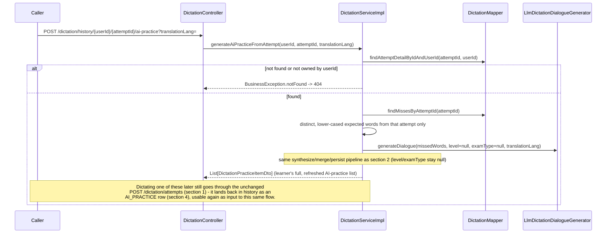
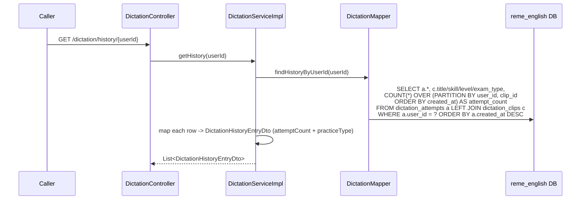
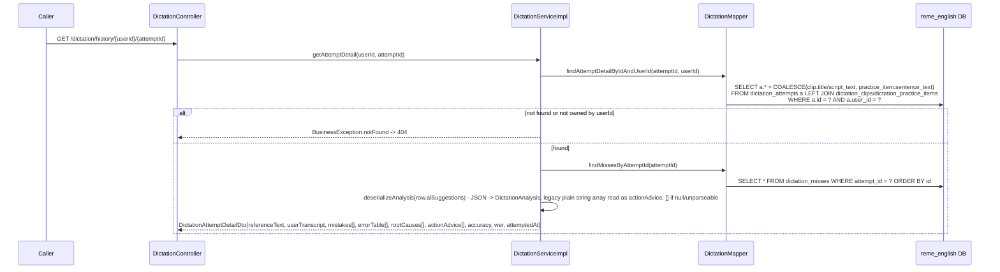

# Dictation practice: library sessions, grading, AI practice

Covers the redesigned `dictation` package (`com.remelearning.english.dictation`), a fifth package in
english-service's modular monolith. It isn't Kafka-driven for its request flow — it's triggered
directly by the FE via bff-service — but the grading flow now **publishes** `learning.gap.analyzed`
so the existing recommendation pipeline turns dictation misses into study suggestions.

Two sections share one grading flow:

- **A. Fixed library** — real recorded clips imported from disk/cloud (via `common`'s `StorageClient`)
  into `dictation_clips`, tagged with skill / CEFR level / topic / exam-type. The learner browses by
  facet, listens, and types.
- **B. "Luyện nghe với AI"** — Gemini generates practice sentences from the learner's recurring
  misses; **Supertonic** (in ai-service) voices them; the learner dictates those too.

**Rev 2 (sentence-mode dictation)**: adds a **folder → file** browse flow (section 3) alongside the
existing facet/session flow (section 1) — a `folder` column on `dictation_clips` (direct parent
directory of the audio file, distinct from the `topic`/`skill`/`level`/`examType` taxonomy) plus a new
`dictation_clip_sentences` table (script split one sentence per line at import time, section 0). The
FE now grades sentence-by-sentence client-side against `GET /dictation/clips/{clipId}`'s `sentences[]`,
then still calls the unchanged `POST /attempts` with the full reassembled transcript. **AI-alignment**
fills in each sentence's `startMs`/`endMs` **lazily, inside that same `GET` call** (section 3): the
first read of a clip whose sentences are still missing timestamps sends the clip's audio + sentence
texts to ai-service's Whisper-based `POST /api/v1/dictation/align-sentences`, persists whatever comes
back, then returns; a sentence that can't be matched (or a downstream failure) just stays `null` and
is retried on a later read - the FE already tolerates that.

**Rev 3 (sentence-mode gating)**: the FE's per-sentence runner no longer auto-advances on a correct
match and no longer lets a wrong answer through - the learner must explicitly check an answer, and
only a correct check unlocks the manual "next sentence" action, so the reassembled `userTranscript`
sent to `POST /attempts` is always fully correct sentence-by-sentence. Since that means the final
transcript's word diff (section 1) no longer captures any of the learner's earlier wrong attempts, the
FE now also collects those as `sentenceMistakes[]` (`{sentenceIndex, expectedText, attemptedText}`)
and sends them alongside `userTranscript` in the same `POST /attempts` call; `DictationServiceImpl`
scores each one independently and folds the resulting word-level misses into the exact same
`dictation_misses`/`learning.gap.analyzed` pipeline a normal wrong answer would produce (section 1).
`accuracy`/`wer`/`diff` in the response still reflect only `userTranscript`, unaffected by
`sentenceMistakes`. The hint button is unchanged server-side (still gated by `minListensForHint` from
`GET /dictation/facets`) - the FE just now explains a locked click with a toast instead of silently
no-op'ing.

## 0. Startup: importing the fixed library

```mermaid
sequenceDiagram
    participant Boot as Spring (ApplicationRunner)
    participant Imp as DictationLibraryImporter
    participant Store as StorageClient (common; local default)
    participant DMapper as DictationMapper
    participant DB as reme_english DB

    Boot->>Imp: run() (only if dictation.library.import-on-startup=true)
    Imp->>Store: list("") -> every key under reme.storage.local.root
    loop each *.mp3 key
        Imp->>Store: read("<parent>/scripts/<code>.txt")
        Imp->>Imp: derive examType (folder), level/skill (path convention), topic/title (filename)
        Imp->>Imp: deriveFolder(segments) - direct parent directory of the audio file (rev 2)
        Imp->>DMapper: upsertClip({code, title, skill, level, topic, examType, scriptText, storageKey, folder})
        DMapper->>DB: INSERT ... ON CONFLICT (code) DO UPDATE
        Imp->>Imp: split scriptText into non-blank lines (rev 2)
        loop each line, 1-based seq
            Imp->>DMapper: upsertSentence(clipId, seq, line)
            DMapper->>DB: INSERT ... ON CONFLICT (clip_id, seq) DO UPDATE text<br/>(start_ms/end_ms untouched - filled in lazily by GET /clips/{clipId}'s AI-alignment, see section 3)
        end
    end
```

## 1. Session + grading (shared by both sections)

```mermaid
sequenceDiagram
    participant Caller
    participant Ctrl as DictationController
    participant Svc as DictationServiceImpl
    participant DMapper as DictationMapper
    participant DB as reme_english DB
    participant Scorer as DictationScorer (pure WER)
    participant An as DictationAnalyzer (rule-based / LLM)
    participant Gemini as Gemini API (llm mode)
    participant Pub as DictationGapEventPublisher
    participant Kafka as learning.gap.analyzed

    Caller->>Ctrl: POST /dictation/sessions/{userId} {skill?, level?, topic?, examType?, count}
    Ctrl->>Svc: startSession(userId, request)
    Svc->>DMapper: findRandomClipsByFacets(...)
    DMapper->>DB: SELECT ... ORDER BY random() LIMIT count
    Svc-->>Ctrl: List[DictationClipDto] (audioUrl -> streaming endpoint; no script)
    Note over Caller,Ctrl: FE plays GET /dictation/clips/{clipId}/audio (streamed via StorageClient.read)

    Caller->>Ctrl: POST /dictation/attempts {userId, clipId? | practiceItemId?, userTranscript, sentenceMistakes?}
    Ctrl->>Svc: submitAttempt(request)
    alt neither id
        Svc-->>Ctrl: BusinessException.badRequest -> 400
    else clip/practice item resolved (else 404)
        Svc->>DMapper: findClipById / findPracticeItemById -> referenceText
        Svc->>Scorer: score(referenceText, userTranscript)
        Scorer-->>Svc: {accuracy, wer, diff[]}
        Svc->>DMapper: insertAttempt(...)
        Svc->>Svc: extractMisses(userTranscript's diff) -> missing/substituted words
        opt sentenceMistakes present (rev 3, sentence-mode retries)
            loop each {sentenceIndex, expectedText, attemptedText}
                Svc->>Scorer: score(expectedText, attemptedText)
                Scorer-->>Svc: diff[] for that one sentence
                Svc->>Svc: extractMisses(...) -> append to the same miss list
            end
        end
        Svc->>DMapper: insertMisses(combined miss list - one batch insert either way)
        Svc->>An: analyzeAttempt(referenceText, userTranscript, diff)
        opt dictation.analyzer.mode = llm
            An->>Gemini: complete(prompt) -> root-cause-classified errorTable + rootCauses + actionAdvice + practice sentences
        end
        An-->>Svc: {errorTable[], rootCauses[], actionAdvice[], practiceSentences[]} (rule-based heuristic on any failure)
        Svc->>DMapper: insertPracticeItem(each practice sentence, source="attempt")
        Svc->>Pub: publish(recordingId, userId, weakPoints[word->vocabulary], recommendation=actionAdvice[0])
        Pub->>Kafka: learning.gap.analyzed (snake_case via EventCodec)
        Svc-->>Ctrl: DictationAttemptResultDto{referenceText, accuracy, wer, diff[], errorTable[], rootCauses[], actionAdvice[], practiceSentences[]}
    end
```

The published `learning.gap.analyzed` is consumed by the **already-built** pipeline —
recommendation-service (`ExerciseGenerator`), dashboard-service, english-service's own vocabulary
consumer + `MistakeHistorySeedConsumer` — turning misses into recommendations with no new analyzer.

## 2. "Luyện nghe với AI": generate a dialogue passage + synthesize (`POST /dictation/ai-practice/{userId}/generate`)

```mermaid
sequenceDiagram
    participant Caller
    participant Ctrl as DictationController
    participant Svc as DictationServiceImpl
    participant DMapper as DictationMapper
    participant Gen as LlmDictationDialogueGenerator
    participant Gemini as Gemini API (LlmClient)
    participant Tts as SupertonicTtsClient (common.ai.tts)
    participant Ai as ai-service /api/v1/tts/synthesize
    participant Merge as WavAudioMerger
    participant Store as StorageClient (common)

    Caller->>Ctrl: POST /dictation/ai-practice/{userId}/generate {level?, examType?, translationLang?}
    Ctrl->>Svc: generateAiPractice(userId, request)
    Svc->>DMapper: findPracticeItemsWithoutAudio(userId)
    alt none pending
        Svc->>DMapper: findTopMissedWords(userId, missWindow)
    end
    Note over Svc: targetPhrases = pending items' sentenceText, or top-missed words if none pending
    Svc->>Svc: resolveLevel(request.level) - concrete value passes through,<br/>"RANDOM" picks from the fixed CEFR pool A1/A2/B1/B2/C1, unset stays null
    Svc->>DMapper: findDistinctExamTypes() (only if examType == "RANDOM")
    Svc->>Svc: resolveExamType(request.examType) - "RANDOM" picks from the library's<br/>own distinct exam types (fallback TOEIC/IELTS/TOEFL/General if none), unset stays null
    Svc->>Gen: generateDialogue(targetPhrases, resolvedLevel, resolvedExamType, request.translationLang)
    Gen->>Gemini: complete(prompt) -> JSON [{speaker, text, translation?}, ...] + topic<br/>(translation only requested when translationLang != "en")
    Gemini-->>Gen: one monologue or multi-speaker dialogue (falls back to templated lines on failure)
    Gen-->>Svc: DialogueGenerationResult{lines[], topic}
    Svc->>Svc: assignVoicesToSpeakers - one random Supertonic voice per distinct speaker
    loop each dialogue line
        Note over Svc: lineText = "Speaker: text" for multi-speaker, else just text -<br/>the SAME string is synthesized AND persisted (bug fix: previously TTS<br/>spoke only the bare line while the graded text carried the "Speaker: " prefix)
        Svc->>Tts: synthesize({text: lineText, lang, voice=speaker's assigned voice})
        Tts->>Ai: POST /api/v1/tts/synthesize
        Ai-->>Tts: {audio_base64, mime_type, sample_rate}
        Tts-->>Svc: TtsAudio (WAV bytes)
    end
    Svc->>DMapper: insertPracticeItem(fullPassageText, translationText?, level, examType, topic, source="ai-practice")
    Svc->>Merge: merge(all line clips)
    Merge-->>Svc: one continuous WAV
    Svc->>Store: write("generated/{userId}/{id}.wav", mergedBytes)
    Svc->>DMapper: updatePracticeItemStorageKey(id, key)
    opt pending items existed
        Svc->>DMapper: deletePracticeItemsWithoutAudio(userId) - replaced by the one new dialogue item
    end
    Svc-->>Ctrl: List[DictationPracticeItemDto] (audioUrl set once synthesized;<br/>level/examType/topic reflect the resolved facets)
    Note over Svc: Any failure in generation/synthesis is logged and swallowed - prior pending<br/>items are left untouched so the next call can retry.
```

Unlike before, `generateAiPractice` no longer produces one practice item per missed word each
TTS'd individually with a fixed voice. It now always asks Gemini (`LlmDictationDialogueGenerator`,
always active - not gated by `dictation.analyzer.mode`) for one cohesive passage covering all
target phrases, assigns a random voice per speaker (`DictationServiceImpl.assignVoicesToSpeakers`,
from the fixed 10-voice Supertonic pool), synthesizes each line, and merges the clips
(`WavAudioMerger`) into a single practice item's audio.

## 2b. "Luyện tập với AI" from one history row (`POST /dictation/history/{userId}/{attemptId}/ai-practice`)

Previously this endpoint called a separate, unmerged path (`DictationAnalyzer.generatePracticeSentences`,
producing many single-sentence items each TTS'd individually). It now shares section 2's exact
generation/synthesis pipeline (`LlmDictationDialogueGenerator` -> per-speaker voice assignment ->
`WavAudioMerger` -> one merged passage), so the same sequence diagram above applies, with two
differences:

- **Input**: `targetPhrases` come from `findMissesByAttemptId(attemptId)` (this one specific past
  attempt's misses, distinct + lower-cased) instead of the aggregate `missWindow` pool across recent
  attempts - the "Luyện tập với AI" action on a single history row, not the aggregate "Tạo bài luyện"
  action.
- **No facet selection**: there's no `level`/`examType` in this endpoint's request - both are passed
  as `null` to `generateDialogue`, so the generator's own default applies (the created item's
  `level`/`examType` come back `null`). `translationLang` (query param) works exactly as in section 2.



## 2c. AI-practice item detail for sentence-mode practice (`GET /dictation/ai-practice/items/{practiceItemId}/detail`)

```mermaid
sequenceDiagram
    participant Caller
    participant Ctrl as DictationController
    participant Svc as DictationServiceImpl
    participant DMapper as DictationMapper

    Caller->>Ctrl: GET /dictation/ai-practice/items/{practiceItemId}/detail
    Ctrl->>Svc: getAiPracticeDetail(practiceItemId)
    Svc->>DMapper: findPracticeItemById(practiceItemId)
    alt not found
        Svc-->>Ctrl: BusinessException.notFound -> 404
    else found
        Svc->>Svc: splitIntoSentences(item.sentenceText, item.translationText)<br/>multi-line dialogue -> split by "\n" (one line per speaker turn)<br/>single-line monologue -> split on sentence-ending punctuation<br/>translationText (if any) split the same way and zipped in as sentence.translation
        Svc-->>Ctrl: DictationPracticeItemDetailDto{practiceItemId, audioUrl, scriptText, level, examType, topic, sentences[]}<br/>every sentence.startMs/endMs is null (one merged audio file, no per-sentence timing);<br/>sentence.translation null unless the passage was generated with a translationLang
        Note over Caller,Svc: FE runs the exact same sentence-mode client-side flow as section 3's<br/>clip detail (estimateSentenceRange fallback for the null timings), then<br/>calls the unchanged POST /dictation/attempts (section 1) with practiceItemId
    end
```

Mirrors section 3's `getClipDetail` so the FE's `SentenceDictationRunner` drives both the library and
"Luyện nghe với AI" identically - the only structural difference is this endpoint never triggers an
AI-alignment call (there's no per-sentence audio boundary to detect, since the whole passage was
synthesized and merged into one file by section 2/2b).

## 3. Folder -> file browsing + sentence-mode clip detail (rev 2)

```mermaid
sequenceDiagram
    participant Caller
    participant Ctrl as DictationController
    participant Svc as DictationServiceImpl
    participant DMapper as DictationMapper
    participant DB as reme_english DB
    participant Store as StorageClient (common)
    participant Align as SentenceAlignmentClient (common.ai.align)
    participant Ai as ai-service /api/v1/dictation/align-sentences

    Caller->>Ctrl: GET /dictation/folders
    Ctrl->>Svc: listFolders()
    Svc->>DMapper: findDistinctFolders()
    DMapper->>DB: SELECT folder, COUNT(*) GROUP BY folder
    Svc-->>Ctrl: List[DictationFolderDto]{folderId, name, lessonCount}

    Caller->>Ctrl: GET /dictation/folders/{folderId}/lessons/{userId}
    Ctrl->>Svc: listFolderLessons(folderId, userId)
    Svc->>DMapper: findLessonSummariesByFolder(folderId, userId)
    DMapper->>DB: SELECT clips LEFT JOIN (per-user attempt agg: count, latest accuracy) WHERE folder = ? ORDER BY code
    Svc-->>Ctrl: List[DictationLessonSummaryDto]{clipId, code, title, audioUrl, level, sentenceCount, attemptCount?, latestAccuracy?} (no script)

    Caller->>Ctrl: GET /dictation/clips/{clipId}?translationLang=
    Ctrl->>Svc: getClipDetail(clipId, translationLang)
    Svc->>DMapper: findClipById(clipId)
    alt not found
        Svc-->>Ctrl: BusinessException.notFound -> 404
    else found
        Svc->>DMapper: findSentencesByClipId(clipId)
        DMapper->>DB: SELECT ... WHERE clip_id = ? ORDER BY seq
        opt any sentence missing startMs/endMs, and clip has a storageKey
            Svc->>Store: read(clip.storageKey)
            Svc->>Align: align(audio, storageKey, sentenceTexts[])
            Align->>Ai: POST /api/v1/dictation/align-sentences<br/>(multipart: audio file + sentences JSON)
            Ai-->>Align: [{start_ms, end_ms}] (Whisper word-timestamps + sequential match)
            alt ai-service unreachable or bad result
                Svc->>Svc: log.warn, keep nulls (retried on a later GET)
            else timings returned
                loop each sentence with a non-null timing
                    Svc->>DMapper: updateSentenceTimestamps(clipId, seq, startMs, endMs)
                    DMapper->>DB: UPDATE dictation_clip_sentences SET start_ms=?, end_ms=?
                end
            end
        end
        opt translationLang present and not "en", and any sentence missing translation
            Svc->>Svc: sentenceTranslator.translate(sentenceTexts[], translationLang) - one batched LLM call
            loop each sentence with a non-null translation
                Svc->>DMapper: updateSentenceTranslation(clipId, seq, translation)
                DMapper->>DB: UPDATE dictation_clip_sentences SET translation=?
            end
        end
        Svc-->>Ctrl: DictationClipDetailDto{clipId, code, title, audioUrl, scriptText, sentences[]}<br/>each sentence.translation null unless translationLang requested and not "en"
        Note over Caller,Svc: FE grades each sentence client-side and forces a correct retype before<br/>advancing (rev 3, no auto-advance/no skip); reassembles the full<br/>transcript + collected sentenceMistakes[] and calls POST /dictation/attempts (section 1)
    end
```

## 4. History list + attempt detail

### History list (`GET /dictation/history/{userId}`)



`attemptCount` is computed via a window function `COUNT(*) OVER (PARTITION BY user_id, clip_id
ORDER BY created_at ROWS BETWEEN UNBOUNDED PRECEDING AND CURRENT ROW)`, so the oldest attempt on a
clip shows 1 and the newest shows N. AI-practice rows (clip_id IS NULL) get NULL for attemptCount.
`practiceType` (`LIBRARY`/`AI_PRACTICE`) is derived in Java straight from `clipId` being present or
not - no extra column - so the FE can badge each row as library vs AI-practice.

### Attempt detail (`GET /dictation/history/{userId}/{attemptId}`)



`mistakes[]` is a **flat list** (`{expectedWord, actualWord, tag}`) sourced directly from
`dictation_misses`, not a re-derived positional diff like section 1's `DictationAttemptResultDto.diff`
— `dictation_misses` has no word-position column, and re-scoring `referenceText` vs `userTranscript`
at read time would show zero mistakes for sentence-mode attempts (the final transcript there is always
forced correct). See the design spec (`docs/superpowers/specs/2026-07-20-dictation-history-detail-design.md`)
for the full reasoning.

## External calls

| # | Call | From -> To | Notes |
|---|------|-----------|-------|
| 1 | StorageClient read/write/list | english-service -> local FS (or S3) | library clips + generated TTS audio; provider via `reme.storage.provider` |
| 2 | HTTPS | english-service -> Gemini API | `LlmDictationDialogueGenerator` (always active for `generateAiPractice`) + `dictation.analyzer.mode=llm` (section 1/2b); both fall back to templates on any failure |
| 3 | HTTP | english-service -> ai-service `/api/v1/tts/synthesize` | Supertonic TTS (`reme.tts.provider=supertonic`, default); one call per practice item, or one call per dialogue line for `generateAiPractice` (merged into one file by `WavAudioMerger`) |
| 4 | Kafka produce | english-service -> `learning.gap.analyzed` | dictation misses as vocabulary weak points, feeding the recommendation pipeline |
| 5 | Postgres | english-service -> `reme_english` | `dictation_clips`, `dictation_clip_sentences`, `dictation_attempts`, `dictation_misses`, `dictation_practice_items` |
| 6 | HTTP (multipart) | english-service -> ai-service `/api/v1/dictation/align-sentences` | `SentenceAlignmentClient` (`reme.alignment.ai-service.*`); lazy, triggered from `getClipDetail` only when a sentence is still missing `startMs`/`endMs`; read-timeout defaults to 120s since it transcribes the whole clip synchronously |
| 7 | Postgres | english-service -> `reme_english` | `dictation_attempts.ai_suggestions` (JSON-encoded `DictationAnalysis` - errorTable/rootCauses/actionAdvice/practiceSentences; column name predates this shape) written by section 1, read back by section 4 |

## Notes

- The clip/practice responses omit the script; it's only revealed as `referenceText` after grading
  (facet/session flow) or as `scriptText`/`sentences[]` on `GET /dictation/clips/{clipId}` (rev 2,
  folder-browse flow) - either way, only once a specific clip is opened, never in a bulk listing.
- Grading uses the unchanged pure `DictationScorer` (word-level Levenshtein/WER); no new analyzer.
- TTS/analysis/storage are all vendor-neutral interfaces (`TtsClient`, `LlmClient` via
  `DictationAnalyzer`, `StorageClient`), selected at the composition root via `@ConditionalOnProperty`.
- Audio isn't web-reachable on local disk, so english-service streams it through
  `GET /dictation/clips/{id}/audio` and `.../ai-practice/items/{id}/audio`; bff relays these.
- `folder` (section 0/3) and `topic`/`skill`/`level`/`examType` (existing taxonomy) are two parallel,
  independent groupings of the same clip - one from the raw storage path, the other derived by
  `DictationLibraryImporter`'s naming-convention heuristics - neither replaces the other.
- The AI-alignment step that fills in `sentences[].startMs`/`endMs` runs lazily inside
  `GET /dictation/clips/{clipId}` itself (see section 3) rather than as a separate background job or
  an import-time step - simplest option given alignment only needs to run once per clip (results are
  persisted) and the FE already tolerates null timestamps while waiting.
- `GET /dictation/ai-practice/items/{practiceItemId}/detail` (section 2c) lets the FE run the same
  `SentenceDictationRunner` for AI-practice as for a library clip - `splitIntoSentences` is a pure,
  in-memory split of the already-persisted `sentenceText`, not a new column/table.
- `SentenceAlignmentClient` (`common.ai.align`) is a vendor-neutral interface like `TtsClient`/
  `LlmClient`, backed today by `AiServiceSentenceAlignmentClient` (`common.ai.align.aiservice`) calling
  ai-service's Whisper-based `POST /api/v1/dictation/align-sentences`. ai-service transcribes the clip
  with word-level timestamps (`FasterWhisperEngine.transcribe_words`) and matches each sentence's
  words sequentially against that timeline (`app/align/sentence_aligner.py`) - a sentence Whisper
  couldn't locate comes back with null timings rather than a guess.
