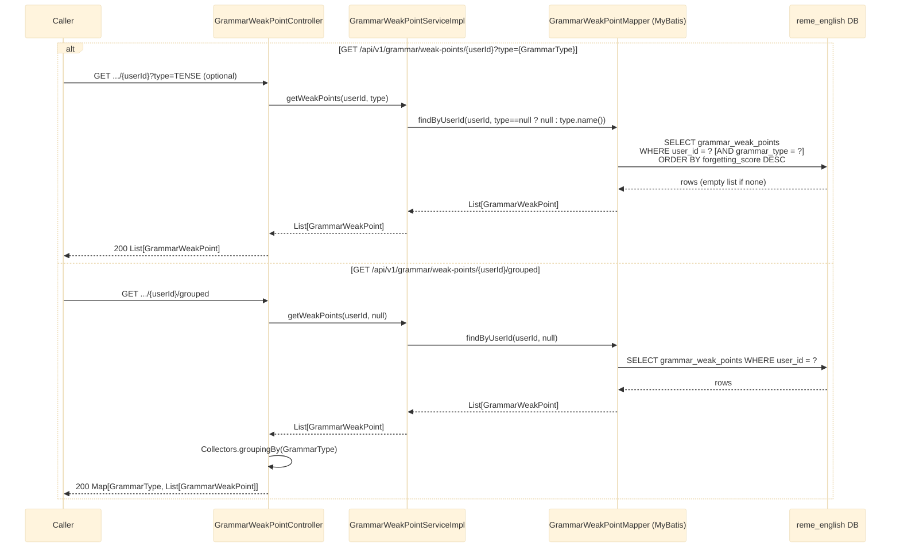

# GET /api/v1/grammar/weak-points/{userId} and /{userId}/grouped

Returns the grammar "weak points" analyzed and persisted for a user, written by grammar's
`LearningGapAnalyzedConsumer` (see
[english-learning-gap-analyzed-grammar.md](english-learning-gap-analyzed-grammar.md)).
See `english-service`'s `grammar/controller/GrammarWeakPointController.java`.

## Notes

- `GrammarType`: `TENSE, SUBJECT_VERB_AGREEMENT, ARTICLE, PREPOSITION, WORD_ORDER, PLURAL,
  PUNCTUATION, OTHER`.
- `GrammarWeakPoint` fields: `id, recordingId, userId, itemId, label, grammarType,
  forgettingScore, recommendation, updatedAt`.
- No validation/exception path beyond a normal DB query — no matching data simply returns an empty
  list, not a 404.
