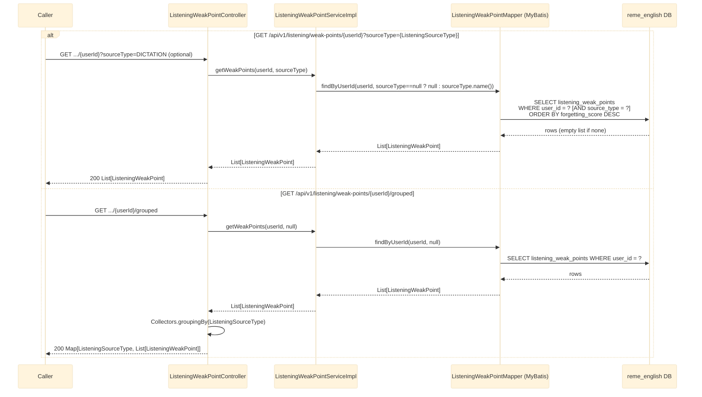

# GET /api/v1/listening/weak-points/{userId} and /{userId}/grouped

Returns the listening "weak points" for a user, merged from two sources distinguished by
`sourceType`: `DICTATION` (dual-written by dictation's `LearningGapAnalyzedConsumer`, see
[english-learning-gap-analyzed-listening.md](english-learning-gap-analyzed-listening.md)) and
`COMPREHENSION` (scored directly by the practice/redo flow's Java engine, see
[practice-redo.md](practice-redo.md) and [listening-learn.md](listening-learn.md)). See
`english-service`'s `listening/weakpoint/controller/ListeningWeakPointController.java`.

## Notes

- `ListeningSourceType`: `DICTATION` (dictation dual-write, always `scoreSource = PYTHON_LEGACY`),
  `COMPREHENSION` (practice/redo Java engine, always `scoreSource = JAVA_ENGINE`).
- `ListeningWeakPoint` fields: `id, recordingId, userId, itemId, label, sourceType, forgettingScore,
  recommendation, masteryLevel, nextReviewAt, scoreSource, updatedAt`.
- Unlike `GrammarWeakPointService`, there is no `getTopWeakPoints`/`findTopByUserId` method - nothing
  in this domain (yet) needs a "top N" query the way dictation's grammar-suggestion flow does.
- No validation/exception path beyond a normal DB query — no matching data simply returns an empty
  list, not a 404.
