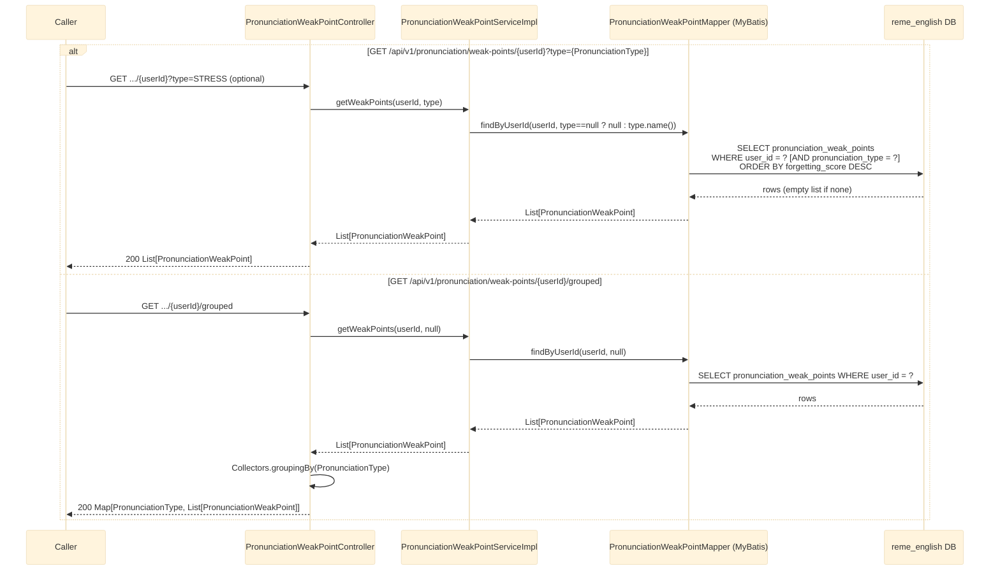

# GET /api/v1/pronunciation/weak-points/{userId} and /{userId}/grouped

Returns the pronunciation "weak points" analyzed and persisted for a user, written by
pronunciation's `LearningGapAnalyzedConsumer` (see
[english-learning-gap-analyzed-pronunciation.md](english-learning-gap-analyzed-pronunciation.md)).
See `english-service`'s `pronunciation/controller/PronunciationWeakPointController.java`.

## Notes

- `PronunciationType`: `VOWEL, CONSONANT, STRESS, INTONATION, LINKING, RHYTHM, OTHER`.
- `PronunciationWeakPoint` fields: `id, recordingId, userId, itemId, label, pronunciationType,
  forgettingScore, recommendation, updatedAt`.
- No validation/exception path beyond a normal DB query — no matching data simply returns an empty
  list, not a 404.
