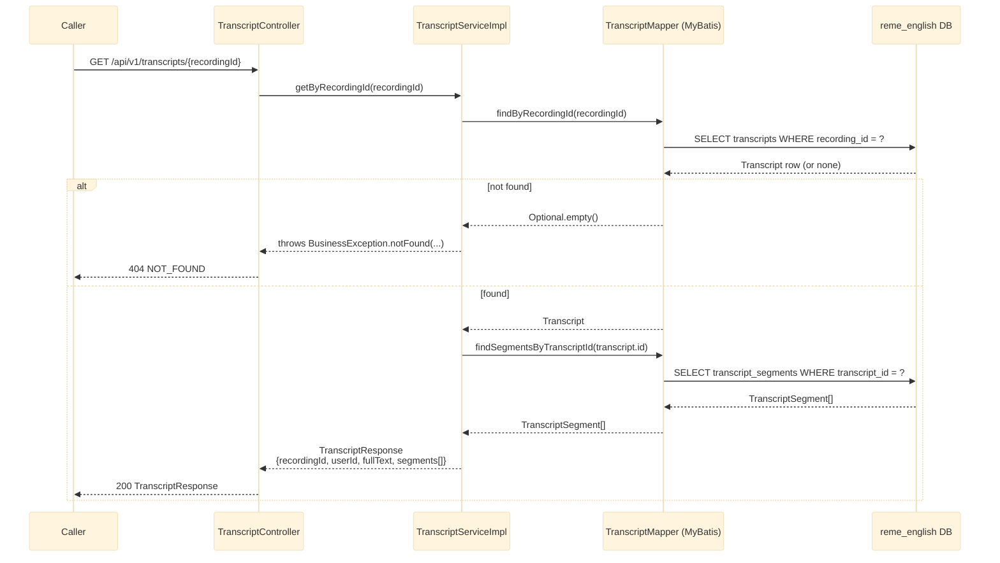

# GET /api/v1/transcripts/{recordingId}

Returns a transcript (with its segments) that was previously persisted from the Kafka
`transcript.ready` event. See `english-service`'s
`vocabulary/controller/TranscriptController.java`.

## Notes

- `segments[]` fields: `id, transcriptId, speaker, content, startSeconds, endSeconds, segmentOrder`.
- This data is written by the Kafka consumer `TranscriptReadyConsumer` — see
  [english-transcript-ready.md](english-transcript-ready.md).
