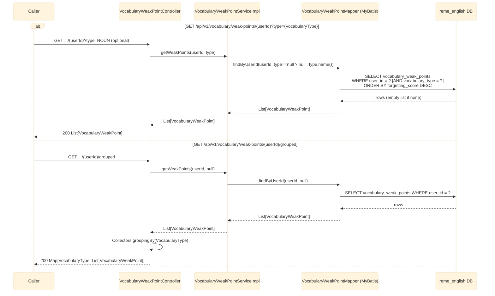

# GET /api/v1/vocabulary/weak-points/{userId} and /{userId}/grouped

Returns the vocabulary "weak points" analyzed and persisted for a user, written by
`LearningGapAnalyzedConsumer` (see
[english-learning-gap-analyzed.md](english-learning-gap-analyzed.md)).
See `english-service`'s `vocabulary/controller/VocabularyWeakPointController.java`.

## Notes

- `VocabularyType`: `NOUN, VERB, ADJECTIVE, ADVERB, PHRASAL_VERB, COLLOCATION, IDIOM, OTHER`.
- `VocabularyWeakPoint` fields: `id, recordingId, userId, itemId, label, vocabularyType,
  forgettingScore, recommendation, updatedAt`.
- No validation/exception path beyond a normal DB query — no matching data simply returns an empty
  list, not a 404.
