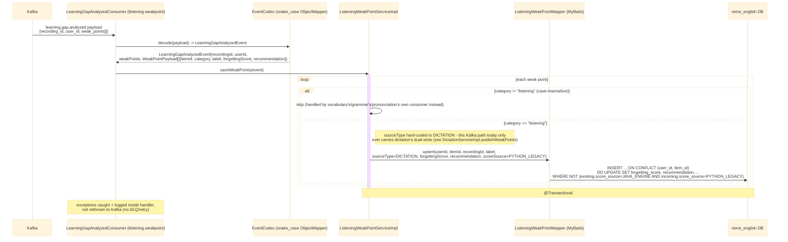

# Kafka consumer: learning.gap.analyzed (listening.weakpoint)

`LearningGapAnalyzedConsumer` (package `listening.weakpoint.kafka`, `groupId:
english-service-listening`) listens on the same `learning.gap.analyzed` topic as
vocabulary/grammar/pronunciation's consumers, filters for the `listening` category, and persists
weak points. Unlike the other three domains, this topic carries only **one** of listening's two
sources today — dictation's dual-write (see `dictation-practice.md`) — so `sourceType` is
hard-coded to `DICTATION` here rather than inferred from the event; the other source
(`COMPREHENSION`) is written by a completely different path (`WeakPointDispatcherImpl`'s Java-direct
`applyJavaComputedScore`, see [practice-redo.md](practice-redo.md)), not through this consumer. See
`english-service`'s `listening/weakpoint/kafka/LearningGapAnalyzedConsumer.java`.

## External calls

| # | Call | From -> To | Notes |
|---|------|-----------|-------|
| 1 | Kafka consume `learning.gap.analyzed` | Kafka broker -> english-service | published by `english-service`'s own `dictation` package (dual-write), not by `ai-service`, for this category |
| 2 | Postgres UPSERT | english-service -> `reme_english` DB | writes/updates `listening_weak_points`, guarded by the same one-way `score_source` ratchet as the other three domains |

## Notes

- Uses a dedicated `groupId` (`english-service-listening`) distinct from the other three domains' -
  required because Kafka splits partitions between consumers sharing one `groupId` on the same
  topic, so a shared `groupId` would mean each domain only sees a subset of messages instead of
  every message.
- Idempotency key: `(user_id, item_id)` — re-analyzing the same item (e.g. the same word mistyped
  again in a later dictation attempt) updates its score instead of creating a new row.
- Unlike `grammar`/`pronunciation`, there is no classifier step here - `sourceType` is a hard-coded
  constant, not something derived from `label`, since this consumer only ever sees one kind of
  producer for category `"listening"` today. If a second Kafka-sourced producer of this category is
  ever added, this hard-coding needs revisiting.
- No downstream event is published (`listening.analyzed` doesn't exist as a topic - listening reuses
  the same `learning.gap.analyzed` topic both to receive dictation's dual-write and, indirectly via
  `practice.redo`, to keep `recommendation-service`/`dashboard-service` in sync).
