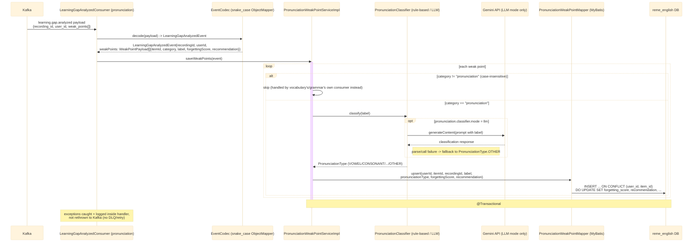

# Kafka consumer: learning.gap.analyzed (pronunciation)

`LearningGapAnalyzedConsumer` (package `pronunciation.kafka`, `groupId:
english-service-pronunciation`) listens on the same `learning.gap.analyzed` topic as vocabulary's
and grammar's consumers (published by `ai-service` — see
[../Ai_service/overview.md](../Ai_service/overview.md) and
[../Ai_service/analyze.md](../Ai_service/analyze.md)), filters for the `pronunciation` category,
and persists weak points. See `english-service`'s
`pronunciation/kafka/LearningGapAnalyzedConsumer.java`.

## External calls

| # | Call | From -> To | Notes |
|---|------|-----------|-------|
| 1 | Kafka consume `learning.gap.analyzed` | Kafka broker -> english-service | published by `ai-service`, see [../Ai_service/overview.md](../Ai_service/overview.md) |
| 2 | Gemini `generateContent` REST call | english-service -> Gemini API | only when `pronunciation.classifier.mode=llm`; the default `rule-based` mode makes no outbound call |
| 3 | Postgres UPSERT | english-service -> `reme_english` DB | writes/updates `pronunciation_weak_points` |

## Notes

- Uses a dedicated `groupId` (`english-service-pronunciation`) distinct from vocabulary's
  (`english-service`) and grammar's (`english-service-grammar`) — required because Kafka splits
  partitions between consumers sharing one `groupId` on the same topic, so a shared `groupId`
  would mean each domain only sees a subset of messages instead of every message.
- Idempotency key: `(user_id, item_id)` — re-analyzing the same item across sessions updates its
  score instead of creating a new row.
- No `TranscriptReadyConsumer` exists in this package — transcripts are a cross-domain concern
  already persisted once by vocabulary's consumer (see
  [english-transcript-ready.md](english-transcript-ready.md)); this domain reads them back via
  `GET /api/v1/transcripts/{recordingId}` if needed, rather than re-ingesting.
- No downstream event is published (the `pronunciation.analyzed` topic constant exists in
  `KafkaTopics.java` but has no producer yet — defined for future use only).
