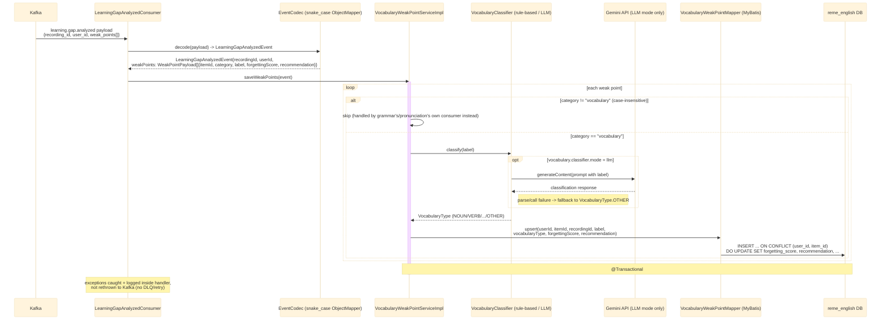

# Kafka consumer: learning.gap.analyzed (vocabulary)

`LearningGapAnalyzedConsumer` (package `vocabulary.kafka`, `groupId: english-service`) listens on
the `learning.gap.analyzed` topic (published by `ai-service` after forgetting-pattern analysis —
see [../Ai_service/overview.md](../Ai_service/overview.md) and
[../Ai_service/analyze.md](../Ai_service/analyze.md)), filters for the `vocabulary` category, and
persists weak points. See `english-service`'s
`vocabulary/kafka/LearningGapAnalyzedConsumer.java`.

The `grammar` and `pronunciation` domains have their own consumers on the same topic, each with
its own `groupId` (`english-service-grammar`, `english-service-pronunciation`) so all three receive
every message instead of splitting partitions between them — see
[english-learning-gap-analyzed-grammar.md](english-learning-gap-analyzed-grammar.md) and
[english-learning-gap-analyzed-pronunciation.md](english-learning-gap-analyzed-pronunciation.md).

## External calls

| # | Call | From -> To | Notes |
|---|------|-----------|-------|
| 1 | Kafka consume `learning.gap.analyzed` | Kafka broker -> english-service | published by `ai-service`, see [../Ai_service/overview.md](../Ai_service/overview.md) |
| 2 | Gemini `generateContent` REST call | english-service -> Gemini API | only when `vocabulary.classifier.mode=llm`; the default `rule-based` mode makes no outbound call |
| 3 | Postgres UPSERT | english-service -> `reme_english` DB | writes/updates `vocabulary_weak_points` |

## Notes

- Idempotency key: `(user_id, item_id)` — re-analyzing the same item across sessions updates its
  score instead of creating a new row.
- Grammar/pronunciation categories are skipped here because they're persisted by their own
  consumer instance in the same JVM (`grammar.kafka.LearningGapAnalyzedConsumer`,
  `pronunciation.kafka.LearningGapAnalyzedConsumer`), each with its own `groupId` so it still gets
  a full copy of every message.
- No downstream event is published (the `vocabulary.analyzed` topic constant exists in
  `KafkaTopics.java` but has no producer yet — defined for future use only).
- For the producer side (`RuleBasedAnalyzer`) and the full cross-service picture, see
  [../Ai_service/overview.md](../Ai_service/overview.md).
