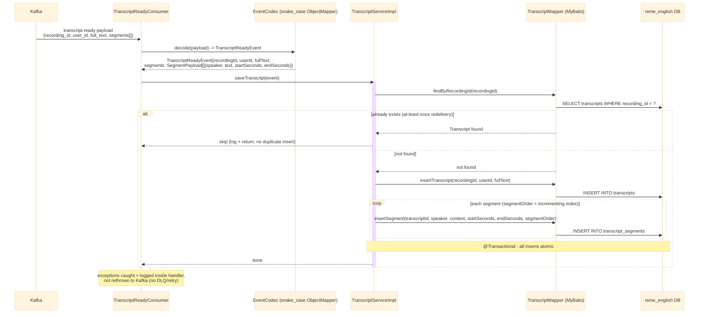

# Kafka consumer: transcript.ready

`TranscriptReadyConsumer` listens on the `transcript.ready` topic (published by `ai-service` after
STT+diarization — see [../Ai_service/overview.md](../Ai_service/overview.md)) and persists the
transcript. See `english-service`'s `vocabulary/kafka/TranscriptReadyConsumer.java`.

## External calls

| # | Call | From -> To | Notes |
|---|------|-----------|-------|
| 1 | Kafka consume `transcript.ready` | Kafka broker -> english-service | published by `ai-service`, see [../Ai_service/overview.md](../Ai_service/overview.md) |
| 2 | Postgres INSERT | english-service -> `reme_english` DB | writes transcript + segments |

## Notes

- Idempotency key: `recording_id` — required since Kafka delivers at-least-once.
- `segments[]` may include `speaker == "vision"` entries when ai-service's `VISION_ENABLED=true`
  (Gemini frame-captioning, see [../Ai_service/overview.md](../Ai_service/overview.md)) — persisted
  the same as any other segment, no special-casing needed here.
- No downstream event is published from the english-service side.
- For the producer side (S3, Whisper, diarization) and the full cross-service picture, see
  [../Ai_service/overview.md](../Ai_service/overview.md).
