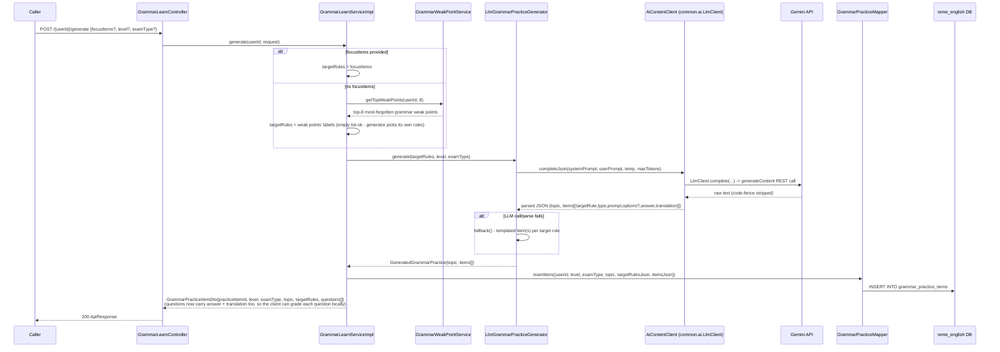
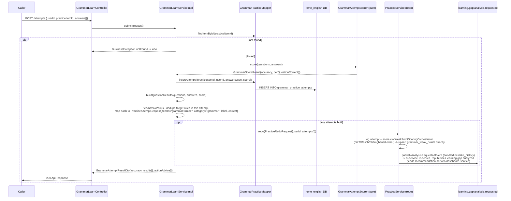
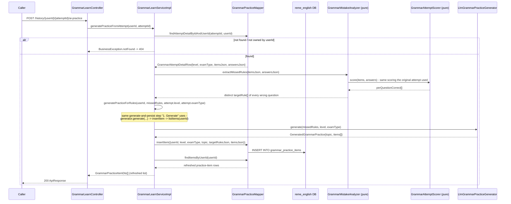

# Grammar learn: AI-generated practice sets + graded attempts

Covers `com.remelearning.english.grammar.learn` (`GrammarLearnController`/`GrammarLearnServiceImpl`),
structurally a clone of `vocabulary-learn.md`'s `VocabLearnServiceImpl` (see that file for the full
rationale) with "word" replaced by "grammar rule" and category `"grammar"` instead of `"vocabulary"`.
FE calls go through `bff-service`'s `LearnerController` (`/api/v1/learners/{userId}/learn/grammar/
...`), a pure pass-through (`EnglishServiceClient`) - omitted from the diagrams below as a separate
hop, same convention as `dictation-practice.md`'s generic `Caller`.

This skill is AI-only: `LlmGrammarPracticeGenerator` is the only `GrammarPracticeGenerator`, with a
static-template fallback on any LLM call/parse failure. No Kafka consumer/producer of its own -
grading reuses `practice.service.PracticeService#redo`, which publishes
`learning.gap.analysis.requested` (see `overview.md` section 3 / `practice-redo.md`).

## 1. Generate (`POST /api/v1/learn/grammar/{userId}/generate`)

## 2. Submit attempt (`POST /api/v1/learn/grammar/attempts`)

## 3. Generate from one past attempt's mistakes (`POST /api/v1/learn/grammar/history/{userId}/{attemptId}/ai-practice`)

## External calls

| # | Call | From -> To | Notes |
|---|------|-----------|-------|
| 1 | HTTPS | english-service -> Gemini API | `LlmGrammarPracticeGenerator` via `AiContentClient`/`LlmClient`; falls back to a template on any failure |
| 2 | Kafka produce | english-service -> `learning.gap.analysis.requested` | via `PracticeService#redo` -> `AnalysisRequestedProducer`, same mechanism as the practice/redo flow (`practice-redo.md`) |
| 3 | Postgres | english-service -> `reme_english` | `grammar_practice_items`, `grammar_practice_attempts`, plus `grammar_weak_points` (upserted by `WeakPointScoringOrchestrator`) |

## Notes

- Structurally identical to `vocabulary-learn.md` - see that file's Notes for the shared rationale
  (client-side grading contract change, binary correct/incorrect feed, no dedicated Kafka
  consumer/producer for this package's own request flow). Like vocabulary, `GrammarQuestionDto` now
  carries `answer` + `translation` on the generate/`getItem`/`listItems` responses so the client grades
  each question locally for instant feedback; the authoritative score still comes only from `submit`.
- Not independently confirmed in code for this report: whether the FE ever calls `GET /items/{itemId}`
  directly outside the immediate `generate` response - both endpoints exist
  (`GrammarLearnController`) but only `generate`/`submit` are diagrammed above per the requested scope.
- `generatePracticeForRules` (section 3) is the shared generate-and-persist step both
  `generatePracticeFromAttempt` and Grammar Library's own `generatePracticeFromSession` delegate to
  (see `grammar-library.md` section 6) - there is only one AI-practice destination
  (`grammar_practice_items`) per domain, regardless of which flow (learn attempt vs. library session)
  the mistake came from. Mirrors `dictation-practice.md` section 2b's "from one history row"
  regeneration action, minus the audio-synthesis step (grammar practice has no audio).
