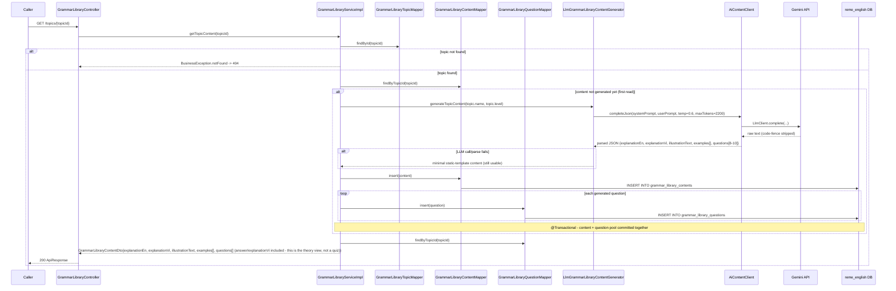
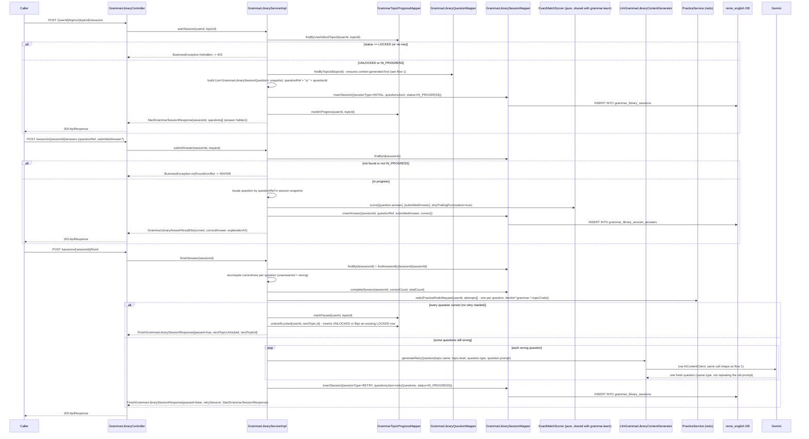
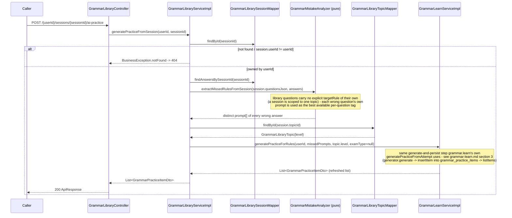

# Grammar library: 60-topic catalog + theory page + session-based practice with pass/retry/unlock

Covers `com.remelearning.english.grammar.library` (`GrammarLibraryController`/
`GrammarLibraryServiceImpl`), a fixed 60-topic grammar catalog (beginner -> intermediate ->
advanced, seeded in `V17__grammar_library.sql`) crossing the "AI content generated once, reused
forever" pattern of [vocabulary-library.md](vocabulary-library.md) with `grammar.learn`'s question
types/scoring (`GrammarQuestionType`, `ExactMatchScorer`). Each topic has a theory page
(bilingual explanation + illustration + examples) plus an 8-10 question pool, generated by AI on
first read only. A learner progresses topic-by-topic: only the first topic starts `UNLOCKED`;
passing a topic (answering every question correctly, including after retries) unlocks the next one.
FE calls go through `bff-service`'s `LearnerController`, a pure pass-through, omitted below as a
separate hop per `vocabulary-library.md`'s convention.

## 1. Open a topic's theory page (`GET /api/v1/learn/grammar/library/topics/{topicId}`)

## 2. Start a session, answer, and finish (`POST .../sessions`, `POST .../answers`, `POST .../finish`)

## 3. Generate from one past session's mistakes (`POST /api/v1/learn/grammar/library/{userId}/sessions/{sessionId}/ai-practice`)

## External calls

| # | Call | From -> To | Notes |
|---|------|-----------|-------|
| 1 | HTTPS | english-service -> Gemini API | `LlmGrammarLibraryContentGenerator` via `AiContentClient`, both for first-read topic content and for per-question RETRY generation; falls back to a static template on failure so neither call ever hard-fails |
| 2 | In-process | english-service -> `PracticeService#redo` | fired once per `finishSession` call, one attempt per question in the session (not deduped), same mechanism as `vocabulary-library.md` §2 |
| 3 | Postgres | english-service -> `reme_english` | `grammar_library_topics`, `grammar_library_contents`, `grammar_library_questions`, `grammar_topic_progress`, `grammar_library_sessions`, `grammar_library_session_answers` |
| 4 | In-process | english-service -> `GrammarLearnService#generatePracticeForRules` | fired only by flow 3 (generate-from-session); delegates the actual generate-and-persist step to `grammar.learn` so both flows feed the same `grammar_practice_items` bank |

## Notes

- `grammar_library_topics` is a fixed, hand-seeded catalog (60 rows, `V17__grammar_library.sql`) —
  unlike `vocabulary_topics`/`vocabulary_library_words`, nothing here is ever generated or topped up;
  only the *content* (theory page + question pool) is AI-generated, once per topic.
- A `RETRY` session's questions are never persisted to `grammar_library_questions` — they live only
  inline in that session's `questions_json`, since they are one-off replacements for a single wrong
  answer, not reusable pool content.
- `unlockIfLocked` is a guarded upsert (`INSERT ... ON CONFLICT DO UPDATE ... WHERE status = 'LOCKED'`)
  so it never regresses a topic a learner has already reached past `LOCKED` — see
  `GrammarTopicProgressMapper.xml`.
- Like the other "Học &amp; Luyện tập" skills, this package has no Kafka consumer/producer of its own
  — it only reaches Kafka indirectly through `PracticeService#redo`'s bundled
  `learning.gap.analysis.requested` publish (see `overview.md` §3).
- Flow 3 (generate-from-session) is a new dependency of `GrammarLibraryServiceImpl` on
  `GrammarLearnService` (interface, not the concrete `GrammarLearnServiceImpl`) - the only cross-package
  collaborator this service has, added specifically so both the learn and library "Luyện tập với AI"
  actions share exactly one persistence path (`grammar_practice_items`) instead of the library growing
  its own parallel bank. See `grammar-learn.md` section 3 for the shared step's own diagram.
