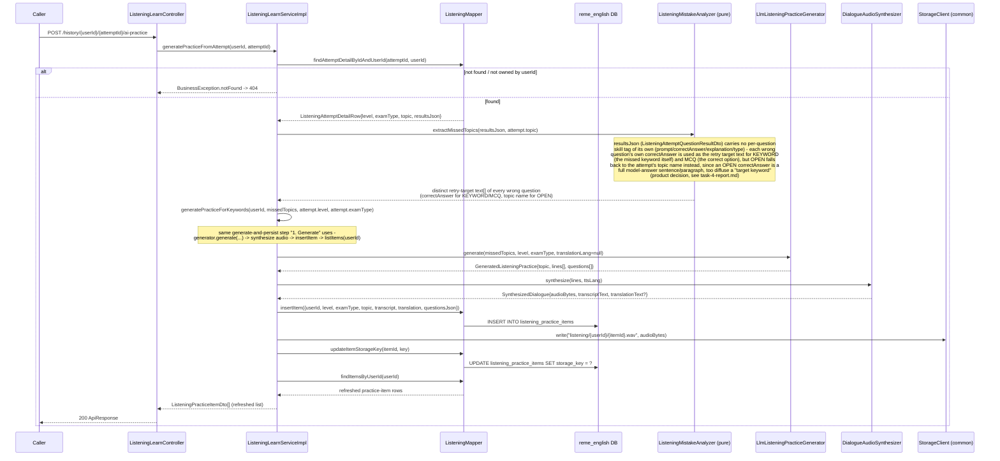
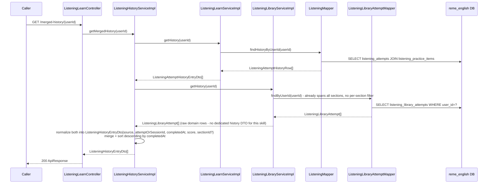

# Listening learn: AI-generated passage + TTS, graded attempts

Covers `com.remelearning.english.listening` (`ListeningLearnController`/`ListeningLearnServiceImpl`),
one of the four "Học &amp; Luyện tập với AI" skills (see `vocabulary-learn.md` for the shared
rationale). Unlike vocabulary/grammar, generation also synthesizes audio (Gemini transcript+questions
via `DialogueAudioSynthesizer`, itself backed by Supertonic TTS in ai-service - the same
infrastructure `dictation-practice.md` section 2 uses), and grading mixes three scoring paths
(MCQ/KEYWORD exact-or-WER vs. OPEN via an LLM grader) before revealing the transcript/translation.
FE calls go through `bff-service`'s `LearnerController` (`/api/v1/learners/{userId}/learn/listening/
...`), a pure pass-through (`EnglishServiceClient`, plus a separate audio-streaming proxy) - omitted
from the diagrams below, same convention as `dictation-practice.md`'s generic `Caller`.

This skill has no dedicated weak-point table (`listening` has no `*_weak_points` migration) - target
keywords for a "no explicit focus" generate come from the learner's own past KEYWORD questions
answered wrong, read straight off `listening_practice_items.questions_json`, not a scored table.
Grading still reuses `practice.service.PracticeService#redo`, publishing
`learning.gap.analysis.requested` exactly like the other three skills.

## 1. Generate (`POST /api/v1/learn/listening/{userId}/generate`)

```mermaid
sequenceDiagram
    participant Caller
    participant Ctrl as ListeningLearnController
    participant Svc as ListeningLearnServiceImpl
    participant LMapper as ListeningMapper
    participant DB as reme_english DB
    participant Gen as LlmListeningPracticeGenerator
    participant Ai as AiContentClient (common.ai.LlmClient)
    participant Gemini as Gemini API
    participant Synth as DialogueAudioSynthesizer
    participant Tts as TtsClient (Supertonic)
    participant AiSvc as ai-service /api/v1/tts/synthesize
    participant Store as StorageClient (common)

    Caller->>Ctrl: POST /{userId}/generate {focusItems?, level?, examType?, translationLang?}
    Ctrl->>Svc: generate(userId, request)
    alt focusItems provided
        Svc->>Svc: targetKeywords = focusItems
    else no focusItems
        Svc->>LMapper: findItemsByUserId(userId)
        LMapper->>DB: SELECT listening_practice_items WHERE user_id = ?
        Svc->>Svc: flatten each item's KEYWORD questions -> distinct answers, limit 8<br/>(empty list ok - generator picks its own topic)
    end
    Svc->>Gen: generate(targetKeywords, level, examType, translationLang)
    Gen->>Ai: completeJson(systemPrompt, userPrompt, temp=0.6, maxTokens=1600)
    Ai->>Gemini: LlmClient.complete(...) -> generateContent REST call
    Gemini-->>Ai: raw text (code-fence stripped)
    Ai-->>Gen: parsed JSON {topic, lines[{speaker,text,translation?}], questions[MCQ x2, KEYWORD x2, OPEN x1]}
    alt LLM call fails, or parse fails, or lines/questions empty
        Gen->>Gen: fallback() - one fixed template line + one MCQ question
    end
    Gen-->>Svc: GeneratedListeningPractice{topic, lines[], questions[]}
    Svc->>Synth: synthesize(lines, ttsLang)
    loop each dialogue line
        Synth->>Tts: synthesize({text, languageCode, voice}) - one random voice per distinct speaker
        Tts->>AiSvc: POST /api/v1/tts/synthesize
        AiSvc-->>Tts: {audio_base64, mime_type, sample_rate}
    end
    Synth->>Synth: WavAudioMerger.merge(all line clips) -> one continuous WAV
    Synth-->>Svc: SynthesizedDialogue{audioBytes, transcriptText, translationText?}
    Svc->>LMapper: insertItem({userId, level, examType, topic, transcript, translation, questionsJson})
    LMapper->>DB: INSERT INTO listening_practice_items
    Svc->>Store: write("listening/{userId}/{itemId}.wav", audioBytes)
    Svc->>LMapper: updateItemStorageKey(itemId, key)
    LMapper->>DB: UPDATE listening_practice_items SET storage_key = ?
    Svc-->>Ctrl: ListeningPracticeItemDto{practiceItemId, audioUrl, level, examType, topic, questions[]}<br/>(questions now carry answer + explanation for client-side grading; answer null for OPEN; transcript/translation still hidden until graded)
    Ctrl-->>Caller: 200 ApiResponse
```

## 2. Submit attempt (`POST /api/v1/learn/listening/attempts`)

```mermaid
sequenceDiagram
    participant Caller
    participant Ctrl as ListeningLearnController
    participant Svc as ListeningLearnServiceImpl
    participant LMapper as ListeningMapper
    participant DB as reme_english DB
    participant Closed as ListeningQuestionScoring (pure, MCQ/KEYWORD)
    participant Grader as LlmOpenAnswerGrader (OPEN)
    participant Ai as AiContentClient (common.ai.LlmClient)
    participant Gemini as Gemini API
    participant PSvc as PracticeService (redo)
    participant Kafka as learning.gap.analysis.requested

    Caller->>Ctrl: POST /attempts {userId, practiceItemId, answers[]}
    Ctrl->>Svc: submit(request)
    Svc->>LMapper: findItemById(practiceItemId)
    alt not found
        Svc-->>Ctrl: BusinessException.notFound -> 404
    else found
        loop each question
            alt type == OPEN
                Svc->>Grader: grade(transcript, prompt, modelAnswer, submitted)
                Grader->>Ai: completeJson(systemPrompt, userPrompt, temp=0.2, maxTokens=300)
                Ai->>Gemini: LlmClient.complete(...) -> generateContent REST call
                Gemini-->>Ai: raw text (code-fence stripped)
                Ai-->>Grader: parsed JSON {score 0.0-1.0, feedback}
                alt LLM call/parse fails
                    Grader->>Grader: neutral fallback score=0.5, generic Vietnamese feedback
                end
                Grader-->>Svc: OpenAnswerGrade{score, feedback}
            else MCQ or KEYWORD
                Svc->>Closed: scoreClosed(question, submitted) - exact match (MCQ) or WER-tolerant match (KEYWORD)
                Closed-->>Svc: subScore
            end
            Svc->>Svc: correct = subScore >= CORRECT_THRESHOLD; accumulate totalScore
        end
        Svc->>Svc: accuracy = totalScore / questions.size()
        Svc->>LMapper: insertAttempt({practiceItemId, userId, answersJson, resultsJson, score})
        LMapper->>DB: INSERT INTO listening_attempts
        Svc->>Svc: feedWeakPoints - dedupe by label (KEYWORD answer or MCQ/OPEN skill),<br/>map each to PracticeAttemptRequest{itemId="listening:<label>", category="listening", label, correct}
        opt any attempts built
            Svc->>PSvc: redo(PracticeRedoRequest{userId, attempts[]})
            PSvc->>PSvc: log attempt + score via WeakPointScoringOrchestrator<br/>-> upsert into whichever weak-point table category "listening" maps to
            PSvc->>Kafka: publish AnalysisRequestedEvent (bundled mistake_history)<br/>-> ai-service re-scores, republishes learning.gap.analyzed
        end
        Svc-->>Ctrl: ListeningAttemptResultDto{accuracy, results[], transcript, translation, actionAdvice[]}<br/>(transcript/translation revealed only now, at grading time)
        Ctrl-->>Caller: 200 ApiResponse
    end
```

## 3. Generate from one past attempt's mistakes (`POST /api/v1/learn/listening/history/{userId}/{attemptId}/ai-practice`)



## 4. Merged history (`GET /api/v1/learn/listening/merged-history/{userId}`)



Note: `ListeningHistoryServiceImpl` is a standalone service, not folded into either
`ListeningLearnServiceImpl` or `ListeningLibraryServiceImpl`, for the same reason as
`GrammarHistoryServiceImpl` (see `grammar-learn.md` section 4) - `ListeningLibraryServiceImpl` already
depends on `ListeningLearnService` (for `generatePracticeFromSection`), so a reverse dependency would
form a circular bean. Unlike Grammar, `ListeningLibraryService.getHistory(userId)` already spanned all
sections (no per-section filter existed to begin with), so no new mapper query was needed here.

## External calls

| # | Call | From -> To | Notes |
|---|------|-----------|-------|
| 1 | HTTPS | english-service -> Gemini API | `LlmListeningPracticeGenerator` (generate) + `LlmOpenAnswerGrader` (submit, OPEN questions only), both via `AiContentClient`/`LlmClient`; both fall back on any failure |
| 2 | HTTP | english-service -> ai-service `/api/v1/tts/synthesize` | Supertonic TTS via `DialogueAudioSynthesizer`, one call per dialogue line, merged into one file by `WavAudioMerger` - identical infra to `dictation-practice.md` section 2 |
| 3 | StorageClient write/read | english-service -> local FS (or S3) | generated passage audio, streamed back via `GET /items/{itemId}/audio` |
| 4 | Kafka produce | english-service -> `learning.gap.analysis.requested` | via `PracticeService#redo` -> `AnalysisRequestedProducer` |
| 5 | Postgres | english-service -> `reme_english` | `listening_practice_items`, `listening_attempts` |

## Notes

- `generate` synthesizes audio synchronously in the request thread (no async job queue anywhere in
  this codebase) - matches dictation's own AI-practice generation pattern.
- **Client-side grading (contract change):** `ListeningQuestionDto` now carries `answer` + `explanation`
  on the generate/`getItem`/`listItems` responses, so the client grades `MCQ`/`KEYWORD` questions locally
  for instant feedback before calling `submit`. `answer` is null for `OPEN` questions - those stay
  LLM-graded server-side (`LlmOpenAnswerGrader`, see submit diagram) and must not leak to the client. The
  transcript/translation are still revealed only at grading time, and the authoritative score still
  comes only from `submit`; call order above is unchanged.
- Grading is the only one of the four "learn" skills that calls the LLM again (for OPEN questions),
  in addition to the generate-time Gemini call - vocabulary/grammar/speaking only call Gemini during
  generate.
- `resolveTargetKeywords`'s fallback (recently-missed KEYWORD answers) is a query over this package's
  own `listening_practice_items` rows, not a weak-point table - listening has no dedicated
  weak-point table today (confirmed by the lack of a `listening_weak_points`-shaped migration/mapper).
- **Confirmed gap, not a diagramming guess:** `WeakPointDispatcherImpl.dispatch` (the component
  `WeakPointScoringOrchestrator` calls to persist a Java-computed score into the owning domain's
  weak-point table) only has `switch` cases for `"vocabulary"`/`"grammar"`/`"pronunciation"` -
  `"listening"` falls through to `default -> log.warn("Unknown category ...")` and is silently
  dropped. So a listening attempt's `mistake_history` row and the bundled
  `learning.gap.analysis.requested` re-publish still happen (both are category-agnostic), but no
  `listening_weak_points`-shaped table gets written directly the way `vocabulary_weak_points`/
  `grammar_weak_points`/`pronunciation_weak_points` do for their own categories - there is no such
  table today. The diagram above still shows the `redo`/dispatch call since it executes; it just
  doesn't result in a persisted weak-point row for this category.
- `generatePracticeForKeywords` (section 3) is the shared generate-and-persist step both
  `generatePracticeFromAttempt` and Listening Library's own `generatePracticeFromSection` delegate
  to (see `listening-library.md` section 3) - there is only one AI-practice destination
  (`listening_practice_items`) per domain, regardless of which flow (learn attempt vs. library
  section) the mistake came from. Mirrors `grammar-learn.md` section 3's same pattern, plus the
  audio-synthesis step grammar practice doesn't have.
