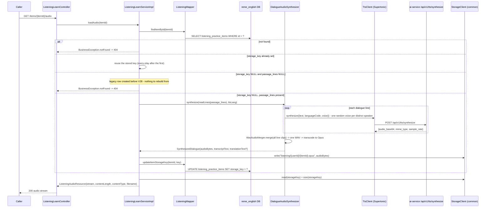
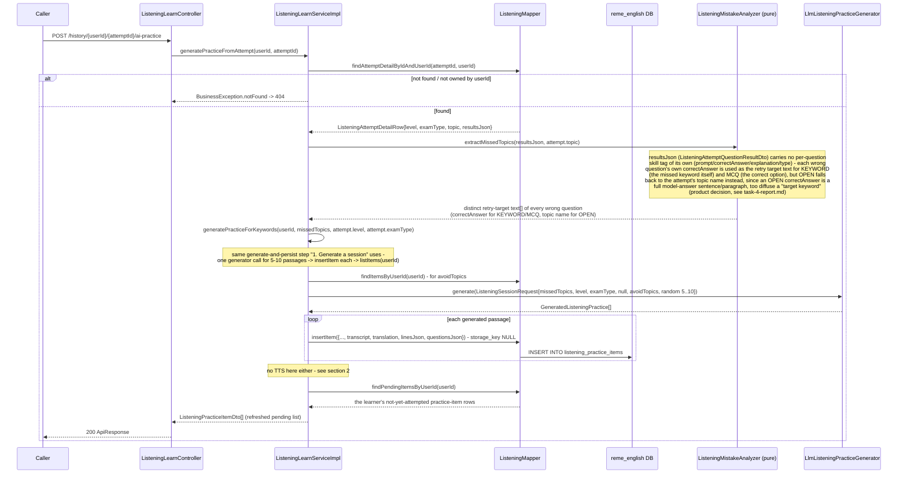
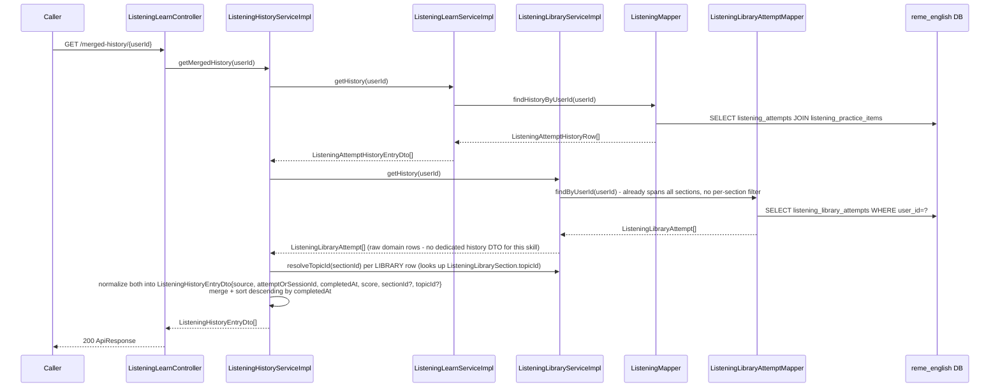

# Listening learn: AI-generated session of passages + lazy TTS, graded attempts

Covers `com.remelearning.english.listening` (`ListeningLearnController`/`ListeningLearnServiceImpl`),
one of the four "Học &amp; Luyện tập với AI" skills (see `vocabulary-learn.md` for the shared
rationale). Two things set it apart from vocabulary/grammar: **one generate call produces a whole
session of 5-10 distinct passages** (a single Gemini call), and each passage's audio is synthesized
**lazily**, on the first request for that passage's `/audio` endpoint, via `DialogueAudioSynthesizer`
(backed by Supertonic TTS in ai-service - the same infrastructure `dictation-practice.md` section 2
uses). Grading then mixes three scoring paths (MCQ/KEYWORD exact-or-WER vs. OPEN via an LLM grader)
before revealing the transcript/translation.
FE calls go through `bff-service`'s `LearnerController` (`/api/v1/learners/{userId}/learn/listening/
...`), a pure pass-through (`EnglishServiceClient`, plus a separate audio-streaming proxy) - omitted
from the diagrams below, same convention as `dictation-practice.md`'s generic `Caller`.

Why a session instead of one passage: pressing "Tạo bài luyện" used to produce exactly one passage,
and because the prompt was built purely from an unshuffled keyword list it was byte-for-byte identical
on every call - so Gemini kept returning the same passage. Asking for 5-10 passages in one call lets
the prompt demand they differ from each other, and carrying the learner's already-practised topics
plus a random draw of scenario hints stops consecutive sessions from converging too. The passages the
learner hasn't done yet are exactly what `GET /{userId}/items` returns ("Bài đã tạo, chưa làm xong").

This skill has no dedicated weak-point table (`listening` has no `*_weak_points` migration) - target
keywords for a "no explicit focus" generate come from the learner's own past KEYWORD questions
answered wrong, read straight off `listening_practice_items.questions_json`, not a scored table.
Grading still reuses `practice.service.PracticeService#redo`, publishing
`learning.gap.analysis.requested` exactly like the other three skills.

## 1. Generate a session (`POST /api/v1/learn/listening/{userId}/generate`)

```mermaid
sequenceDiagram
    participant Caller
    participant Ctrl as ListeningLearnController
    participant Svc as ListeningLearnServiceImpl
    participant LMapper as ListeningMapper
    participant DB as reme_english DB
    participant Gen as LlmListeningPracticeGenerator
    participant Ai as AiContentClient (common.ai.LlmClient)
    participant Gemini as Gemini API
    participant Render as DialogueTextRenderer (pure)

    Caller->>Ctrl: POST /{userId}/generate {focusItems?, level?, examType?, translationLang?}
    Ctrl->>Svc: generate(userId, request)
    Svc->>LMapper: findItemsByUserId(userId) - read once, feeds both keywords and avoid-topics
    LMapper->>DB: SELECT listening_practice_items WHERE user_id = ?
    alt focusItems provided
        Svc->>Svc: targetKeywords = focusItems
    else no focusItems
        Svc->>Svc: flatten each item's KEYWORD questions -> distinct answers,<br/>SHUFFLE, then limit 8 (empty list ok - generator picks its own topics)
    end
    Svc->>Svc: avoidTopics = distinct topics of the 12 newest items
    Svc->>Svc: passageCount = random 5..10 (per call)
    Svc->>Gen: generate(ListeningSessionRequest{targetKeywords, level, examType, translationLang, avoidTopics, passageCount})
    Gen->>Gen: draw 2 x passageCount scenario hints at random from a 24-entry pool
    Gen->>Ai: completeJson(systemPrompt, userPrompt, temp=0.9, maxTokens=600 + 1300 x passageCount)
    Ai->>Gemini: LlmClient.complete(...) -> generateContent REST call
    Gemini-->>Ai: raw text (code-fence stripped)
    Ai-->>Gen: parsed JSON {passages[{topic, lines[{speaker,text,translation?}], questions[MCQ x2, KEYWORD x2, OPEN x1]}]}
    Gen->>Gen: skip any passage returned with no lines or no questions
    alt LLM call fails, or parse fails, or every passage unusable
        Gen-->>Svc: BusinessException EXTERNAL_SERVICE_ERROR (502) - no template passage
    end
    Gen-->>Svc: GeneratedListeningPractice[] (5-10)
    loop each generated passage
        Svc->>Render: render(lines) - join lines, speaker-prefix only when multi-speaker
        Render-->>Svc: DialogueText{transcriptText, translationText?}
        Svc->>LMapper: insertItem({userId, level, examType, topic, transcript, translation,<br/>linesJson, questionsJson}) - storage_key stays NULL
        LMapper->>DB: INSERT INTO listening_practice_items
    end
    Note over Svc: No TTS here. Audio is synthesized on first playback (section 2)
    Svc-->>Ctrl: ListeningPracticeItemDto[] {practiceItemId, audioUrl, level, examType, topic, questions[]}<br/>(audioUrl advertised even though no audio exists yet - calling it is what triggers synthesis;<br/>questions carry answer + explanation for client-side grading, answer null for OPEN;<br/>transcript/translation still hidden until graded)
    Ctrl-->>Caller: 200 ApiResponse
```

The FE opens the first passage and leaves the rest to `GET /{userId}/items`, which returns only the
learner's items with no attempt row yet (`findPendingItemsByUserId`, a `NOT EXISTS` against
`listening_attempts`) - the "Bài đã tạo, chưa làm xong" list, cloned from writing's `WritingTaskList`.

## 2. Stream audio, synthesizing it on first play (`GET /api/v1/learn/listening/items/{itemId}/audio`)

```mermaid
sequenceDiagram
    participant Caller
    participant Ctrl as ListeningLearnController
    participant Svc as ListeningLearnServiceImpl
    participant LMapper as ListeningMapper
    participant DB as reme_english DB
    participant Synth as DialogueAudioSynthesizer
    participant Tts as TtsClient (Supertonic)
    participant AiSvc as ai-service /api/v1/tts/synthesize
    participant Store as StorageClient (common)

    Caller->>Ctrl: GET /items/{itemId}/audio
    Ctrl->>Svc: loadAudio(itemId)
    Svc->>LMapper: findItemById(itemId)
    LMapper->>DB: SELECT listening_practice_items WHERE id = ?
    alt not found
        Svc-->>Ctrl: BusinessException.notFound -> 404
    else storage_key already set
        Svc->>Svc: reuse the stored key (every play after the first)
    else storage_key NULL and passage_lines NULL
        Note over Svc: legacy row created before V28 - nothing to rebuild from
        Svc-->>Ctrl: BusinessException.notFound -> 404
    else storage_key NULL, passage_lines present
        Svc->>Synth: synthesize(readLines(passage_lines), ttsLang)
        loop each dialogue line
            Synth->>Tts: synthesize({text, languageCode, voice}) - one random voice per distinct speaker
            Tts->>AiSvc: POST /api/v1/tts/synthesize
            AiSvc-->>Tts: {audio_base64, mime_type, sample_rate}
        end
        Synth->>Synth: WavAudioMerger.merge(all line clips) -> one WAV -> transcode to Opus
        Synth-->>Svc: SynthesizedDialogue{audioBytes, transcriptText, translationText?}
        Svc->>Store: write("listening/{userId}/{itemId}.opus", audioBytes)
        Svc->>LMapper: updateItemStorageKey(itemId, key)
        LMapper->>DB: UPDATE listening_practice_items SET storage_key = ?
    end
    Svc->>Store: read(storageKey) + size(storageKey)
    Svc-->>Ctrl: ListeningAudioResource{stream, contentLength, contentType, filename}
    Ctrl-->>Caller: 200 audio stream
```

## 3. Submit attempt (`POST /api/v1/learn/listening/attempts`)

```mermaid
sequenceDiagram
    participant Caller
    participant Ctrl as ListeningLearnController
    participant Svc as ListeningLearnServiceImpl
    participant LMapper as ListeningMapper
    participant DB as reme_english DB
    participant Closed as ListeningQuestionScoring (pure, MCQ/KEYWORD)
    participant Grader as LlmOpenAnswerGrader (OPEN)
    participant Ai as AiContentClient (common.ai.LlmClient)
    participant Gemini as Gemini API
    participant PSvc as PracticeService (redo)
    participant Kafka as learning.gap.analysis.requested

    Caller->>Ctrl: POST /attempts {userId, practiceItemId, answers[]}
    Ctrl->>Svc: submit(request)
    Svc->>LMapper: findItemById(practiceItemId)
    alt not found
        Svc-->>Ctrl: BusinessException.notFound -> 404
    else found
        loop each question
            alt type == OPEN
                Svc->>Grader: grade(transcript, prompt, modelAnswer, submitted)
                Grader->>Ai: completeJson(systemPrompt, userPrompt, temp=0.2, maxTokens=300)
                Ai->>Gemini: LlmClient.complete(...) -> generateContent REST call
                Gemini-->>Ai: raw text (code-fence stripped)
                Ai-->>Grader: parsed JSON {score 0.0-1.0, feedback}
                alt LLM call/parse fails
                    Grader-->>Svc: AiContentException - no neutral 0.5 substitute
                end
                Grader-->>Svc: OpenAnswerGrade{score, feedback}
            else MCQ or KEYWORD
                Svc->>Closed: scoreClosed(question, submitted) - exact match (MCQ) or WER-tolerant match (KEYWORD)
                Closed-->>Svc: subScore
            end
            Svc->>Svc: correct = subScore >= CORRECT_THRESHOLD; accumulate totalScore
        end
        Svc->>Svc: accuracy = totalScore / questions.size()
        Svc->>LMapper: insertAttempt({practiceItemId, userId, answersJson, resultsJson, score})
        LMapper->>DB: INSERT INTO listening_attempts
        Svc->>Svc: feedWeakPoints - dedupe by label (KEYWORD answer or MCQ/OPEN skill),<br/>map each to PracticeAttemptRequest{itemId="listening:<label>", category="listening", label, correct}
        opt any attempts built
            Svc->>PSvc: redo(PracticeRedoRequest{userId, attempts[]})
            PSvc->>PSvc: log attempt + score via WeakPointScoringOrchestrator<br/>-> upsert into whichever weak-point table category "listening" maps to
            PSvc->>Kafka: publish AnalysisRequestedEvent (bundled mistake_history)<br/>-> ai-service re-scores, republishes learning.gap.analyzed
        end
        Svc-->>Ctrl: ListeningAttemptResultDto{accuracy, results[], transcript, translation, actionAdvice[]}<br/>(transcript/translation revealed only now, at grading time)
        Ctrl-->>Caller: 200 ApiResponse
    end
```

## 4. Generate a session from one past attempt's mistakes (`POST /api/v1/learn/listening/history/{userId}/{attemptId}/ai-practice`)

```mermaid
sequenceDiagram
    participant Caller
    participant Ctrl as ListeningLearnController
    participant Svc as ListeningLearnServiceImpl
    participant LMapper as ListeningMapper
    participant DB as reme_english DB
    participant Analyzer as ListeningMistakeAnalyzer (pure)
    participant Gen as LlmListeningPracticeGenerator

    Caller->>Ctrl: POST /history/{userId}/{attemptId}/ai-practice
    Ctrl->>Svc: generatePracticeFromAttempt(userId, attemptId)
    Svc->>LMapper: findAttemptDetailByIdAndUserId(attemptId, userId)
    alt not found / not owned by userId
        Svc-->>Ctrl: BusinessException.notFound -> 404
    else found
        LMapper-->>Svc: ListeningAttemptDetailRow{level, examType, topic, resultsJson}
        Svc->>Analyzer: extractMissedTopics(resultsJson, attempt.topic)
        Note over Analyzer: resultsJson (ListeningAttemptQuestionResultDto) carries no per-question<br/>skill tag of its own (prompt/correctAnswer/explanation/type) - each wrong<br/>question's own correctAnswer is used as the retry target text for KEYWORD<br/>(the missed keyword itself) and MCQ (the correct option), but OPEN falls<br/>back to the attempt's topic name instead, since an OPEN correctAnswer is a<br/>full model-answer sentence/paragraph, too diffuse a "target keyword"<br/>(product decision, see task-4-report.md)
        Analyzer-->>Svc: distinct retry-target text[] of every wrong question<br/>(correctAnswer for KEYWORD/MCQ, topic name for OPEN)
        Svc->>Svc: generatePracticeForKeywords(userId, missedTopics, attempt.level, attempt.examType)
        Note over Svc: same generate-and-persist step "1. Generate a session" uses -<br/>one generator call for 5-10 passages -> insertItem each -> listItems(userId)
        Svc->>LMapper: findItemsByUserId(userId) - for avoidTopics
        Svc->>Gen: generate(ListeningSessionRequest{missedTopics, level, examType, null, avoidTopics, random 5..10})
        Gen-->>Svc: GeneratedListeningPractice[]
        loop each generated passage
            Svc->>LMapper: insertItem({..., transcript, translation, linesJson, questionsJson}) - storage_key NULL
            LMapper->>DB: INSERT INTO listening_practice_items
        end
        Note over Svc: no TTS here either - see section 2
        Svc->>LMapper: findPendingItemsByUserId(userId)
        LMapper-->>Svc: the learner's not-yet-attempted practice-item rows
        Svc-->>Ctrl: ListeningPracticeItemDto[] (refreshed pending list)
        Ctrl-->>Caller: 200 ApiResponse
    end
```

## 5. Merged history (`GET /api/v1/learn/listening/merged-history/{userId}`)

```mermaid
sequenceDiagram
    participant Caller
    participant Ctrl as ListeningLearnController
    participant HSvc as ListeningHistoryServiceImpl
    participant LearnSvc as ListeningLearnServiceImpl
    participant LibSvc as ListeningLibraryServiceImpl
    participant LMapper as ListeningMapper
    participant AMapper as ListeningLibraryAttemptMapper
    participant DB as reme_english DB

    Caller->>Ctrl: GET /merged-history/{userId}
    Ctrl->>HSvc: getMergedHistory(userId)
    HSvc->>LearnSvc: getHistory(userId)
    LearnSvc->>LMapper: findHistoryByUserId(userId)
    LMapper->>DB: SELECT listening_attempts JOIN listening_practice_items
    LMapper-->>LearnSvc: ListeningAttemptHistoryRow[]
    LearnSvc-->>HSvc: ListeningAttemptHistoryEntryDto[]
    HSvc->>LibSvc: getHistory(userId)
    LibSvc->>AMapper: findByUserId(userId) - already spans all sections, no per-section filter
    AMapper->>DB: SELECT listening_library_attempts WHERE user_id=?
    AMapper-->>LibSvc: ListeningLibraryAttempt[]
    LibSvc-->>HSvc: ListeningLibraryAttempt[] (raw domain rows - no dedicated history DTO for this skill)
    HSvc->>LibSvc: resolveTopicId(sectionId) per LIBRARY row (looks up ListeningLibrarySection.topicId)
    HSvc->>HSvc: normalize both into ListeningHistoryEntryDto{source, attemptOrSessionId, completedAt, score, sectionId?, topicId?}<br/>merge + sort descending by completedAt
    HSvc-->>Ctrl: ListeningHistoryEntryDto[]
    Ctrl-->>Caller: 200 ApiResponse
```

Note: `ListeningHistoryServiceImpl` is a standalone service, not folded into either
`ListeningLearnServiceImpl` or `ListeningLibraryServiceImpl`, for the same reason as
`GrammarHistoryServiceImpl` (see `grammar-learn.md` section 4) - `ListeningLibraryServiceImpl` already
depends on `ListeningLearnService` (for `generatePracticeFromSection`), so a reverse dependency would
form a circular bean. Unlike Grammar, `ListeningLibraryService.getHistory(userId)` already spanned all
sections (no per-section filter existed to begin with), so no new mapper query was needed here.

## External calls

| # | Call | From -> To | Notes |
|---|------|-----------|-------|
| 1 | HTTPS | english-service -> Gemini API | `LlmListeningPracticeGenerator` (generate, ONE call for the whole 5-10 passage session) + `LlmOpenAnswerGrader` (submit, OPEN questions only), both via `AiContentClient`/`LlmClient`; both fall back on any failure |
| 2 | HTTP | english-service -> ai-service `/api/v1/tts/synthesize` | Supertonic TTS via `DialogueAudioSynthesizer`, one call per dialogue line, merged into one file by `WavAudioMerger` - identical infra to `dictation-practice.md` section 2. Now happens during `GET /items/{itemId}/audio` (section 2), not during generate |
| 3 | StorageClient write/read | english-service -> local FS (or S3) | generated passage audio; written on the first `GET /items/{itemId}/audio` for that passage, read on every one |
| 4 | Kafka produce | english-service -> `learning.gap.analysis.requested` | via `PracticeService#redo` -> `AnalysisRequestedProducer` |
| 5 | Postgres | english-service -> `reme_english` | `listening_practice_items`, `listening_attempts` |

## Notes

- **`generate` no longer synthesizes audio.** It returns a whole session of 5-10 passages from one
  Gemini call; each passage's audio is built on the first `GET /items/{itemId}/audio` for it and cached
  under `storage_key` (section 2). Eager synthesis would have put one TTS call per line plus one
  transcode per passage into a single generate request - minutes of work, much of it for passages the
  learner never opens. There is still no async job queue anywhere in this codebase; the lazy step runs
  in the audio request's own thread, so the first play of a passage is noticeably slower than the rest.
  This is what `V28__listening_practice_passage_lines.sql` (`passage_lines TEXT`) exists for: the
  flattened `transcript` column can't be split back into speaker-tagged lines, so the generator's line
  array is persisted verbatim. Rows created before V28 have their audio already and never take this
  path; a pre-V28 row with no audio 404s exactly as it always did.
- `DialogueTextRenderer` (new, pure) owns the transcript/translation rendering that used to live inside
  `DialogueAudioSynthesizer.synthesize` - generation needs the text without the audio, playback needs
  both, and keeping one renderer means the two can't drift.
- **Variety is explicit, not emergent.** The generate prompt carries `avoidTopics` (the learner's 12
  newest passage topics), a random draw of scenario hints, a "no two passages may share a scenario"
  requirement, and `temperature = 0.9`; `resolveTargetKeywords` shuffles before truncating to 8. Before
  this, the prompt was identical on every call for an unchanged keyword set and Gemini returned the same
  passage every time - the bug this section replaced.
- **Client-side grading (contract change):** `ListeningQuestionDto` now carries `answer` + `explanation`
  on the generate/`getItem`/`listItems` responses, so the client grades `MCQ`/`KEYWORD` questions locally
  for instant feedback before calling `submit`. `answer` is null for `OPEN` questions - those stay
  LLM-graded server-side (`LlmOpenAnswerGrader`, see submit diagram) and must not leak to the client. The
  transcript/translation are still revealed only at grading time, and the authoritative score still
  comes only from `submit`; call order above is unchanged.
- Grading is the only one of the four "learn" skills that calls the LLM again (for OPEN questions),
  in addition to the generate-time Gemini call - vocabulary/grammar/speaking only call Gemini during
  generate.
- `resolveTargetKeywords`'s fallback (recently-missed KEYWORD answers) is a query over this package's
  own `listening_practice_items` rows, not a weak-point table - unrelated to the `listening_weak_points`
  table in the new `listening.weakpoint` package below, which is read by the weak-points UI, not by
  this generator.
- **Gap fixed (previously noted here):** `WeakPointDispatcherImpl.dispatch` now has a `case
  "listening" -> listeningWeakPointService.applyJavaComputedScore(update)`, so a listening redo attempt
  (this package's `submit`) upserts into `listening_weak_points` with `sourceType = COMPREHENSION`,
  `scoreSource = JAVA_ENGINE`, the same as `vocabulary_weak_points`/`grammar_weak_points`/
  `pronunciation_weak_points` do for their own categories. See
  [english-get-listening-weak-points.md](english-get-listening-weak-points.md) and
  [english-learning-gap-analyzed-listening.md](english-learning-gap-analyzed-listening.md) (the
  Kafka-side sibling flow, sourced from dictation's dual-write instead, `sourceType = DICTATION`).
- `generatePracticeForKeywords` (section 4) is the shared generate-and-persist step both
  `generatePracticeFromAttempt` and Listening Library's own `generatePracticeFromSection` delegate
  to (see `listening-library.md` section 3) - there is only one AI-practice destination
  (`listening_practice_items`) per domain, regardless of which flow (learn attempt vs. library
  section) the mistake came from. Mirrors `grammar-learn.md` section 3's same pattern, plus the
  audio-synthesis step grammar practice doesn't have.
