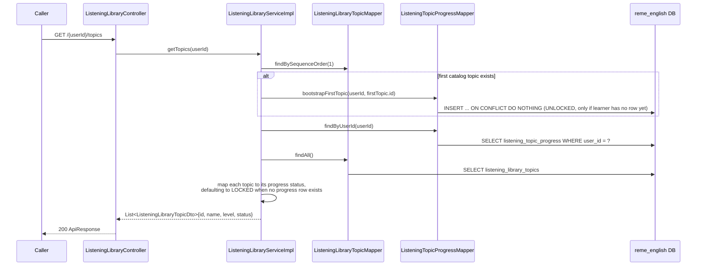
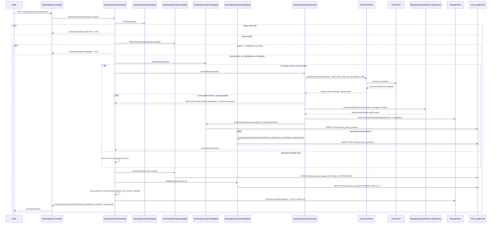
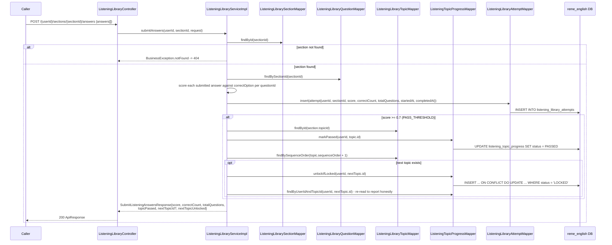
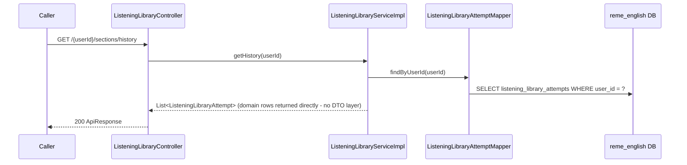

# Listening library: fixed topic catalog + AI Section (passage + audio) + pass/unlock-next-topic

Covers `com.remelearning.english.listening.library` (`ListeningLibraryController`/
`ListeningLibraryServiceImpl`), a fixed listening-topic catalog (same names/order as
`grammar_library_topics`, seeded in `V19__listening_library.sql`) crossing the "AI content generated
once, reused forever" pattern of [grammar-library.md](grammar-library.md) with the LOCKED/UNLOCKED/
IN_PROGRESS/PASSED gating state machine grammar.library also uses. Each topic has one or more
Sections (a short passage + Supertonic-synthesized audio), generated by AI on first read only, backed
by a 4-question multiple-choice pool. A learner progresses topic-by-topic: only the first topic
starts `UNLOCKED`; scoring ≥ 0.7 on a Section (`PASS_THRESHOLD`) marks the topic `PASSED` and unlocks
the next one. FE calls go through `bff-service`'s `LearnerController`, a pure pass-through, omitted
below as a separate hop per `vocabulary-library.md`'s convention — `bff-service` proxies all four of
these endpoints (via `EnglishServiceClient`/`LearnerController`), same as Vocabulary/Grammar Library.

## 1. List topics (`GET /api/v1/learn/listening/library/{userId}/topics`)

## 2. Start or resume a Section (`POST /{userId}/topics/{topicId}/sections`)

## 3. Submit answers (`POST /{userId}/sections/{sectionId}/answers`)

## 4. History (`GET /{userId}/sections/history`)

## External calls

| # | Call | From -> To | Notes |
|---|------|-----------|-------|
| 1 | HTTPS | english-service -> Gemini API | `LlmListeningLibraryGenerator` via `AiContentClient`, first-read Section generation only; unlike `grammar.library`'s generator, any LLM/parse failure propagates as `AiContentException` instead of falling back to a static template, since this is content-authoring, not a learner-facing generate call - a failed generation simply produces no Section rather than persisting placeholder content |
| 2 | Supertonic TTS (in-process/local call, via `DialogueAudioSynthesizer`) | english-service -> Supertonic | synthesizes the passage as a single-speaker ("Narrator") monologue, same synthesizer `listening-learn` uses |
| 3 | `StorageClient` (S3/local, per `common.storage`) | english-service -> storage backend | writes/reads the Section's audio object; key is `listening-library/{topicId}/{uuid}.wav`, addressed by topic id since no section id exists yet at synthesis time |
| 4 | Postgres | english-service -> `reme_english` | `listening_library_topics`, `listening_library_sections`, `listening_library_questions`, `listening_topic_progress`, `listening_library_attempts` |

## Notes

- `listening_library_topics` is a fixed, hand-seeded catalog (60 rows, `V19__listening_library.sql`,
  same topic set/order as `grammar_library_topics`) — nothing about the topic list itself is ever
  AI-generated; only a topic's Section (passage + audio + question pool) is, once.
- Unlike `grammar.library`'s `RETRY` session flow, `listening.library` has no retry/regeneration path
  today — a topic is simply re-attempted against the same Section until the learner scores ≥ 0.7.
- `unlockIfLocked` is the same guarded upsert pattern as `grammar.library`
  (`INSERT ... ON CONFLICT DO UPDATE ... WHERE status = 'LOCKED'`) so it never regresses a topic the
  learner has already reached past `LOCKED` — see `ListeningTopicProgressMapper.xml`.
- `getHistory` returns the `ListeningLibraryAttempt` domain object directly (no dedicated history DTO
  like `GrammarLibraryHistoryEntryDto`) — a simplification worth revisiting if the FE needs a shape
  closer to Grammar Library's history entries (e.g. an `accuracy` field or topic identity alongside
  the raw counts).
- Like the other "Học &amp; Luyện tập" skills, this package has no Kafka consumer/producer of its own
  and does not call `PracticeService#redo` — scoring here only writes to `listening_library_attempts`
  and `listening_topic_progress`, not to any weak-point table (mirrors the gap already documented in
  `overview.md` §5: category `listening` has no dedicated weak-point table anywhere in the service).
- `bff-service` proxies all four of these endpoints through its own `LearnerController` (backed by
  `EnglishServiceClient`), the same pass-through pattern already used for Vocabulary Library and
  Grammar Library, so the FE reaches Listening Library through `bff-service` like every other skill.
