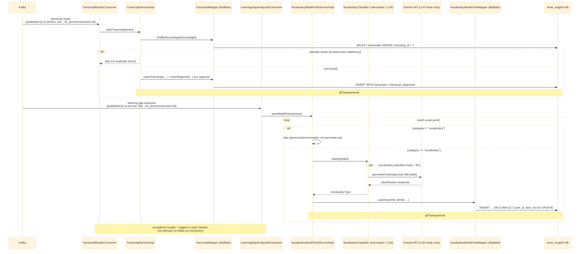
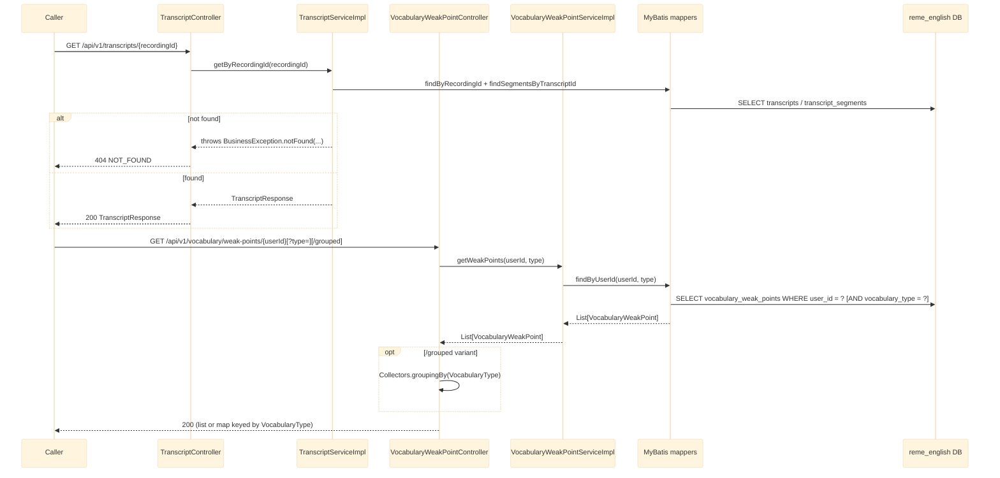

# english-service — Overview

`english-service` (Java/Spring Boot) is a modular monolith; only the `vocabulary` domain
(`com.remelearning.english.vocabulary`) is built out so far. It has two entry points into the
domain: two Kafka consumers that ingest events from `ai-service`, and two REST controllers that
serve the persisted data back out. See
`RemeLearning/services/english-service/src/main/java/com/remelearning/english/vocabulary/`.

This file covers `english-service`'s own internals only. The Kafka topics it consumes
(`transcript.ready`, `learning.gap.analyzed`) are published upstream by `ai-service` — for that
side's internal handling, see [../Ai_service/overview.md](../Ai_service/overview.md). Per-endpoint/
per-consumer detail lives in [english-get-transcript.md](english-get-transcript.md),
[english-get-weak-points.md](english-get-weak-points.md),
[english-transcript-ready.md](english-transcript-ready.md),
[english-learning-gap-analyzed.md](english-learning-gap-analyzed.md).

## 1. Kafka consumers (ingestion)

## 2. REST controllers (read-out)

## Notes

- Idempotency keys: `recording_id` for transcripts, `(user_id, item_id)` for weak points — both
  needed because Kafka delivers at-least-once.
- `grammar`/`pronunciation` domains are placeholders (`package-info.java` only) — their categories
  in `learning.gap.analyzed` are received but discarded until those domains are built out.
- No outbound Kafka event is published by `english-service` today (`vocabulary.analyzed` topic
  constant exists but has no producer yet).
- For where these Kafka messages come from (S3 download, Whisper, pyannote diarization,
  `RuleBasedAnalyzer`), see [../Ai_service/overview.md](../Ai_service/overview.md).
