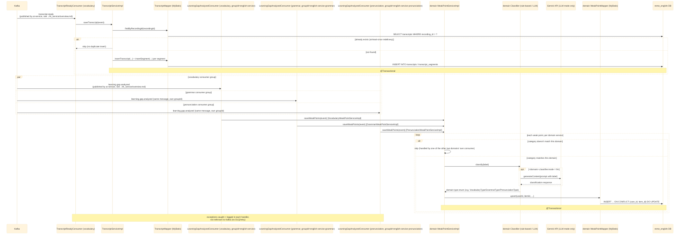
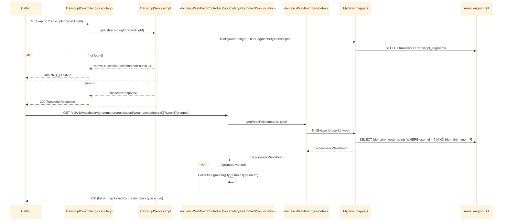

# english-service — Overview

`english-service` (Java/Spring Boot) is a modular monolith covering three domains — `vocabulary`,
`grammar`, `pronunciation` (each `com.remelearning.english.<domain>`) — all now built out. Only
`vocabulary` owns the `TranscriptReadyConsumer`/transcript persistence: the `transcripts`/
`transcript_segments` tables are a cross-domain concern written once, and `grammar`/`pronunciation`
read them back via the shared `GET /api/v1/transcripts/{recordingId}` endpoint instead of
re-ingesting `transcript.ready`. All three domains do have their own `LearningGapAnalyzedConsumer`,
each filtering `learning.gap.analyzed` to its own `category` and each on its own Kafka `groupId`
(`english-service`, `english-service-grammar`, `english-service-pronunciation`) — necessary because
Kafka splits partitions between consumers sharing one `groupId` on the same topic. See
`RemeLearning/services/english-service/src/main/java/com/remelearning/english/`.

This file covers `english-service`'s own internals only. The Kafka topics it consumes
(`transcript.ready`, `learning.gap.analyzed`) are published upstream by `ai-service` — for that
side's internal handling, see [../Ai_service/overview.md](../Ai_service/overview.md). Per-endpoint/
per-consumer detail lives in [english-get-transcript.md](english-get-transcript.md),
[english-get-weak-points.md](english-get-weak-points.md) (vocabulary),
[english-get-grammar-weak-points.md](english-get-grammar-weak-points.md),
[english-get-pronunciation-weak-points.md](english-get-pronunciation-weak-points.md),
[english-transcript-ready.md](english-transcript-ready.md),
[english-learning-gap-analyzed.md](english-learning-gap-analyzed.md) (vocabulary),
[english-learning-gap-analyzed-grammar.md](english-learning-gap-analyzed-grammar.md),
[english-learning-gap-analyzed-pronunciation.md](english-learning-gap-analyzed-pronunciation.md).

## 1. Kafka consumers (ingestion)

## 2. REST controllers (read-out)

## Notes

- Idempotency keys: `recording_id` for transcripts, `(user_id, item_id)` for weak points — both
  needed because Kafka delivers at-least-once.
- `grammar`/`pronunciation` each persist to their own table (`grammar_weak_points`,
  `pronunciation_weak_points`) via their own `LearningGapAnalyzedConsumer`, filtered to their own
  `category` and running on their own Kafka `groupId` so all three domains get every message
  instead of splitting partitions between them.
- No outbound Kafka event is published by `english-service` today (`vocabulary.analyzed`,
  `grammar.analyzed`, `pronunciation.analyzed` topic constants exist but have no producer yet).
- For where these Kafka messages come from (S3 download, Whisper, pyannote diarization,
  `RuleBasedAnalyzer`), see [../Ai_service/overview.md](../Ai_service/overview.md).
