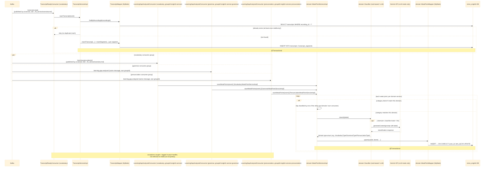
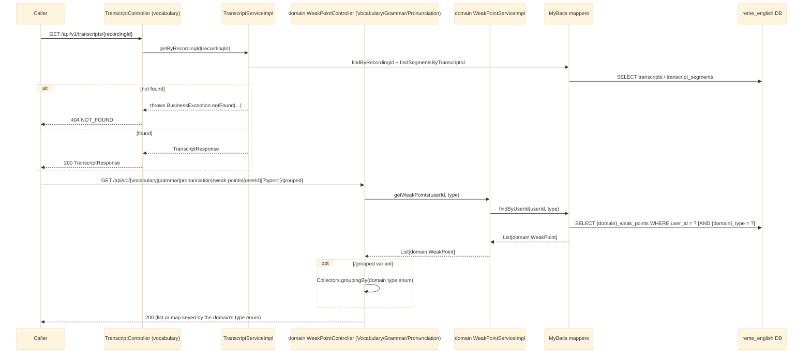
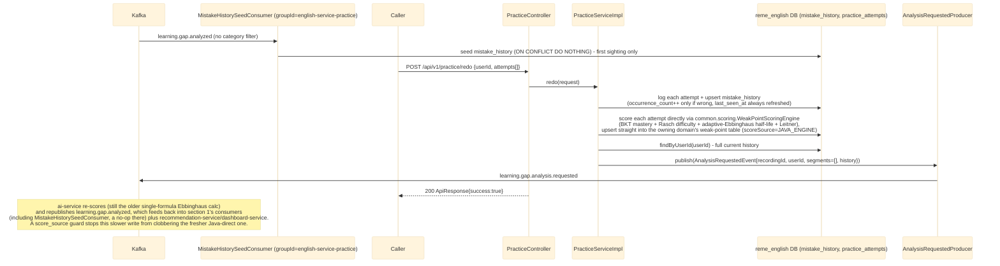
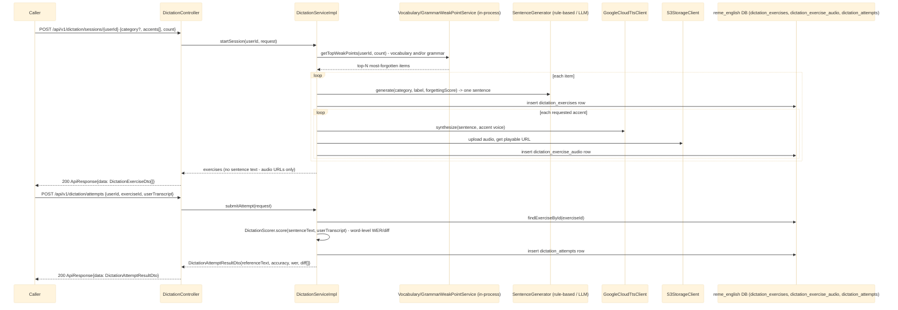

# english-service — Overview

`english-service` (Java/Spring Boot) is a modular monolith covering three analysis domains —
`vocabulary`, `grammar`, `pronunciation` (each `com.remelearning.english.<domain>`) — plus a fourth,
cross-cutting `practice` package for redo-exercises, a fifth, `dictation`, for listen-and-type
practice generated from a learner's most-forgotten vocabulary/grammar items (see
[dictation-practice.md](dictation-practice.md)) - unlike the other four, it is pull-based (triggered
by the FE, no Kafka consumer of its own) and reuses `vocabulary`/`grammar`'s weak-point services
in-process rather than adding a new inter-service call - and four more "Học &amp; Luyện tập với AI"
`learn` packages (`vocabulary.learn`, `grammar.learn`, `listening`, `speaking`), each generating one
AI practice item (Gemini text, plus Supertonic TTS for listening/speaking) and grading a submitted
attempt by reusing `practice.service.PracticeService#redo` in-process, exactly like `dictation`
reuses the domain weak-point services - see [vocabulary-learn.md](vocabulary-learn.md),
[grammar-learn.md](grammar-learn.md), [listening-learn.md](listening-learn.md), and
[speaking-learn.md](speaking-learn.md). Only `vocabulary` owns the
`TranscriptReadyConsumer`/transcript persistence: the `transcripts`/`transcript_segments` tables are
a cross-domain concern written once, and `grammar`/`pronunciation` read them back via the shared
`GET /api/v1/transcripts/{recordingId}` endpoint instead of re-ingesting `transcript.ready`. All
three domains do have their own `LearningGapAnalyzedConsumer`, each filtering `learning.gap.analyzed`
to its own `category` and each on its own Kafka `groupId` (`english-service`,
`english-service-grammar`, `english-service-pronunciation`) — necessary because Kafka splits
partitions between consumers sharing one `groupId` on the same topic. `practice` adds a **fourth**
consumer of the same topic (`groupId: english-service-practice`, no category filter) to seed mistake
history, plus the service's first Kafka **producer**, `AnalysisRequestedProducer`
(`learning.gap.analysis.requested`) — see section 3 below. See
`RemeLearning/services/english-service/src/main/java/com/remelearning/english/`.

This file covers `english-service`'s own internals only. The Kafka topics it consumes
(`transcript.ready`, `learning.gap.analyzed`) are published upstream by `ai-service` — for that
side's internal handling, see [../Ai_service/overview.md](../Ai_service/overview.md). Per-endpoint/
per-consumer detail lives in [english-get-transcript.md](english-get-transcript.md),
[english-get-weak-points.md](english-get-weak-points.md) (vocabulary),
[english-get-grammar-weak-points.md](english-get-grammar-weak-points.md),
[english-get-pronunciation-weak-points.md](english-get-pronunciation-weak-points.md),
[english-transcript-ready.md](english-transcript-ready.md),
[english-learning-gap-analyzed.md](english-learning-gap-analyzed.md) (vocabulary),
[english-learning-gap-analyzed-grammar.md](english-learning-gap-analyzed-grammar.md),
[english-learning-gap-analyzed-pronunciation.md](english-learning-gap-analyzed-pronunciation.md),
[practice-redo.md](practice-redo.md) (mistake-history seeding + redo-exercise grading),
[dictation-practice.md](dictation-practice.md) (session generation + transcript grading),
[vocabulary-learn.md](vocabulary-learn.md), [grammar-learn.md](grammar-learn.md),
[listening-learn.md](listening-learn.md), and [speaking-learn.md](speaking-learn.md) (the four
"Học &amp; Luyện tập với AI" `learn` skills: AI-generated practice item + graded attempt).

- [Vocabulary library: topic word bank + Section practice](vocabulary-library.md) - extends the
  vocabulary skill with a persistent topic word bank and Leitner-lite in-session repetition.
- [Grammar library: 60-topic catalog + theory page + session practice](grammar-library.md) - a fixed
  grammar topic catalog with an AI-generated theory page + question pool per topic (generated once,
  reused forever) and a pass/retry/unlock-next-topic progression per learner.
- [Listening library: fixed topic catalog + AI Section (passage + audio) + pass/unlock-next-topic](listening-library.md) -
  a fixed listening topic catalog crossing Grammar Library's gating state machine with an
  AI-generated passage + Supertonic audio + question pool per Section (generated once, reused
  forever); `bff-service` does not yet proxy it (gap noted in the linked file).
- [Speaking library: fixed topic catalog + AI Section (sample sentences + per-sentence audio) + pass/unlock-next-topic](speaking-library.md) -
  a fixed speaking topic catalog crossing the same gating state machine with an AI-generated pool of
  5 sample sentences (IPA + one Supertonic sample clip per sentence) per Section; scoring is per
  sentence via the reused GOP `PronunciationScoringClient`, and gating only advances in a separate
  `finishSection` call (not on every submitted attempt, unlike Listening Library); `bff-service` does
  not yet proxy it either (same gap).

## 1. Kafka consumers (ingestion)

## 2. REST controllers (read-out)

## 3. Practice / redo-exercise (`practice` package)

Full detail in [practice-redo.md](practice-redo.md); summary below.

A `GET /api/v1/practice/review-queue/{userId}` endpoint also exists, reading items due for review
(`next_review_at <= now`) straight from `mistake_history`, sorted soonest-first — see
[practice-redo.md](practice-redo.md) section 3.

## 4. Dictation practice (`dictation` package)

Full detail in [dictation-practice.md](dictation-practice.md); summary below.

A fourth flow, `GET /api/v1/dictation/history/{userId}/{attemptId}`, returns full detail for one past
attempt (reference text, transcript, a flat mistake list, and the AI suggestions persisted at submit
time) — see [dictation-practice.md](dictation-practice.md) section 4.

## 5. "Học & Luyện tập với AI" learn skills (`vocabulary.learn`, `grammar.learn`, `listening`, `speaking`)

Full detail in [vocabulary-learn.md](vocabulary-learn.md), [grammar-learn.md](grammar-learn.md),
[listening-learn.md](listening-learn.md), [speaking-learn.md](speaking-learn.md); summary below. All
four follow one shape: `generate` an AI practice item targeting the learner's own top weak points (or
an explicit focus list), then `submit` an attempt that grades it and feeds the result back into
`practice.service.PracticeService#redo` — the same Java-scoring-engine + `learning.gap.analysis.
requested` mechanism section 3 documents, not a bespoke publisher per skill.

| Skill | Generator | Extra generate-time call | Submit scoring | Weak-point category |
|---|---|---|---|---|
| `vocabulary.learn` | `LlmVocabPracticeGenerator` | — | pure `VocabAttemptScorer` | `vocabulary` (existing table) |
| `grammar.learn` | `LlmGrammarPracticeGenerator` | — | pure `GrammarAttemptScorer` | `grammar` (existing table) |
| `listening` | `LlmListeningPracticeGenerator` | Supertonic TTS via `DialogueAudioSynthesizer` (multi-speaker) | MCQ/KEYWORD pure scoring + OPEN via `LlmOpenAnswerGrader` (another LLM call) | `listening` (new category — see below) |
| `speaking` | `LlmSpeakingPracticeGenerator` | Supertonic TTS via `TtsClient` (single voice) | ai-service wav2vec2 GOP via `PronunciationScoringClient` (multipart upload) | `pronunciation` (existing table, reused) |

All four generators are Gemini-only (no rule-based mode) with a static-template fallback on any LLM
call/parse failure, so `generate` never hard-fails. None of the four packages has its own Kafka
consumer/producer — they only reach Kafka indirectly through `PracticeService#redo`.

**Client-side grading (contract change, vocabulary/grammar/listening only):** the practice-item
question payloads (`generate`/`getItem`/`listItems`) now carry the correct answer — `answer` +
`translation` for vocabulary/grammar, `answer` + `explanation` for listening (`answer` null for `OPEN`,
which stays LLM-graded server-side) — so the client checks each question locally for instant feedback
before submitting. The call order between services is unchanged; the authoritative score is still
produced only by the `submit`-attempt step.

## Notes

- Idempotency keys: `recording_id` for transcripts, `(user_id, item_id)` for weak points and for
  `mistake_history` — needed because Kafka delivers at-least-once.
- `grammar`/`pronunciation` each persist to their own table (`grammar_weak_points`,
  `pronunciation_weak_points`) via their own `LearningGapAnalyzedConsumer`, filtered to their own
  `category` and running on their own Kafka `groupId` so all three domains get every message
  instead of splitting partitions between them.
- `vocabulary.analyzed`/`grammar.analyzed`/`pronunciation.analyzed` topic constants still exist with
  no producer. `learning.gap.analysis.requested`, however, now has one:
  `practice.kafka.AnalysisRequestedProducer` (section 3) — the redo-exercise flow is the mechanism
  by which a learner's mistake history gets bundled and sent back to `ai-service` for re-scoring.
- For where the *original* `learning.gap.analyzed` messages come from (S3 download, Whisper,
  pyannote diarization, `RuleBasedAnalyzer`), see [../Ai_service/overview.md](../Ai_service/overview.md).
- `dictation` is the only one of the five packages with no Kafka consumer of its own - it reads
  `vocabulary`/`grammar`'s weak-point tables via their existing service interfaces in-process
  instead, and is triggered synchronously by the FE (through bff-service) rather than by an event.
- The diagram in section 4 above predates the `dictation` package's rewrite around a fixed real-audio
  library (see [dictation-practice.md](dictation-practice.md) for the current, accurate flow,
  including rev 2's folder -> file browsing and sentence-mode clip detail).
- Like `dictation`, none of the four `learn` skills (section 5) has its own Kafka consumer/producer —
  request flow is triggered synchronously by the FE (through bff-service) and reaches Kafka only via
  `PracticeService#redo`'s bundled `learning.gap.analysis.requested` publish.
- **Gap surfaced while documenting section 5:** `LearningCategories.LISTENING` ("listening") is a
  valid category on `PracticeAttemptRequest`, but `WeakPointDispatcherImpl.dispatch` (called from
  `WeakPointScoringOrchestrator` during `PracticeService#redo`) only switches on
  `"vocabulary"`/`"grammar"`/`"pronunciation"` — a `"listening"` attempt falls through to
  `default -> log.warn(...)` and is silently dropped, so no listening-specific weak-point table is
  ever written (none exists today, matching this gap). `mistake_history` and the
  `learning.gap.analysis.requested` re-publish still happen either way, since both are
  category-agnostic. See [listening-learn.md](listening-learn.md)'s Notes for detail.
