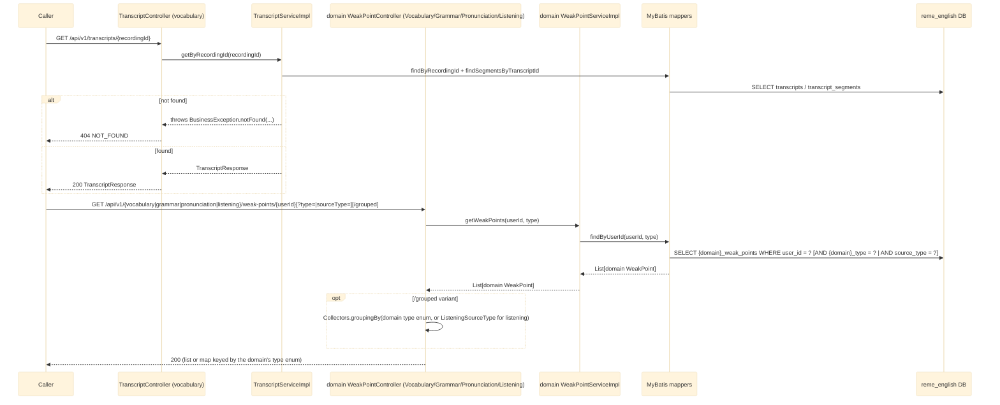
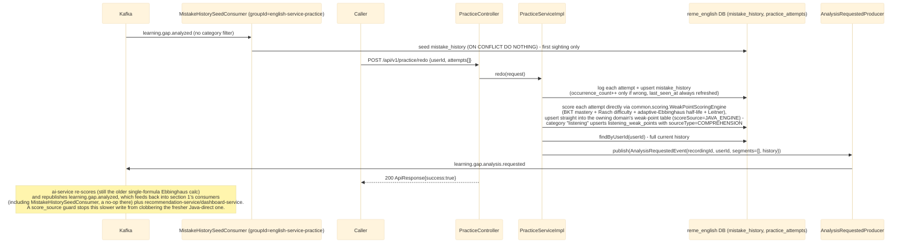
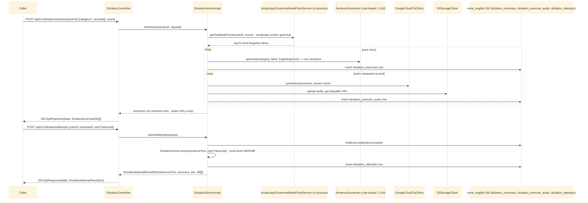

# english-service — Overview

`english-service` (Java/Spring Boot) is a modular monolith covering four analysis domains —
`vocabulary`, `grammar`, `pronunciation`, `listening.weakpoint` (each its own package, the last one
`com.remelearning.english.listening.weakpoint`, deliberately not `listening.mapper` which already
belongs to the listening-comprehension **learn** skill below) — plus a fifth, cross-cutting
`practice` package for redo-exercises, a sixth, `dictation`, for listen-and-type practice generated
from a learner's most-forgotten vocabulary/grammar items (see
[dictation-practice.md](dictation-practice.md)) - unlike the other domains, it is pull-based
(triggered by the FE, no Kafka consumer of its own) and reuses `vocabulary`/`grammar`'s weak-point
services in-process rather than adding a new inter-service call - and four more "Học &amp; Luyện tập
với AI" `learn` packages (`vocabulary.learn`, `grammar.learn`, `listening`, `speaking`,
`writing`), each
generating one AI practice item (Gemini text, plus Supertonic TTS for listening/speaking) and grading
a submitted attempt by reusing `practice.service.PracticeService#redo` in-process, exactly like
`dictation` reuses the domain weak-point services - see [vocabulary-learn.md](vocabulary-learn.md),
[grammar-learn.md](grammar-learn.md), [listening-learn.md](listening-learn.md), and
[speaking-learn.md](speaking-learn.md). Only `vocabulary` owns the
`TranscriptReadyConsumer`/transcript persistence: the `transcripts`/`transcript_segments` tables are
a cross-domain concern written once, and `grammar`/`pronunciation`/`listening.weakpoint` read them
back via the shared `GET /api/v1/transcripts/{recordingId}` endpoint instead of re-ingesting
`transcript.ready`. All four analysis domains have their own `LearningGapAnalyzedConsumer`, each
filtering `learning.gap.analyzed` to its own `category` and each on its own Kafka `groupId`
(`english-service`, `english-service-grammar`, `english-service-pronunciation`,
`english-service-listening`) — necessary because Kafka splits partitions between consumers sharing
one `groupId` on the same topic. `listening.weakpoint`'s weak points come from **two** sources,
distinguished by `sourceType`: `DICTATION` (dictation's dual-write onto `learning.gap.analyzed`, see
[dictation-practice.md](dictation-practice.md)) and `COMPREHENSION` (the practice/redo flow's Java
engine, via `WeakPointDispatcherImpl`'s `"listening"` case — see
[english-learning-gap-analyzed-listening.md](english-learning-gap-analyzed-listening.md) and
[practice-redo.md](practice-redo.md)). `practice` adds a **fifth** consumer of the same topic
(`groupId: english-service-practice`, no category filter) to seed mistake history, plus the service's
first Kafka **producer**, `AnalysisRequestedProducer` (`learning.gap.analysis.requested`) — see
section 3 below. See `RemeLearning/services/english-service/src/main/java/com/remelearning/english/`.

This file covers `english-service`'s own internals only. The Kafka topics it consumes
(`transcript.ready`, `learning.gap.analyzed`) are published upstream by `ai-service` — for that
side's internal handling, see [../Ai_service/overview.md](../Ai_service/overview.md). Per-endpoint/
per-consumer detail lives in [english-get-transcript.md](english-get-transcript.md),
[english-get-weak-points.md](english-get-weak-points.md) (vocabulary),
[english-get-grammar-weak-points.md](english-get-grammar-weak-points.md),
[english-get-pronunciation-weak-points.md](english-get-pronunciation-weak-points.md),
[english-get-listening-weak-points.md](english-get-listening-weak-points.md),
[english-transcript-ready.md](english-transcript-ready.md),
[english-learning-gap-analyzed.md](english-learning-gap-analyzed.md) (vocabulary),
[english-learning-gap-analyzed-grammar.md](english-learning-gap-analyzed-grammar.md),
[english-learning-gap-analyzed-pronunciation.md](english-learning-gap-analyzed-pronunciation.md),
[english-learning-gap-analyzed-listening.md](english-learning-gap-analyzed-listening.md),
[practice-redo.md](practice-redo.md) (mistake-history seeding + redo-exercise grading),
[dictation-practice.md](dictation-practice.md) (session generation + transcript grading),
[vocabulary-learn.md](vocabulary-learn.md), [grammar-learn.md](grammar-learn.md),
[listening-learn.md](listening-learn.md), [speaking-learn.md](speaking-learn.md), and
[writing-learn.md](writing-learn.md) (the five "Học &amp; Luyện tập với AI" `learn` skills:
AI-generated practice item + graded attempt).

- [Vocabulary library: topic word bank + Section practice](vocabulary-library.md) - extends the
  vocabulary skill with a persistent topic word bank and Leitner-lite in-session repetition.
- [Grammar library: 60-topic catalog + theory page + session practice](grammar-library.md) - a fixed
  grammar topic catalog with an AI-generated theory page + question pool per topic (generated once,
  reused forever) and a pass/retry/unlock-next-topic progression per learner.
- [Listening library: fixed topic catalog + AI Section (passage + audio) + pass/unlock-next-topic](listening-library.md) -
  a fixed listening topic catalog crossing Grammar Library's gating state machine with an
  AI-generated passage + Supertonic audio + question pool per Section (generated once, reused
  forever); `bff-service` proxies it (via `EnglishServiceClient`/`LearnerController`), same as
  Vocabulary/Grammar Library.
- [Speaking library: fixed topic catalog + AI Section (sample sentences + per-sentence audio) + pass/unlock-next-topic](speaking-library.md) -
  a fixed speaking topic catalog crossing the same gating state machine with an AI-generated pool of
  5 sample sentences (IPA + one Supertonic sample clip per sentence) per Section; scoring is per
  sentence via the reused GOP `PronunciationScoringClient`, and gating only advances in a separate
  `finishSection` call (not on every submitted attempt, unlike Listening Library); `bff-service`
  proxies it too, same as Listening Library.
- [Writing library: fixed catalogue over THREE independent taxonomy axes](writing-library.md) -
  the only library with more than one axis: `grammar` (the same 60-topic taxonomy),
  `genre` (12 real-world text types) and `vocab_theme` (the vocabulary themes).
  `sequence_order` is unique per axis only and unlocking never crosses axes, so the three
  progressions are fully independent. Each topic is a chain of 3-6 lazily-generated prompts,
  graded by the very same `WritingGrader`/`WritingErrorPipeline` the learn tab uses.

## 1. Kafka consumers (ingestion)

```mermaid
---
config:
  theme: base
  themeVariables:
    background: '#ffffff'
---
sequenceDiagram
    participant Kafka
    participant TRConsumer as TranscriptReadyConsumer (vocabulary)
    participant TSvc as TranscriptServiceImpl
    participant TMapper as TranscriptMapper (MyBatis)
    participant LGAVocab as LearningGapAnalyzedConsumer (vocabulary, groupId=english-service)
    participant LGAGrammar as LearningGapAnalyzedConsumer (grammar, groupId=english-service-grammar)
    participant LGAPron as LearningGapAnalyzedConsumer (pronunciation, groupId=english-service-pronunciation)
    participant LGAListening as LearningGapAnalyzedConsumer (listening.weakpoint, groupId=english-service-listening)
    participant WSvc as domain WeakPointServiceImpl
    participant Cls as domain Classifier (rule-based / LLM)
    participant Gemini as Gemini API (LLM mode only)
    participant WMapper as domain WeakPointMapper (MyBatis)
    participant DB as reme_english DB

    Kafka->>TRConsumer: transcript.ready<br/>(published by ai-service, see ../Ai_service/overview.md)
    TRConsumer->>TSvc: saveTranscript(event)
    TSvc->>TMapper: findByRecordingId(recordingId)
    TMapper->>DB: SELECT transcripts WHERE recording_id = ?
    alt already exists (at-least-once redelivery)
        TSvc-->>TRConsumer: skip (no duplicate insert)
    else not found
        TSvc->>TMapper: insertTranscript(...) + insertSegment(...) per segment
        TMapper->>DB: INSERT INTO transcripts / transcript_segments
        Note over TSvc,DB: @Transactional
    end

    par vocabulary consumer group
        Kafka->>LGAVocab: learning.gap.analyzed<br/>(published by ai-service, see ../Ai_service/overview.md)
    and grammar consumer group
        Kafka->>LGAGrammar: learning.gap.analyzed (same message, own groupId)
    and pronunciation consumer group
        Kafka->>LGAPron: learning.gap.analyzed (same message, own groupId)
    and listening.weakpoint consumer group
        Kafka->>LGAListening: learning.gap.analyzed (same message, own groupId)
    end

    LGAVocab->>WSvc: saveWeakPoints(event) [VocabularyWeakPointServiceImpl]
    LGAGrammar->>WSvc: saveWeakPoints(event) [GrammarWeakPointServiceImpl]
    LGAPron->>WSvc: saveWeakPoints(event) [PronunciationWeakPointServiceImpl]
    LGAListening->>WSvc: saveWeakPoints(event) [ListeningWeakPointServiceImpl]
    loop each weak point, per domain service
        alt category doesn't match this domain
            WSvc->>WSvc: skip (handled by one of the other domains' own consumer)
        else category matches this domain
            opt vocabulary/grammar/pronunciation (listening.weakpoint has no classifier - see below)
                WSvc->>Cls: classify(label)
                opt <domain>.classifier.mode = llm
                    Cls->>Gemini: generateContent(prompt with label)
                    Gemini-->>Cls: classification response
                end
                Cls-->>WSvc: domain type enum (e.g. VocabularyType/GrammarType/PronunciationType)
            end
            Note right of WSvc: listening.weakpoint hard-codes sourceType=DICTATION instead of<br/>classifying - this Kafka path today only ever carries dictation's<br/>dual-write, so there's no itemId convention to infer sourceType from
            WSvc->>WMapper: upsert(userId, itemId, ...)
            WMapper->>DB: INSERT ... ON CONFLICT (user_id, item_id) DO UPDATE
            Note over WSvc,DB: @Transactional
        end
    end

    Note over TRConsumer,LGAListening: exceptions caught + logged in each handler,<br/>not rethrown to Kafka (no DLQ/retry)
```

## 2. REST controllers (read-out)

```mermaid
---
config:
  theme: base
  themeVariables:
    background: '#ffffff'
---
sequenceDiagram
    participant Caller
    participant TCtrl as TranscriptController (vocabulary)
    participant TSvc as TranscriptServiceImpl
    participant WCtrl as domain WeakPointController (Vocabulary/Grammar/Pronunciation/Listening)
    participant WSvc as domain WeakPointServiceImpl
    participant Mapper as MyBatis mappers
    participant DB as reme_english DB

    Caller->>TCtrl: GET /api/v1/transcripts/{recordingId}
    TCtrl->>TSvc: getByRecordingId(recordingId)
    TSvc->>Mapper: findByRecordingId + findSegmentsByTranscriptId
    Mapper->>DB: SELECT transcripts / transcript_segments
    alt not found
        TSvc-->>TCtrl: throws BusinessException.notFound(...)
        TCtrl-->>Caller: 404 NOT_FOUND
    else found
        TSvc-->>TCtrl: TranscriptResponse
        TCtrl-->>Caller: 200 TranscriptResponse
    end

    Caller->>WCtrl: GET /api/v1/{vocabulary|grammar|pronunciation|listening}/weak-points/{userId}[?type=|sourceType=][/grouped]
    WCtrl->>WSvc: getWeakPoints(userId, type)
    WSvc->>Mapper: findByUserId(userId, type)
    Mapper->>DB: SELECT {domain}_weak_points WHERE user_id = ? [AND {domain}_type = ? | AND source_type = ?]
    Mapper-->>WSvc: List[domain WeakPoint]
    WSvc-->>WCtrl: List[domain WeakPoint]
    opt /grouped variant
        WCtrl->>WCtrl: Collectors.groupingBy(domain type enum, or ListeningSourceType for listening)
    end
    WCtrl-->>Caller: 200 (list or map keyed by the domain's type enum)
```

## 3. Practice / redo-exercise (`practice` package)

Full detail in [practice-redo.md](practice-redo.md); summary below.

```mermaid
---
config:
  theme: base
  themeVariables:
    background: '#ffffff'
---
sequenceDiagram
    participant Kafka
    participant Seed as MistakeHistorySeedConsumer (groupId=english-service-practice)
    participant Caller
    participant Ctrl as PracticeController
    participant Svc as PracticeServiceImpl
    participant DB as reme_english DB (mistake_history, practice_attempts)
    participant Producer as AnalysisRequestedProducer

    Kafka->>Seed: learning.gap.analyzed (no category filter)
    Seed->>DB: seed mistake_history (ON CONFLICT DO NOTHING) - first sighting only

    Caller->>Ctrl: POST /api/v1/practice/redo {userId, attempts[]}
    Ctrl->>Svc: redo(request)
    Svc->>DB: log each attempt + upsert mistake_history<br/>(occurrence_count++ only if wrong, last_seen_at always refreshed)
    Svc->>DB: score each attempt directly via common.scoring.WeakPointScoringEngine<br/>(BKT mastery + Rasch difficulty + adaptive-Ebbinghaus half-life + Leitner),<br/>upsert straight into the owning domain's weak-point table (scoreSource=JAVA_ENGINE) -<br/>category "listening" upserts listening_weak_points with sourceType=COMPREHENSION
    Svc->>DB: findByUserId(userId) - full current history
    Svc->>Producer: publish(AnalysisRequestedEvent{recordingId, userId, segments=[], history})
    Producer->>Kafka: learning.gap.analysis.requested
    Ctrl-->>Caller: 200 ApiResponse{success:true}

    Note over Kafka: ai-service re-scores (still the older single-formula Ebbinghaus calc)<br/>and republishes learning.gap.analyzed, which feeds back into section 1's consumers<br/>(including MistakeHistorySeedConsumer, a no-op there) plus recommendation-service/dashboard-service.<br/>A score_source guard stops this slower write from clobbering the fresher Java-direct one.
```

A `GET /api/v1/practice/review-queue/{userId}` endpoint also exists, reading items due for review
(`next_review_at <= now`) straight from `mistake_history`, sorted soonest-first — see
[practice-redo.md](practice-redo.md) section 3.

## 4. Dictation practice (`dictation` package)

Full detail in [dictation-practice.md](dictation-practice.md); summary below.

```mermaid
---
config:
  theme: base
  themeVariables:
    background: '#ffffff'
---
sequenceDiagram
    participant Caller
    participant Ctrl as DictationController
    participant Svc as DictationServiceImpl
    participant WSvc as Vocabulary/GrammarWeakPointService (in-process)
    participant Gen as SentenceGenerator (rule-based / LLM)
    participant Tts as GoogleCloudTtsClient
    participant S3 as S3StorageClient
    participant DB as reme_english DB (dictation_exercises, dictation_exercise_audio, dictation_attempts)

    Caller->>Ctrl: POST /api/v1/dictation/sessions/{userId} {category?, accents[], count}
    Ctrl->>Svc: startSession(userId, request)
    Svc->>WSvc: getTopWeakPoints(userId, count) - vocabulary and/or grammar
    WSvc-->>Svc: top-N most-forgotten items
    loop each item
        Svc->>Gen: generate(category, label, forgettingScore) -> one sentence
        Svc->>DB: insert dictation_exercises row
        loop each requested accent
            Svc->>Tts: synthesize(sentence, accent voice)
            Svc->>S3: upload audio, get playable URL
            Svc->>DB: insert dictation_exercise_audio row
        end
    end
    Svc-->>Ctrl: exercises (no sentence text - audio URLs only)
    Ctrl-->>Caller: 200 ApiResponse{data: DictationExerciseDto[]}

    Caller->>Ctrl: POST /api/v1/dictation/attempts {userId, exerciseId, userTranscript}
    Ctrl->>Svc: submitAttempt(request)
    Svc->>DB: findExerciseById(exerciseId)
    Svc->>Svc: DictationScorer.score(sentenceText, userTranscript) - word-level WER/diff
    Svc->>DB: insert dictation_attempts row
    Svc-->>Ctrl: DictationAttemptResultDto{referenceText, accuracy, wer, diff[]}
    Ctrl-->>Caller: 200 ApiResponse{data: DictationAttemptResultDto}
```

A fourth flow, `GET /api/v1/dictation/history/{userId}/{attemptId}`, returns full detail for one past
attempt (reference text, transcript, a flat mistake list, and the AI suggestions persisted at submit
time) — see [dictation-practice.md](dictation-practice.md) section 4.

## 5. "Học & Luyện tập với AI" learn skills (`vocabulary.learn`, `grammar.learn`, `listening`, `speaking`, `writing`)

Full detail in [vocabulary-learn.md](vocabulary-learn.md), [grammar-learn.md](grammar-learn.md),
[listening-learn.md](listening-learn.md), [speaking-learn.md](speaking-learn.md),
[writing-learn.md](writing-learn.md); summary below. All
five follow one shape: `generate` an AI practice item targeting the learner's own top weak points (or
an explicit focus list), then `submit` an attempt that grades it and feeds the result back into
`practice.service.PracticeService#redo` — the same Java-scoring-engine + `learning.gap.analysis.
requested` mechanism section 3 documents, not a bespoke publisher per skill.

| Skill | Generator | Extra generate-time call | Submit scoring | Weak-point category |
|---|---|---|---|---|
| `vocabulary.learn` | `LlmVocabPracticeGenerator` | — | pure `VocabAttemptScorer` | `vocabulary` (existing table) |
| `grammar.learn` | `LlmGrammarPracticeGenerator` | — | pure `GrammarAttemptScorer` | `grammar` (existing table) |
| `listening` | `LlmListeningPracticeGenerator` | Supertonic TTS via `DialogueAudioSynthesizer` (multi-speaker) | MCQ/KEYWORD pure scoring + OPEN via `LlmOpenAnswerGrader` (another LLM call) | `listening` (new category — see below) |
| `speaking` | `LlmSpeakingPracticeGenerator` | Supertonic TTS via `TtsClient` (single voice) | ai-service wav2vec2 GOP via `PronunciationScoringClient` (multipart upload) | `pronunciation` (existing table, reused) |
| `writing` | `LlmWritingPracticeGenerator` | — (optional `LlmNextSentenceSuggester` call, only when the learner presses "Gợi ý") | `LlmWritingGrader` — per-criterion scores + labelled errors (1 LLM call) | **both** `grammar` and `vocabulary` (existing tables) — routed per error, no table of its own |

All five generators are Gemini-only (no rule-based mode) with a static-template fallback on any LLM
call/parse failure, so `generate` never hard-fails. None of the five packages has its own Kafka
consumer/producer — they only reach Kafka indirectly through `PracticeService#redo`.

`writing` is the only one of the five whose weak-point category is decided **per mistake** rather
than per skill: the grader labels every error `grammar` or `vocabulary`, and
`WritingErrorPipeline` keys it under that domain's existing item-id prefix (`"grammar:"` /
`"vocab:"` — note vocabulary's is NOT its category name). That is deliberate: a "past perfect"
slip made while writing must add to the same weak-point row dictation/listening already built up,
not start a parallel one. Consequently there is no `writing_weak_points` table and no
`"writing"` case in `WeakPointDispatcher`.

**Client-side grading (contract change, vocabulary/grammar/listening only):** the practice-item
question payloads (`generate`/`getItem`/`listItems`) now carry the correct answer — `answer` +
`translation` for vocabulary/grammar, `answer` + `explanation` for listening (`answer` null for `OPEN`,
which stays LLM-graded server-side) — so the client checks each question locally for instant feedback
before submitting. The call order between services is unchanged; the authoritative score is still
produced only by the `submit`-attempt step.

## 6. Practice session (`practice.session` package)

Full detail in [practice-session.md](practice-session.md); summary below. The refactored **"Luyện
tập"** feature: a **session** bundles ~4 AI exercises (random topics) across all four skills, aimed at
the learner's highest-scoring weak points. It only orchestrates — reuses each domain's `generate()`
(section 5) to build a slot and each domain's `submit` (which feeds weak points via
`PracticeService#redo`, section 3) to grade one — and tracks progress in two tables
(`practice_sessions`, `practice_session_exercises`, migration `V25`). No Kafka producer/consumer of
its own.

```mermaid
---
config:
  theme: base
  themeVariables:
    background: '#ffffff'
---
sequenceDiagram
    participant Caller
    participant Ctrl as PracticeSessionController
    participant Svc as PracticeSessionServiceImpl
    participant WP as domain WeakPointServices
    participant Gen as domain LearnService.generate()
    participant DB as reme_english DB (practice_sessions, practice_session_exercises)

    Caller->>Ctrl: POST /api/v1/practice/sessions {userId, exerciseCount?}
    Ctrl->>Svc: startSession(...)
    Svc->>WP: getTopWeakPoints per category (rank by forgettingScore desc)
    loop each slot (cycle ranked categories; even spread on cold-start)
        Svc->>Gen: generate(focusItems = category top weak-point labels)
        Svc->>DB: insert session exercise slot (PENDING)
    end
    Ctrl-->>Caller: 200 PracticeSession {exercises[]}

    Note over Caller: FE runs each slot via its domain getItem + submit (graded there),<br/>then POST /practice/sessions/{id}/exercises/{order}/complete {score}
    Caller->>Ctrl: complete exercise {score}
    Ctrl->>Svc: completeExercise(...)
    Svc->>DB: mark slot DONE; if none pending -> session COMPLETED
    Ctrl-->>Caller: 200 PracticeSession (refreshed)
```

Read side: `GET /api/v1/practice/sessions/{sessionId}` and `GET /api/v1/practice/sessions/latest/
{userId}` (newest in-progress session for resume, or null).

## Notes

- Idempotency keys: `recording_id` for transcripts, `(user_id, item_id)` for weak points and for
  `mistake_history` — needed because Kafka delivers at-least-once.
- `grammar`/`pronunciation`/`listening.weakpoint` each persist to their own table
  (`grammar_weak_points`, `pronunciation_weak_points`, `listening_weak_points`) via their own
  `LearningGapAnalyzedConsumer`, filtered to their own `category` and running on their own Kafka
  `groupId` so all four domains get every message instead of splitting partitions between them.
- `vocabulary.analyzed`/`grammar.analyzed`/`pronunciation.analyzed` topic constants still exist with
  no producer. `learning.gap.analysis.requested`, however, now has one:
  `practice.kafka.AnalysisRequestedProducer` (section 3) — the redo-exercise flow is the mechanism
  by which a learner's mistake history gets bundled and sent back to `ai-service` for re-scoring.
- For where the *original* `learning.gap.analyzed` messages come from (S3 download, Whisper,
  pyannote diarization, `RuleBasedAnalyzer`), see [../Ai_service/overview.md](../Ai_service/overview.md).
- `dictation` is the only one of the five packages with no Kafka consumer of its own - it reads
  `vocabulary`/`grammar`'s weak-point tables via their existing service interfaces in-process
  instead, and is triggered synchronously by the FE (through bff-service) rather than by an event.
- The diagram in section 4 above predates the `dictation` package's rewrite around a fixed real-audio
  library (see [dictation-practice.md](dictation-practice.md) for the current, accurate flow,
  including rev 2's folder -> file browsing and sentence-mode clip detail).
- Like `dictation`, none of the four `learn` skills (section 5) has its own Kafka consumer/producer —
  request flow is triggered synchronously by the FE (through bff-service) and reaches Kafka only via
  `PracticeService#redo`'s bundled `learning.gap.analysis.requested` publish.
- **Gap resolved:** the gap previously noted here — `LearningCategories.LISTENING` ("listening") being
  a valid category on `PracticeAttemptRequest` but falling through `WeakPointDispatcherImpl.dispatch`'s
  `default -> log.warn(...)` with nowhere to persist — is fixed. `WeakPointDispatcherImpl` now has a
  `case "listening" -> listeningWeakPointService.applyJavaComputedScore(update)`, and a real
  `listening_weak_points` table exists (`listening.weakpoint` package, migration `V24`). See
  [english-get-listening-weak-points.md](english-get-listening-weak-points.md),
  [english-learning-gap-analyzed-listening.md](english-learning-gap-analyzed-listening.md), and
  [listening-learn.md](listening-learn.md)'s Notes for detail.
