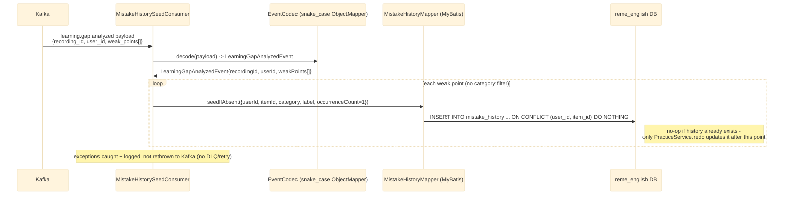
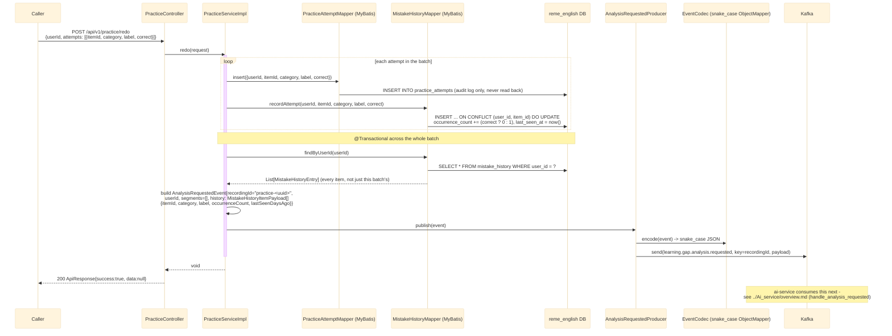

# Practice / redo-exercise: seed history, grade a redo, re-trigger analysis

Covers the `practice` package (`com.remelearning.english.practice`), which closes the loop the other
three domains leave open: when a learner **redoes an exercise**, the system must grade each answer,
re-evaluate how forgotten that item is, and re-propose recommendations. This package doesn't own a
weak-point table of its own — it maintains `mistake_history` (occurrence count + recency per item,
across all three domains) and is the first real producer of `learning.gap.analysis.requested`
(previously only a topic-name constant with no publisher — see
[../Ai_service/overview.md](../Ai_service/overview.md) for the `handle_analysis_requested` Kafka
handler that consumes it and runs `RuleBasedAnalyzer`).

## 1. Seeding `mistake_history` (`MistakeHistorySeedConsumer`)

Runs on its own `groupId` (`english-service-practice`), same topic as the other three domain
consumers (`english-service`, `english-service-grammar`, `english-service-pronunciation`) — see
[overview.md](overview.md). Unlike them it does **not** filter by category (same pattern as
recommendation-service/dashboard-service): every weak point, from every domain, seeds history the
first time it's ever seen.

## 2. Grading a redo (`POST /api/v1/practice/redo`)

## External calls

| # | Call | From -> To | Notes |
|---|------|-----------|-------|
| 1 | Kafka consume `learning.gap.analyzed` | Kafka broker -> english-service (`practice`) | seeds `mistake_history`, no category filter |
| 2 | Postgres INSERT | english-service -> `reme_english` DB | `practice_attempts` (audit) + `mistake_history` (upsert) |
| 3 | Kafka produce `learning.gap.analysis.requested` | english-service -> Kafka broker | key = synthetic `recordingId`, snake_case via `EventCodec`, no envelope (same pattern as `RecordingUploadedProducer`) |

## Notes

- Idempotency: `mistake_history` is keyed on `(user_id, item_id)`. Seeding is `DO NOTHING` on
  conflict (never overwrites); grading is `DO UPDATE` and only increments `occurrence_count` when
  the answer was wrong, so the seed consumer and the redo flow never double-count the same mistake.
- `segments` is always empty in the published `AnalysisRequestedEvent` — there's no transcript in a
  redo-exercise round, so `RuleBasedAnalyzer`'s "recurs in this session" boost never applies here
  (only the frequency/recency decay part of the score is affected by a redo).
- One `learning.gap.analysis.requested` event is published per redo batch, carrying the learner's
  **entire** current history (not just the items just answered), so ai-service re-scores everything
  consistently in one pass.
- What happens after publish is entirely the existing pipeline, unchanged: ai-service's
  `RuleBasedAnalyzer` recomputes `forgettingScore` and republishes `learning.gap.analyzed`, which the
  three domain consumers, `recommendation-service`, and `dashboard-service` all re-upsert by
  `(user_id, item_id)` — see [overview.md](overview.md) and
  [../Ai_service/overview.md](../Ai_service/overview.md).
