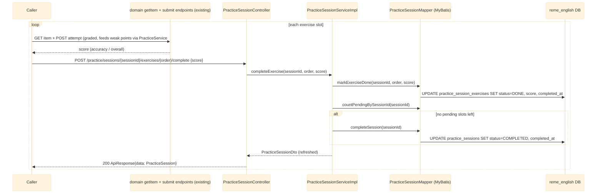

# Practice session — orchestrate ~4 AI exercises, track progress

Covers the `practice.session` package (`com.remelearning.english.practice.session`), the refactored
**"Luyện tập"** feature. A **practice session** bundles ~4 real AI exercises (random topics), mixing
all four skills (vocabulary/grammar/listening/speaking), aimed at the learner's highest-scoring weak
points. This layer only **orchestrates** generation and **tracks progress** — it re-uses each domain's
existing `generate()` to build a slot and each domain's existing `submit` endpoint to grade one (so
weak points still feed back through `PracticeService#redo`, exactly like the "Học" flow). It owns two
tables (`practice_sessions`, `practice_session_exercises`, migration `V25`); `practice_item_id` is a
by-value reference into whichever domain's practice-item bank owns the slot's category (no physical FK,
since each category stores items in a different table).

## 1. Start a session (`POST /api/v1/practice/sessions`)

Ranks the four skill categories by the learner's highest weak-point score, then generates one exercise
per slot via the owning domain, cycling the ranked categories (highest first / most often) and
spreading evenly across all four on cold-start (no weak points yet).

```mermaid
---
config:
  theme: base
  themeVariables:
    background: '#ffffff'
---
sequenceDiagram
    participant Caller
    participant Ctrl as PracticeSessionController
    participant Svc as PracticeSessionServiceImpl
    participant WP as Vocabulary/Grammar/Pronunciation WeakPointService + ListeningWeakPointService
    participant Gen as Vocab/Grammar/Listening/Speaking LearnService.generate()
    participant Mapper as PracticeSessionMapper (MyBatis)
    participant DB as reme_english DB

    Caller->>Ctrl: POST /api/v1/practice/sessions {userId, exerciseCount?}
    Ctrl->>Svc: startSession(userId, exerciseCount)
    activate Svc
    Svc->>WP: getTopWeakPoints(userId, 3) per category<br/>(listening: getWeakPoints(userId, null) sorted desc)
    WP-->>Svc: top weak points per category
    Svc->>Svc: rank categories by top forgettingScore desc;<br/>empty everywhere -> even spread over all 4 skills
    Svc->>Mapper: insertSession({userId, status=IN_PROGRESS, totalExercises=slots})
    Mapper->>DB: INSERT INTO practice_sessions
    loop each slot (1..slots), cycling ranked categories
        Svc->>Gen: generate(userId, {focusItems = category's top weak-point labels})<br/>(listening: empty focus -> self-falls-back to recently-missed keywords)
        Note right of Gen: reuses the domain's existing AI generator +<br/>Supertonic TTS for listening/speaking (synchronous)
        Gen-->>Svc: domain PracticeItemDto {practiceItemId, topic}
        Svc->>Mapper: insertExercise({sessionId, order, category, practiceItemId, topic, status=PENDING})
        Mapper->>DB: INSERT INTO practice_session_exercises
    end
    Svc-->>Ctrl: PracticeSessionDto {sessionId, exercises[]}
    deactivate Svc
    Ctrl-->>Caller: 200 ApiResponse{data: PracticeSession}
```

## 2. Run + complete each exercise

The FE fetches each slot's item via the domain's existing `getItem` endpoint, renders that domain's
runner, and grades via the domain's existing `submit` endpoint (which feeds weak points through
`PracticeService#redo` — see [practice-redo.md](practice-redo.md)). The session layer is told the
resulting score only to track progress.



A `GET /api/v1/practice/sessions/{sessionId}` (one session) and `GET /api/v1/practice/sessions/latest/
{userId}` (newest still-in-progress, for resume — `data: null` if none) round out the read side.

## External calls

| # | Call | From -> To | Notes |
|---|------|-----------|-------|
| 1 | in-process `getTopWeakPoints` / `getWeakPoints` | session service -> domain weak-point services | ranks categories; no inter-service or Kafka call |
| 2 | in-process domain `generate()` | session service -> domain learn services | reuses existing AI generators (+ Supertonic TTS for listening/speaking), synchronous |
| 3 | Postgres INSERT/UPDATE | english-service -> `reme_english` DB | `practice_sessions` + `practice_session_exercises` |

## Notes

- The session layer **does not grade** anything and publishes **no** Kafka event of its own. All
  scoring/weak-point feedback happens through the domain `submit` endpoints the FE calls per slot,
  i.e. through `PracticeService#redo` — see [practice-redo.md](practice-redo.md).
- `PronunciationWeakPointService.getTopWeakPoints(userId, limit)` was added for this feature (the
  vocabulary/grammar services already had it); listening has no such method and is generated with
  empty focus so its generator self-falls-back to recently-missed keywords.
- Generation is sequential (each domain `generate` is `@Transactional`, and listening/speaking
  synthesize TTS), so `POST /practice/sessions` can be slow — the FE shows a generating state.

## Update: five skills and a per-session exam style

Two changes to `startSession`:

**1. `writing` joined the rotation** (five skills, not four). It is the only category that cannot be
ranked off its own weak-point table, because by design it has none - a writing mistake is stored as a
`grammar` or `vocabulary` weak point (see [writing-learn.md](writing-learn.md)). So it borrows both:

- **Ranking score:** `max(grammar top score, vocabulary top score)`. It participates whenever either of
  those two has any weak point at all.
- **Focus items:** the grammar labels *and* the vocabulary labels, concatenated - writing is the one
  exercise that drills both at once, so narrowing it to one domain would waste that.
- **Task type:** one of `COMPOSE`/`TRANSLATE_VI_EN`/`TRANSLATE_EN_VI` at random per slot, so a
  multi-exercise session doesn't serve the same writing mode twice. Unlike the other domains' optional
  facets, `taskType` is *required* by the writing generator, which is why the session picks one.

Cold start (no weak points anywhere) now spreads one exercise across all five skills.

**2. `examType` on the request** (`TOEIC`/`IELTS`/`TOEFL`/`VSTEP`/`General`, optional). Normalized once
via `ExamTypes.normalize` and passed to **every** domain generator, so a whole session is generated for
one consistent exam style rather than each slot defaulting independently. Omitted means no exam in
mind, which is what the session did unconditionally before this field existed.
